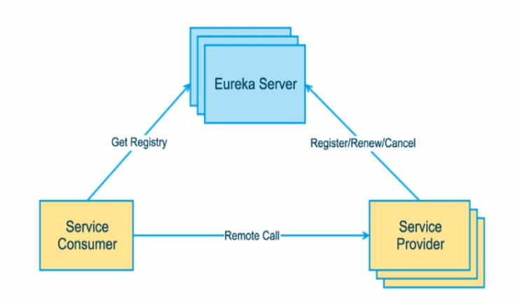

# Eureka

> 来自**[github](https://github.com/Netflix/eureka)**360浏览器翻译

Eureka是一种基于REST（Representational State Transfer）的服务，主要用于AWS云，用于定位服务，以实现中间层服务器的负载平衡和故障转移。*服务注册与发现对于微服务架构来说很重要的，有了服务注册与发现* ，==只需要使用服务的标识符，就可以访问到服务==，*而不需要修改服务调用的配置文件了。功能类似与dubbo的注册中心，比如Zookeeper。*

在Netflix，除了在中间层负载平衡中起关键作用之外，Eureka还用于以下目的。

* 为了帮助Netflix Asgard - 一种开源服务，可以更轻松地实现云部署
  * 如果出现问题，可以快速回滚版本，避免重新启动可能需要很长时间的100个实例。
  * 在滚动推送中，以避免在出现问题时将新版本传播到所有实例。
* 对于我们的cassandra部署，将实例从流量中取出进行维护。
* 对于我们的memcached缓存服务来识别环中的节点列表。
* 由于各种其他原因而携带有关服务的其他应用程序特定元数据。

## 构建

构建需要java8，因为一些必需的库是java8（伺服），但源和目标兼容性仍设置为1.7。

## 支持

[Eureka Google Group](https://groups.google.com/forum/?fromgroups#!forum/eureka_netflix)

## 文档

有关详细文档，请参阅[wiki](https://github.com/Netflix/eureka/wiki)。

## Eureka组件

### Eureka Server

​	Eureka Server提供服务注册

​	各个节点启动后，会在EurekaServer中进行注册，这样EurekaService中的服务注册表就会存储所有可用服务节点的信息，服务节点的信息可以在界面中直观的看到；

### Eureka Client

​	EurekaClient是一个Java客户端，用于简化EurekaServer的交互，客户端同时也具备一个内置的、使用轮训（round-robin）负载算法的负载均衡器。在应用启动后，将会向EurekaServer发送心跳（默认30秒）。如果EurekaServer在多个心跳周期内没有接收到某个节点的心跳，EurekaServer将会从服务注册表中把这个服务节点移除（默认90秒）。

