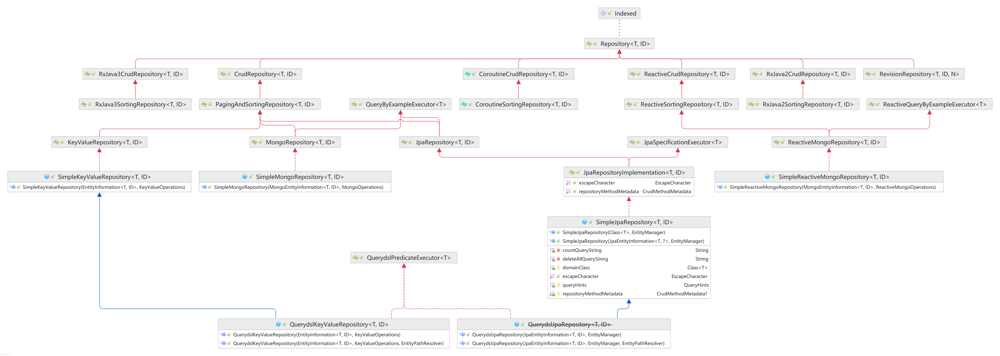

# spring data 概述

Spring Data的任务是为数据访问提供一个熟悉且一致的，基于Spring的编程模型，同时仍保留基础数据存储的特​​殊特征。

它使使用数据访问技术，关系和非关系数据库，map-reduce框架以及基于云的数据服务变得容易。这是一个总括项目，其中包含许多特定于给定数据库的子项目。这些项目是与这些令人兴奋的技术背后的许多公司和开发人员共同开发的。

# 特征
- 强大的存储库和自定义对象映射抽象
- 从存储库方法名称动态查询
- 提供基本属性的实现域基类
- 支持透明审核（已创建，最后更改）
- 集成自定义存储库代码的可能性
- 通过JavaConfig和自定义XML名称空间轻松进行Spring集成
- 与Spring MVC控制器的高级集成
- 实验性支持跨商店持久性

# 继承图

