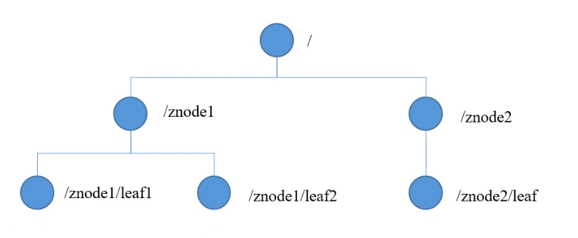
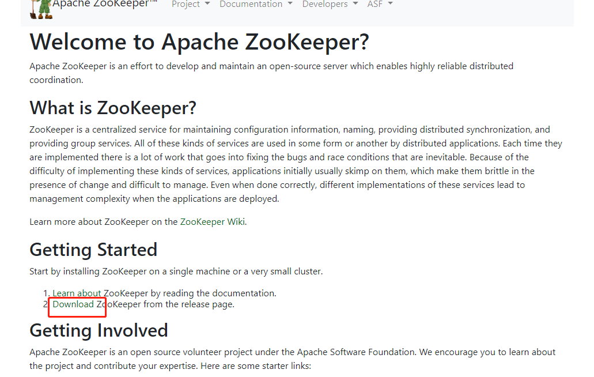

# Zookeeper 入门

## 1. 概述

Zookeeper 是一种分布式协调服务 , 用于管理大型主机 . 在分布式环境中协调和管理服务是一个复杂的过程 . Zookeeper 通过简单的架构和API解决了这个问题 . Zookeeper允许开发人员专注于核心应用程序逻辑 , 而不必担心应用程序的分布式特性 . 

### 分布式应用

分布式应用可以在给定时间（同时）在网络中的多个系统上运行，通过协调它们以快速有效的方式完成特定任务。通常来说，对于复杂而耗时的任务，非分布式应用（运行在单个系统中）需要几个小时才能完成，而分布式应用通过使用所有系统涉及的计算能力可以在几分钟内完成。

通过将分布式应用配置为在更多系统上运行，可以进一步减少完成任务的时间。分布式应用正在运行的一组系统称为**集群**，而在集群中运行的每台机器被称为**节点**。

分布式应用有两部分， **Server（服务器）** 和 **Client（客户端）** 应用程序。服务器应用程序实际上是分布式的，并具有通用接口，以便客户端可以连接到集群中的任何服务器并获得相同的结果。 客户端应用程序是与分布式应用进行交互的工具。

### 分布式应用的优点

- **可靠性** - 单个或几个系统的故障不会使整个系统出现故障。
- **可扩展性** - 可以在需要时增加性能，通过添加更多机器，在应用程序配置中进行微小的更改，而不会有停机时间。
- **透明性** - 隐藏系统的复杂性，并将其显示为单个实体/应用程序。

### 分布式应用的挑战

* **竞争条件** - 两个或多个机器尝试执行特定任务，实际上只需在任意给定时间由单个机器完成。例如，共享资源只能在任意给定时间由单个机器修改。
* **死锁** - 两个或多个操作等待彼此无限期完成。
* **不一致** - 数据的部分失败。

## 什么是Apache ZooKeeper？

Apache ZooKeeper是由集群（节点组）使用的一种服务，用于在自身之间协调，并通过稳健的同步技术维护共享数据。ZooKeeper本身是一个分布式应用程序，为写入分布式应用程序提供服务。

ZooKeeper提供的常见服务如下 :

* **命名服务** - 按名称标识集群中的节点。它类似于DNS，但仅对于节点。
* **配置管理** - 加入节点的最近的和最新的系统配置信息。
* **集群管理** - 实时地在集群和节点状态中加入/离开节点。
* **选举算法** - 选举一个节点作为协调目的的leader。
* **锁定和同步服务** - 在修改数据的同时锁定数据。此机制可帮助你在连接其他分布式应用程序（如Apache HBase）时进行自动故障恢复。
* **高度可靠的数据注册表** - 即使在一个或几个节点关闭时也可以获得数据。

分布式应用程序提供了很多好处，但它们也抛出了一些复杂和难以解决的挑战。ZooKeeper框架提供了一个完整的机制来克服所有的挑战。竞争条件和死锁使用**故障安全同步方法**进行处理。另一个主要缺点是数据的不一致性，ZooKeeper使用**原子性**解析。

## ZooKeeper的好处

以下是使用ZooKeeper的好处：

* **简单的分布式协调过程**
* **同步** - 服务器进程之间的相互排斥和协作。此过程有助于Apache HBase进行配置管理。
* **有序的消息**
* **序列化** - 根据特定规则对数据进行编码。确保应用程序运行一致。这种方法可以在MapReduce中用来协调队列以执行运行的线程。
* **可靠性**
* **原子性** - 数据转移完全成功或完全失败，但没有事务是部分的。

# 2. 工作机制

Zookeeper 从设计模式角度来理解 : 是一个基于观察者模式设计的分布式服务框架 , 它**扶着存储和管理大家都关心的数据 ,** 然后**接受观察者的注册** , 一旦这些数据的状态发生变化 , Zookeeper就将**负责通知已经在Zookeeper上注册的那些观察者**做出相应的反应

## 3. Zookeeper 特点

1. Zookeeper : 一个领导者 (**Leader**) , 多个追随着 (**Follower**) 组成的集群
2. **集群中只要有半数以上节点存活 , Zookeeper集群就能正常服务**
3. 全局数据一致 : 每个Server 保存一份相同的数据副本 , Client 无论连接到哪个Server , 数据都是一致的
4. 更新请求顺序进行 , 来自同一个 Client 的更新请求按其发送顺序依次执行 .
5. 更新数据原子性 , 一次数据更新要么成功 , 要么失败
6. 实时性 , 在一定时间范围内 , Client 能读到最新数据

## 4. 数据结构

Zookeeper 数据模型的结构与**Uninx文件系统很类似** , 整体可以看做一棵树 , 每个节点都乘坐ZNode . 每个ZNode默认都能存储**1MB**的数据 . 每个ZNode都可以**通过其路径唯一标识** .

## 5. 应用场景

提供的服务包括 :

- 统一命名服务
- 统一配置管理
- 统一jiqunguanli
- 服务器节点动态上下线
- 软负载均衡

## 6. Zookeeper 下载

[Zookeeper下载](zookeeper.apache.org)

