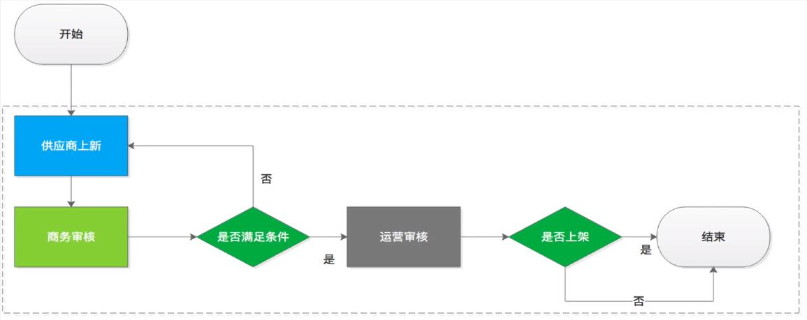
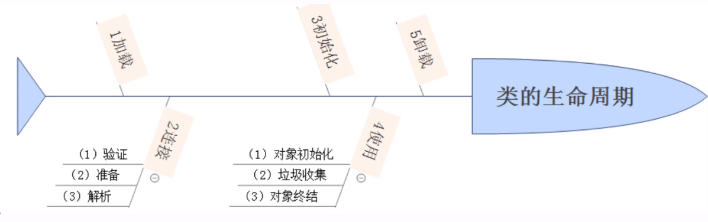
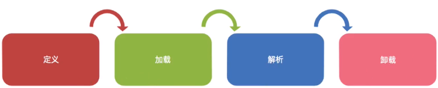
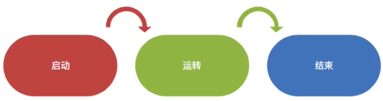
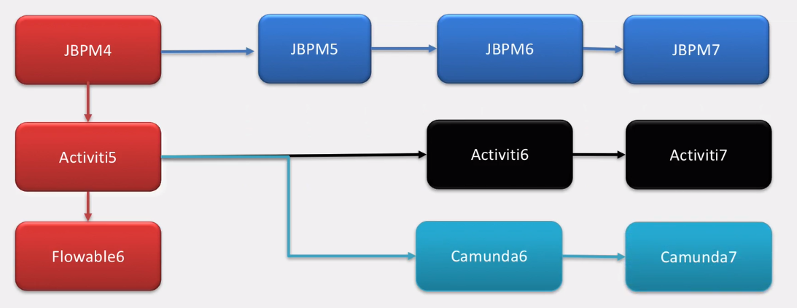

# 1.工作流介绍
## 1.1工作流概念

* 工作流(Workflow),就是"**业务过程的部分或整体在计算机环境下的自动化**",它主要解决的是"**是在多个参与者之间按照某种预定义的规则传递文档、信息或人物的过程自动进行(优势,如果没有自动化,那肯定是需要纸质方式进行),从而实现摸个预期的业务目标,或者促使此目标的实现**"

* 工作流管理系统(Workflow Management System , WfMS)是一个软件系统,它完成工作量的定义和管理,并按照在系统中预先定义好的**<u>工作流规则</u>**进行**<u>工作流实例的执行</u>**.工作流管理系统不是企业管理系统,而是为企业的业务系统的运行提供了一个软件的**<u>支撑环境</u>**.

* 工作流管理联盟(WfMC , Workflow Management Coalition)给出的关于工作流管理系统的定义是:工作流管理系统是一个软件系统,他通过执行计算的**<u>流程定义</u>**去支持一批专门设定的**<u>业务流程</u>**.工作流管理系统是被用来**<u>定义</u>**、**<u>管理</u>**、和**<u>执行</u>**工作流.

* 工作流管理系统的目标:管理工作的流程以确保工作在正确的时间被期望的人员所执行--------在自动化进行的业务过程中插入人工的执行和干预.

* 工作流管理系统(Workflow Management System , WfMS)是一个软件系统 , 他完成工作量的定义和管理 , 并按照在系统中预先定义好的工作流规则进行工作流实例的执行 . 工作流管理系统不是企业管理系统 , 而是为企业的业务系统的运行提供了一个软件支撑的环境 . 

* 流程示例

  

## 1.2元素

* 人物
* 事件(动作)
* 发起流程和结束流程
* 启动实例以及完成
* 任务 : 
  * 数据的流转	
  * 数据的权限
  * 数据的状态
  * 待办任务
  * 完成任务

# 2.工作流的声明周期
## 2.1Java类的生命周期



1. 加载

   我们编写一个java源文件,经过编译后生成一个后缀为.class的文件,这结合四字节码文件,java虚拟机就识别这种文件,java的生命周期就是class文件从加载到消亡的过程.关于加载,其实,就是将源文件的class文件找到类的信息将其加载到方法区中,然后再堆中实例一个java.lang.Class对象,作为方法区中这个类的信息入口.

2. 连接

   一般会跟加载阶段和初始化阶段交叉进行,过程由三个部分组成:验证、准备和解析.

   * 验证

     确定该类是否符合java语言规范,没有属性和行为的重复,继承是否合理,总之,就是确保jvm可以执行.

   * 准备

     主要做的就是为由`static`相似的成员变量分配内存,并设置默认的初始值.

     默认的初始值如下:

     * 八种基本数据类型的初始值
     * 引用数据类型的初始值
     * 有`static final`修饰的会直接赋值.

   * 解析

     这一阶段的任务就是把常量池中的符号引用转换为直接引用,说白了就是jvm会将所有的类或接口名、字段名、方法名转化为具体的内存地址

3. 初始化

   这个阶段就是讲静态变量(类变量)赋值的过程,即只有`static`修饰才能被初始化,执行顺序就是:父类静态域或静态代码块,然后是子类的静态域或者子类静态代码块

4. 使用

   在类的使用过程中依然存在这三部:

   1. 对象实例化

      就是执行类中的构造函数的内容,如果该类存在父类jvm会通过显示或者隐式的方式先执行父类的构造函数,在对内存中为父类的实例变量开辟空间,并赋予默认的初始值,然后在根据构造函数的将真正的值赋予变量本身,然后,引用变量获取对象的首地址,通过操作对象来调用实例变量和方法

   2. 垃圾回收

      当对象不再被引用的时候,就会被虚拟机标记上垃圾记号,在堆中等待GC回收

   3. 对象的终结

      对象被GC回收后,就不再存在,对象的生命也就走到了尽头

5. 卸载

   即类的生命周期走到了最后一步,程序不再有该类的引用,该类也就会被jvm执行立即回收,从此生命结束

> ```cmd
> cd 目录
> java -v Person.class	# 类的文件名
> 
> javap -verbose Person	# 类名 
> ```
>
> 可以查看类的加载过程

## 2.2流程定义的生命周期



##  2.3流程实例的生命周期




# 3.工作流技术选型

## 3.1关系图




## 3.2选型

|       框架       | Activiti5.x | Flowable5.x | Activiti6.x | Flowable6.x |
| :--------------: | :---------: | :---------: | :---------: | :---------: |
|   BPMN2.0规范    |      √      |      √      |      √      |      √      |
|     CMMN规范     |      ×      |      ×      |      ×      |      √      |
|     DMN规范      |      ×      |      ×      |      x      |      √      |
|       PVM        |      √      |      √      |      x      |      x      |
|       Job        |      √      |      √      |      x      |      x      |
|  AsyncExecutor   |      √      |      √      |      √      |      √      |
|     瞬态变量     |      x      |      x      |      √      |      √      |
|  事务依赖监听器  |      x      |      x      |      √      |      √      |
| 历史数据表单处理 |      x      |      x      |      √      |      √      |
|      Agenda      |      x      |      x      |      √      |      √      |
| AtomicOperation  |      √      |      √      |      x      |      x      |
|   xxoperation    |      √      |      √      |      √      |      √      |
|       消息       |      x      |      x      |      √      |      √      |
|    LiquiBase     |      x      |      x      |      √      |      √      |
|  多实例加/减签   |      x      |      x      |      x      |      √      |

# 4.下载

## 4.1 下载地址

[[Activiti 6.0.0]](https://github.com/Activiti/Activiti/releases?after=7-201711-EA)

## 4.2目录说明

* libs -> 源码和jar包

* wars-> 案例
  * admin
  * app 
  * rest.war -> 对外接口
* database -> 数据库
  * create -> 创建sql
  * drop -> 删除sql
  * upgrade -> 升级sql

# 5.Activiti6源码

https://github.com/Activiti/Activiti.git

通过git拉取

## 5.1 源码目录


1. distro	
   * 发行的版本
2. eclipse	
   * 使用eclipse的模板文件
3. modules	
   * 所有模块java源文件
4. qa	
   * 配置文件样例
5. scripts	
6. tooling/archetypes	
7. .gitignore	
8. .travis.yml	
9. LICENSE.txt	
10. README.md	
11. dependency-check-suppression.xml	
12. pom.xml	
    * 依赖第三方包

# 6.运行Activiti

* distro > wars 中

提供了3个war包

1. `activiti-admin.war`
2. `activiti-app.war`
3. `activiti-rest.war`