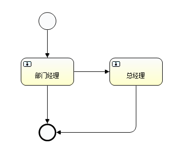
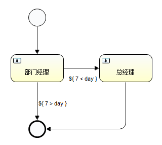
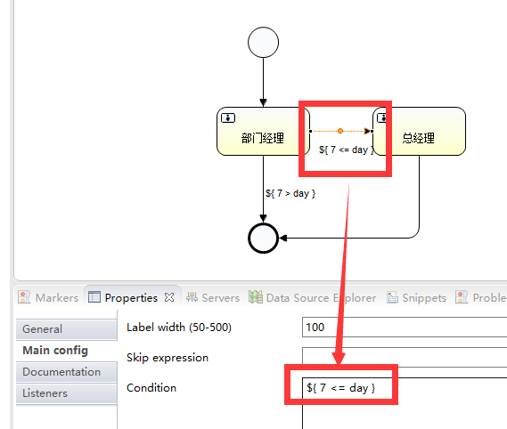

# 0. 总结

1. 一个活动中可以指定一个或多个SequenceFlow
   * 开始任务有一个
   * 结束任务没有
   * 其他活动有一个或者多个
2. 如果只有一个可以不使用流程变量设置到`codition`
3. 如果有多个,则需要使用流程变量设置`codition`,使用`${}`boolean类型的表达式用来判断连线

# 1.流程图

## 1.流程图



## 2.分支判断

1. 如图

   

2. 参数设置 

   * `${ 7 <= day }`

     * `condition` : 条件

     * `<conditionExpression xsi:type="tFormalExpression"><![CDATA[${ 7 <= day }]]></conditionExpression>`

   * ${ 7 > day }

     - `condition` : 条件

     - `<conditionExpression xsi:type="tFormalExpression"><![CDATA[${ 7 > day }]]></conditionExpression>`

   * 如图

     * 

# 2.流程的使用

## 1.流程部署

```java
	/**
	 * 部署流程
	 */
	@Test
	public void processDef() {
		RepositoryService repositoryService = processEngine.getRepositoryService();
		// 使用流的方式部署
		InputStream inputStream = this.getClass().getResourceAsStream("MyProcess.zip");
		ZipInputStream zipInputStream = new ZipInputStream(inputStream);
		Deployment deploy = repositoryService.createDeployment().name("请假分支流程").addZipInputStream(zipInputStream)
				.deploy();

		System.out.println("部署id=" + deploy.getId());
	}
```


## 2.启动流程

```java
	/**
	 * 启动流程
	 */
	@Test
	public void startProcess() {
		RuntimeService runtimeService = processEngine.getRuntimeService();
		ProcessInstance processInstance = runtimeService.startProcessInstanceById("level:2:12504");
		System.out.println("流程实例id="+processInstance.getProcessInstanceId());
	}
```

## 3.查询个人任务,并办理


	/**
	 * 查询第一个用户节点张三的个人任务
	 * 
	 * 如果有,进行办理,并且告知其 请假天数
	 */
	@Test
	public void selectTask() {
		TaskService taskService = processEngine.getTaskService();
		// 查询张三的任务
		String assignee = "张三";
		Task task = taskService.createTaskQuery().taskAssignee(assignee).singleResult();
		System.err.println("办理人=" + task.getAssignee());
		// 办理任务,并传入流程变量
		Map<String, Object> variables = new HashMap<>();
		variables.put("day", 10);
		taskService.complete(task.getId(), variables);
	}
