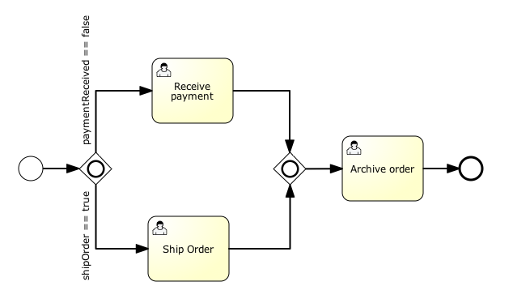
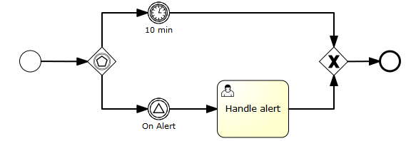

## 网关

网关用来控制流程的流向（或像BPMN 2.0里描述的那样，流程的*tokens*。） 网关可以*消费*也可以*生成*token。

网关显示成菱形图形，内部有有一个小图标。 图标表示网关的类型。


### 1.排他网关

#### a.描述

排他网关（也叫*异或（XOR）网关*，或更技术性的叫法 *基于数据的排他网关*）， 用来在流程中实现**决策**。 当流程执行到这个网关，所有外出顺序流都会被处理一遍。 其中条件解析为true的顺序流（或者没有设置条件，概念上在顺序流上定义了一个*'true'*） 会被选中，让流程继续运行。

**注意这里的外出顺序流 与BPMN 2.0通常的概念是不同的。通常情况下，所有条件结果为true的顺序流 都会被选中，以并行方式执行，但排他网关只会选择一条顺序流执行。 就是说，虽然多个顺序流的条件结果为true， 那么XML中的第一个顺序流（也只有这一条）会被选中，并用来继续运行流程。 如果没有选中任何顺序流，会抛出一个异常。**

#### b.图形标记

排他网关显示成一个普通网关（比如，菱形图形）， 内部是一个“X”图标，表示*异或（XOR）*语义。 注意，没有内部图标的网关，默认为排他网关。 BPMN 2.0规范不允许在同一个流程定义中同时使用没有X和有X的菱形图形。


#### c.XML内容

排他网关的XML内容是很直接的：用一行定义了网关， 条件表达式定义在外出顺序流中。

参考下面模型实例：


它对应的XML内容如下：

```xml
<exclusiveGateway id="exclusiveGw" name="Exclusive Gateway" />

<sequenceFlow id="flow2" sourceRef="exclusiveGw" targetRef="theTask1">
  <conditionExpression xsi:type="tFormalExpression">${input == 1}</conditionExpression>
</sequenceFlow>

<sequenceFlow id="flow3" sourceRef="exclusiveGw" targetRef="theTask2">
  <conditionExpression xsi:type="tFormalExpression">${input == 2}</conditionExpression>
</sequenceFlow>

<sequenceFlow id="flow4" sourceRef="exclusiveGw" targetRef="theTask3">
  <conditionExpression xsi:type="tFormalExpression">${input == 3}</conditionExpression>
</sequenceFlow>
```


### 2.并行网关

#### a.描述

网关也可以表示流程中的并行情况。最简单的并行网关是 **并行网关**，它允许将流程 *分*成多条分支，也可以把多条分支 *汇聚*到一起。 of execution.

并行网关的功能是基于进入和外出的顺序流的：

* **分支：** 并行后的所有外出顺序流，为每个顺序流都创建一个并发分支。
* **汇聚：** 所有到达并行网关，在此等待的进入分支， 直到所有进入顺序流的分支都到达以后， 流程就会通过汇聚网关。

注意，如果同一个并行网关有多个进入和多个外出顺序流， 它就同时具有**分支和汇聚功能**。 这时，网关会先汇聚所有进入的顺序流，然后再切分成多个并行分支。

> **与其他网关的主要区别是，并行网关不会解析条件。 即使顺序流中定义了条件，也会被忽略。**

#### b.图形标记

并行网关显示成一个普通网关（菱形）内部是一个“加号”图标， 表示“与（AND）”语义。


#### c.XML内容

定义并行网关只需要一行XML：

```xml
<parallelGateway id="myParallelGateway" />
```

实际发生的行为（分支，聚合，同时分支聚合）， 要根据并行网关的顺序流来决定。

参考如下代码：

```xml
    <startEvent id="theStart" />
    <sequenceFlow id="flow1" sourceRef="theStart" targetRef="fork" />

    <parallelGateway id="fork" />
    <sequenceFlow sourceRef="fork" targetRef="receivePayment" />
    <sequenceFlow sourceRef="fork" targetRef="shipOrder" />

    <userTask id="receivePayment" name="Receive Payment" />
    <sequenceFlow sourceRef="receivePayment" targetRef="join" />

    <userTask id="shipOrder" name="Ship Order" />
    <sequenceFlow sourceRef="shipOrder" targetRef="join" />

    <parallelGateway id="join" />
    <sequenceFlow sourceRef="join" targetRef="archiveOrder" />

    <userTask id="archiveOrder" name="Archive Order" />
    <sequenceFlow sourceRef="archiveOrder" targetRef="theEnd" />

    <endEvent id="theEnd" />
```


上面例子中，流程启动之后，会创建两个任务：

```java
ProcessInstance pi = runtimeService.startProcessInstanceByKey("forkJoin");
TaskQuery query = taskService.createTaskQuery()
                         .processInstanceId(pi.getId())
                         .orderByTaskName()
                         .asc();

List<Task> tasks = query.list();
assertEquals(2, tasks.size());

Task task1 = tasks.get(0);
assertEquals("Receive Payment", task1.getName());
Task task2 = tasks.get(1);
assertEquals("Ship Order", task2.getName());
```

当两个任务都完成时，第二个并行网关会汇聚两个分支，因为它只有一条外出连线， 不会创建并行分支， 只会创建*归档订单*任务。

注意并行网关不需要是“平衡的”（比如， 对应并行网关的进入和外出节点数目相等）。 并行网关只是等待所有进入顺序流，并为每个外出顺序流创建并发分支， 不会受到其他流程节点的影响。 所以下面的流程在BPMN 2.0中是合法的：


### 3.包含网关

#### a.描述

**包含网关**可以看做是排他网关和并行网关的结合体。 和排他网关一样，你可以在外出顺序流上定义条件，包含网关会解析它们。 但是主要的区别是包含网关可以选择多于一条顺序流，这和并行网关一样。

包含网关的功能是基于进入和外出顺序流的：

* **分支：** 所有外出顺序流的条件都会被解析，结果为true的顺序流会以并行方式继续执行， 会为每个顺序流创建一个分支。
* **汇聚：** 所有并行分支到达包含网关，会进入等待章台， 直到每个包含流程token的进入顺序流的分支都到达。 这是与并行网关的最大不同。

> 包含网关只会等待被选中执行了的进入顺序流。 在汇聚之后，流程会穿过包含网关继续执行。

注意，如果同一个包含节点拥有多个进入和外出顺序流， 它就会同时**含有分支和汇聚功能**。 这时，网关会先汇聚所有拥有流程token的进入顺序流， 再根据条件判断结果为true的外出顺序流，为它们生成多条并行分支。

#### b.图形标记

并行网关显示为一个普通网关（菱形），内部包含一个圆圈图标。




#### c.XML内容

定义一个包含网关需要一行XML：

```
<inclusiveGateway id="myInclusiveGateway" />
```

实际的行为（分支，汇聚或同时分支汇聚）， 是由连接在包含网关的顺序流决定的。

参考如下代码：

```xml
    <startEvent id="theStart" />
    <sequenceFlow id="flow1" sourceRef="theStart" targetRef="fork" />

    <inclusiveGateway id="fork" />
    <sequenceFlow sourceRef="fork" targetRef="receivePayment" >
    <conditionExpression xsi:type="tFormalExpression">${paymentReceived == false}</conditionExpression>
    </sequenceFlow>
    <sequenceFlow sourceRef="fork" targetRef="shipOrder" >
    <conditionExpression xsi:type="tFormalExpression">${shipOrder == true}</conditionExpression>
    </sequenceFlow>

    <userTask id="receivePayment" name="Receive Payment" />
    <sequenceFlow sourceRef="receivePayment" targetRef="join" />

    <userTask id="shipOrder" name="Ship Order" />
    <sequenceFlow sourceRef="shipOrder" targetRef="join" />

    <inclusiveGateway id="join" />
    <sequenceFlow sourceRef="join" targetRef="archiveOrder" />

    <userTask id="archiveOrder" name="Archive Order" />
    <sequenceFlow sourceRef="archiveOrder" targetRef="theEnd" />

    <endEvent id="theEnd" />
```


在上面的例子中，流程开始之后，如果流程变量为paymentReceived == false和shipOrder == true， 就会创建两个任务。如果，只有一个流程变量为true，就会只创建一个任务。 如果没有条件为true，就会抛出一个异常。 如果想避免异常，可以定义一个默认顺序流。下面的例子中，会创建一个任务，发货任务：

```java
HashMap<String, Object> variableMap = new HashMap<String, Object>();
          variableMap.put("receivedPayment", true);
          variableMap.put("shipOrder", true);
          ProcessInstance pi = runtimeService.startProcessInstanceByKey("forkJoin");
TaskQuery query = taskService.createTaskQuery()
                         .processInstanceId(pi.getId())
                         .orderByTaskName()
                         .asc();

List<Task> tasks = query.list();
assertEquals(1, tasks.size());

Task task = tasks.get(0);
assertEquals("Ship Order", task.getName());
```

当任务完成后，第二个包含网关会汇聚两个分支， 因为只有一个外出顺序流，所以不会创建并行分支， 只有*归档订单*任务会被激活。

注意，包含网关不需要“平衡”（比如， 对应包含网关的进入和外出数目需要相等）。 包含网关会等待所有进入顺序流完成， 并为每个外出顺序流创建并行分支， 不会受到流程中其他元素的影响。

### 4.基于事件网关

#### a.描述

基于事件网关允许根据事件判断流向。网关的每个外出顺序流都要连接到一个中间捕获事件。 当流程到达一个基于事件网关，网关会进入等待状态：会暂停执行。 与此同时，会为每个外出顺序流创建相对的事件订阅。

注意基于事件网关的外出顺序流和普通顺序流不同。这些顺序流不会真的"执行"。 相反，它们让流程引擎去决定执行到基于事件网关的流程需要订阅哪些事件。 要考虑以下条件：

* 基于事件网关必须有两条或以上外出顺序流。
* 基于事件网关后，只能使用`intermediateCatchEvent`类型。 （activiti不支持基于事件网关后连接ReceiveTask。）
* 连接到基于事件网关的`intermediateCatchEvent`只能有一条进入顺序流。


#### b.图形标记

基于事件网关和其他BPMN网关一样显示成一个菱形， 内部包含指定图标。


#### c.XML内容

用来定义基于事件网关的XML元素是`eventBasedGateway`。

#### d.实例

下面的流程是一个使用基于事件网关的例子。当流程执行到基于事件网关时， 流程会暂停执行。与此同时，流程实例会订阅警告信号事件，并创建一个10分钟后触发的定时器。 这会产生流程引擎为一个信号事件等待10分钟的效果。如果10分钟内发出信号，定时器就会取消，流程会沿着信号执行。 如果信号没有出现，流程会沿着定时器的方向前进，信号订阅会被取消。




```xml
<definitions id="definitions"
        xmlns="http://www.omg.org/spec/BPMN/20100524/MODEL"
        xmlns:activiti="http://activiti.org/bpmn"
        targetNamespace="Examples">

        <signal id="alertSignal" name="alert" />

        <process id="catchSignal">

                <startEvent id="start" />

                <sequenceFlow sourceRef="start" targetRef="gw1" />

                <eventBasedGateway id="gw1" />

                <sequenceFlow sourceRef="gw1" targetRef="signalEvent" />
                <sequenceFlow sourceRef="gw1" targetRef="timerEvent" />

                <intermediateCatchEvent id="signalEvent" name="Alert">
                        <signalEventDefinition signalRef="alertSignal" />
                </intermediateCatchEvent>

                <intermediateCatchEvent id="timerEvent" name="Alert">
                        <timerEventDefinition>
                                <timeDuration>PT10M</timeDuration>
                        </timerEventDefinition>
                </intermediateCatchEvent>

                <sequenceFlow sourceRef="timerEvent" targetRef="exGw1" />
                <sequenceFlow sourceRef="signalEvent" targetRef="task" />

                <userTask id="task" name="Handle alert"/>

                <exclusiveGateway id="exGw1" />

                <sequenceFlow sourceRef="task" targetRef="exGw1" />
                <sequenceFlow sourceRef="exGw1" targetRef="end" />

                <endEvent id="end" />
</process>
</definitions>
```