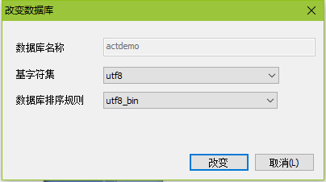

# 1.配置pom.xml

```xml
<project xmlns="http://maven.apache.org/POM/4.0.0"
	xmlns:xsi="http://www.w3.org/2001/XMLSchema-instance"
	xsi:schemaLocation="http://maven.apache.org/POM/4.0.0 http://maven.apache.org/xsd/maven-4.0.0.xsd">
	<modelVersion>4.0.0</modelVersion>
	<groupId>cn.luke.activiti</groupId>
	<artifactId>activitiDemo</artifactId>
	<version>0.0.1-SNAPSHOT</version>

	<!-- 配置版本 -->
	<properties>
		<spring.version>4.3.17.RELEASE</spring.version>
		<mysql.version>5.1.39</mysql.version>
		<activiti.version>5.22.0</activiti.version>
		<mybatis.version>3.4.6</mybatis.version>
		<log4j.version>1.2.17</log4j.version>
	</properties>
	<dependencies>
		<!-- activiti -->
		<dependency>
			<groupId>org.activiti</groupId>
			<artifactId>activiti-engine</artifactId>
			<version>${activiti.version}</version>
		</dependency>
		<!-- 如果是web项目 -->
		<dependency>
			<groupId>org.activiti</groupId>
			<artifactId>activiti-spring</artifactId>
			<version>${activiti.version}</version>
		</dependency>
		<!-- 数据库 mysql -->
		<dependency>
			<groupId>mysql</groupId>
			<artifactId>mysql-connector-java</artifactId>
			<version>${mysql.version}</version>
		</dependency>
		<!-- Spring -->
		<dependency>
			<groupId>org.springframework</groupId>
			<artifactId>spring-aspects</artifactId>
			<version>${spring.version}</version>
		</dependency>
		<dependency>
			<groupId>org.springframework</groupId>
			<artifactId>spring-aop</artifactId>
			<version>${spring.version}</version>
		</dependency>
		<dependency>
			<groupId>org.springframework</groupId>
			<artifactId>spring-context</artifactId>
			<version>${spring.version}</version>
		</dependency>
		<dependency>
			<groupId>org.springframework</groupId>
			<artifactId>spring-core</artifactId>
			<version>${spring.version}</version>
		</dependency>
		<dependency>
			<groupId>org.springframework</groupId>
			<artifactId>spring-expression</artifactId>
			<version>${spring.version}</version>
		</dependency>
		<dependency>
			<groupId>org.springframework</groupId>
			<artifactId>spring-jdbc</artifactId>
			<version>${spring.version}</version>
		</dependency>
		<dependency>
			<groupId>org.springframework</groupId>
			<artifactId>spring-tx</artifactId>
			<version>${spring.version}</version>
		</dependency>
		<!-- Mybatis -->
		<dependency>
			<groupId>org.mybatis</groupId>
			<artifactId>mybatis</artifactId>
			<version>${mybatis.version}</version>
		</dependency>
		<!-- 日志文件 -->
		<dependency>
			<groupId>log4j</groupId>
			<artifactId>log4j</artifactId>
			<version>${log4j.version}</version>
		</dependency>
		<dependency>
			<groupId>org.slf4j</groupId>
			<artifactId>slf4j-api</artifactId>
			<version>1.7.25</version>
		</dependency>
		<dependency>
			<groupId>org.slf4j</groupId>
			<artifactId>slf4j-simple</artifactId>
			<version>1.7.25</version>
		</dependency>
	</dependencies>
	<build>
		<plugins>
			<!-- 声明jdk版本 -->
			<plugin>
				<groupId>org.apache.maven.plugins</groupId>
				<artifactId>maven-compiler-plugin</artifactId>
				<version>3.7.0</version>
				<configuration>
					<source>1.8</source>
					<target>1.8</target>
				</configuration>
			</plugin>
		</plugins>
	</build>
</project>
```

# 2.配置log4j.properties

```properties
log4j.rootLogger = debug,stdout

log4j.appender.stdout = org.apache.log4j.ConsoleAppender
log4j.appender.stdout.layout = org.apache.log4j.PatternLayout

log4j.appender.stdout.layout.ConversionPattern = [%-5p] %d{yyyy-MM-dd HH:mm:ss,SSS} method:%l%n%m%n

log4j.logger.com.codahale.metrics = WARN
log4j.logger.com.ryantenney = WARN
log4j.logger.com.zaxxer = WARN
log4j.logger.com.apache = WARN
log4j.logger.com.apache = WARN
log4j.logger.com.hibernate = WARN
log4j.logger.com.hibernate.engine.internal = WARN
log4j.logger.com.hibernate.validator = WARN
log4j.logger.com.springframework = WARN
log4j.logger.com.springframework.web = WARN
log4j.logger.com.springframework.security = WARN


```


# 3.初始化数据库

## 3.1创建数据库



## 3.2初始化表

### a.方式1 代码初始化

```java
@Test
	public void InitTables() {
		// 创建数据源
		DriverManagerDataSource dataSource = new DriverManagerDataSource();
		dataSource.setDriverClassName("com.mysql.jdbc.Driver");
		dataSource.setUrl("jdbc:mysql://127.0.0.1:3306/actdemo");
		dataSource.setUsername("root");
		dataSource.setPassword("root");
		// 创建流程引擎的配置
		ProcessEngineConfiguration configuration = ProcessEngineConfiguration
				.createStandaloneProcessEngineConfiguration();
		/*
		 * configuration.setJdbcDriver("com.mysql.jdbc.Driver");
		 * configuration.setJdbcUrl("jdbc:mysql://127.0.0.1:3306/actdemo");
		 * configuration.setJdbcUsername("root"); configuration.setJdbcPassword("root");
		 */
		configuration.setDataSource(dataSource);
		// 配置表的初始化方式
		/**
		 * @databaseSchemaUpdate DB_SCHEMA_UPDATE_FALSE 如果数据库里面没有表都不会创建
		 * @databaseSchemaUpdate DB_SCHEMA_UPDATE_CREATE_DROP 创建表,使用完后上删除
		 * @databaseSchemaUpdate DB_SCHEMA_UPDATE_TRUE 如果数据库里没有表,就创建
		 **/
		configuration.setDatabaseSchemaUpdate(ProcessEngineConfiguration.DB_SCHEMA_UPDATE_TRUE);

		// 得到流程引擎
		ProcessEngine processEngine = configuration.buildProcessEngine();
		System.out.println("构造流程引擎");
	}
```


### b.方式2 activiti.cfg.xml

* 配置文件

```xml
<?xml version="1.0" encoding="UTF-8"?>
<beans xmlns="http://www.springframework.org/schema/beans" xmlns:xsi="http://www.w3.org/2001/XMLSchema-instance"
	xmlns:p="http://www.springframework.org/schema/p" xmlns:context="http://www.springframework.org/schema/context"
	xmlns:mvc="http://www.springframework.org/schema/mvc" xmlns:task="http://www.springframework.org/schema/task"
	xsi:schemaLocation="
        http://www.springframework.org/schema/beans 
        http://www.springframework.org/schema/beans/spring-beans-4.2.xsd 
        http://www.springframework.org/schema/context 
        http://www.springframework.org/schema/context/spring-context-4.2.xsd 
        http://www.springframework.org/schema/mvc 
        http://www.springframework.org/schema/mvc/spring-mvc-4.2.xsd 
        http://www.springframework.org/schema/task 
        http://www.springframework.org/schema/task/spring-task-4.2.xsd">
	<bean id="processEngineConfiguration" class="org.activiti.engine.impl.cfg.StandaloneProcessEngineConfiguration">
		<property name="jdbcDriver" value="com.mysql.jdbc.Driver"></property>
		<property name="jdbcUrl" value="jdbc:mysql://127.0.0.1:3306/actdemo"></property>
		<property name="jdbcUsername" value="root"></property>
		<property name="jdbcPassword" value="root"></property>
		<!-- 创建数据库 -->
		<property name="databaseSchemaUpdate" value="true"></property>
	</bean>
</beans>
```

* 代码加载文件

	@Test
	public void InitTablesSpring() {
		// 创建流程引擎的配置
		ProcessEngineConfiguration configuration = ProcessEngineConfiguration
				.createProcessEngineConfigurationFromResource("/activiti.cfg.xml");
		ProcessEngine processEngine = configuration.buildProcessEngine();
		System.out.println("构造流程引擎");
	}
### c.方式3 默认配置文件

* 会寻找默认的`activiti.cfg.xml`文件名进行加载配置
* 必须创建`activiti.cfg.xml`名字也必须一样

```java
	@Test
	public void InitTablesProcessEngine() {
		ProcessEngine processEngine = ProcessEngines.getDefaultProcessEngine();
		System.out.println("默认配置文件");
	}
```

