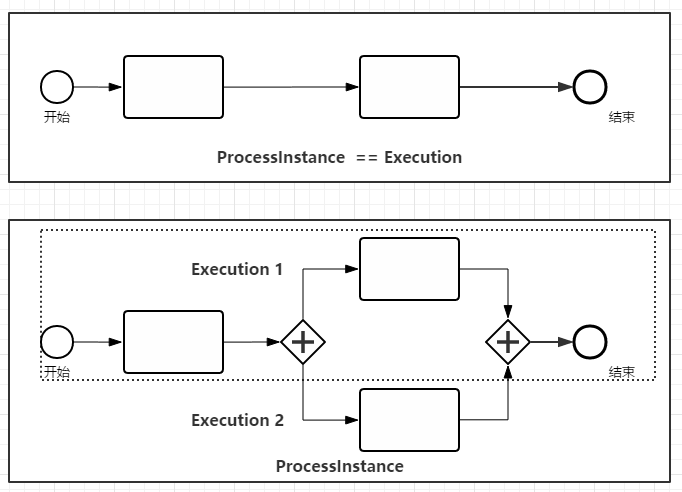

> | 类型    | 名称              | 释义         |
> | ------- | ----------------- | ------------ |
> | service | RepositoryService | 流程定义服务 |
> |         |                   |              |
> |         |                   |              |
>
> 

# 1.ProcessEngine

> 说明:
>
> Activiti中最核心的类,其他的类都是由他而来

## 1.1获取方式

### a. bullid

```java
ProcessEngineConfiguration configuration = ProcessEngineConfiguration.createProcessEngineConfigurationFromResource("/activiti.cfg.xml");
ProcessEngine processEngine = configuration.buildProcessEngine();
```

### b.default

```java
ProcessEngine processEngine = ProcessEngines.getDefaultProcessEngine();
```

## 1.2获取Service

```java
// 流程部署修改删除
RepositoryService repositoryService = processEngine.getRepositoryService();
// 流程运行
RuntimeService runtimeService = processEngine.getRuntimeService();
TaskService taskService = processEngine.getTaskService();
// 历史记录
HistoryService historyService = processEngine.getHistoryService();
// 页面表单
FormService formService = processEngine.getFormService();
// 用户管理
IdentityService identityService = processEngine.getIdentityService();
ManagementService managementService = processEngine.getManagementService();
```
# 2. Service
## 2.1 管理流程定义 `RepositoryService`

是Activiti的仓库服务类,所谓的仓库指流程定义文档的两个文件,bpmn文件和流程图片

a.生产方式

```java
RepositoryService repositoryService = processEngine.getRepositoryService();
```

b. 定义流程部署

```java
DeploymentBuilder createDeployment = repositoryService.createDeployment();
```

c.删除流程

```java
repositoryService.deleteDeployment(deploymentId);
```


## 2.3 执行管理

##  `RuntimeService`

是activiti的流程执行服务类 , 可以从这个服务类中获取很多关于流程执行相关的信息 .

## 2.4 任务管理 `TaskService`

是activiti的任务服务类 , 可以从这个类中获取任务的信息 .

## 2.5 历史管理 `HistoryService`

是activiti的查询历史信息的类 , 在一个流程执行完成后 , 这个对象为我们提供查询历史信息 .

## 2.6 表单管理 `FormService`

是一个可选服务。即使不使用它，Activiti也可以完美运行， 不会损失任何功能。这个服务提供了*启动表单*和*任务表单*两个概念。*启动表单*会在流程实例启动之前展示给用户， *任务表单*会在用户完成任务时展示。Activiti支持在BPMN 2.0流程定义中设置这些表单。 这个服务以一种简单的方式将数据暴露出来。再次重申，它时可选的， 表单也不一定要嵌入到流程定义中。

## 2.7 组织机构管理 `IdentityService`

非常简单。它可以管理（创建，更新，删除，查询...）群组和用户。 请注意， Activiti执行时并没有对用户进行检查。 例如，任务可以分配给任何人，但是引擎不会校验系统中是否存在这个用户。 这是Activiti引擎也可以使用外部服务，比如ldap，活动目录，等等。

## 2.8 管理器服务 `ManagementService`

在使用Activiti的定制环境中基本上不会用到。 它可以查询数据库的表和表的元数据。另外，它提供了查询和管理异步操作的功能。 Activiti的异步操作用途很多，比如定时器，异步操作， 延迟暂停、激活，等等。后续，会讨论这些功能的更多细节。

# 3. 流程
## 3.1 流程定义 `ProcessDefinition` 
* `act_re_procdef` 
* 流程定义类 , 可以从这里获得资源文件等 . 当流程被部署后 , 查询出来的数据就是流程定义的数据 .
* 表示流程定义的环节


## 3.2 流程实例 `ProcessInstance` 
* 代表流程定义的执行实例 . 一个流程实例就表示一个流程从开始到结束的最大的流程分支 , 即一个流程中流程实例只有一个
* 表示当前执行的流程

## 3.3 执行实例 `Execution` 

* `act_ru_execution`

* activiti用这个对象去描述流程执行的每一个节点 . 在没有并发的情况下 , Execution就是同PricessInstance . 流程按照流程定义的规则执行一次的过程 , 就可以用执行对象 Execution .

* 只有在有分支和汇合时 `ProcessInstance`  == `Execution1 + Execution2`

* 只有在没有分支和汇合时 `ProcessInstance`  == `Execution`

* 如图

  

## 3.4 任务实例 `TaskInstance ` 

* `act_ru_task`

  


