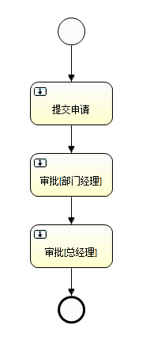
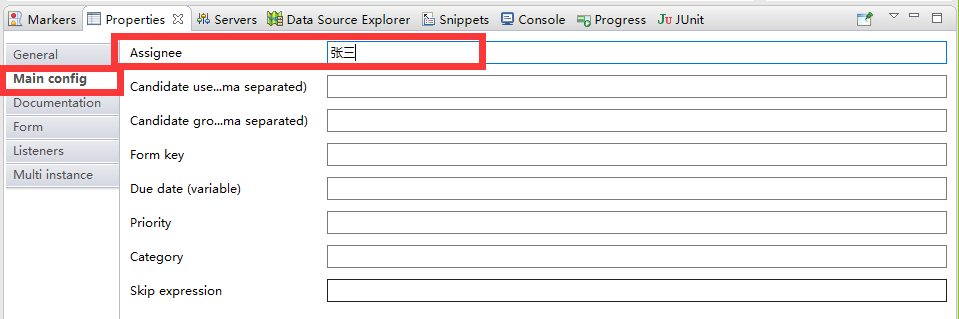

# 1.流程图

1. 画流程图




2. 定义代理人



3. 定义流程id和name


# 2.部署流程

## 2.1 classpath 方式

```java
	/**
	 * 部署流程使用classpath
	 */
	@Test
	public void deployProcess01() {
		RepositoryService repositoryService = this.processEngine.getRepositoryService();
		Deployment deploy = repositoryService
				// 创建
				.createDeployment()
				// 名称
				.name("请假流程001")
				// 路径
				.addClasspathResource("HelloWorld.bpm")
				// 路径
				.addClasspathResource("HelloWorld.png")
				// 部署
				.deploy();
		System.out.println("部署成功:流程部署ID = " + deploy.getId());
	}
```

## 2.2 inputStream 方式

```java
	/**
	 * 部署流程使用zip 流程图的文件必须是xxx.zip
	 */
	@Test
	public void deployProcess02() {
		// 获取流文件
		InputStream inputStream = this.getClass().getResourceAsStream("/HelloWorld.zip");
		System.out.println(inputStream);
		RepositoryService repositoryService = this.processEngine.getRepositoryService();
		Deployment deploy = repositoryService
				// 创建
				.createDeployment()
				// 名称
				.name("请假流程001")
				// 添加流文件
				.addZipInputStream(new ZipInputStream(inputStream))
				// 部署
				.deploy();
		System.out.println("部署成功:流程部署ID = " + deploy.getId());
	}
```


# 3.启动流程

```java
/**
 * 启动流程
 */
@Test
public void startProcess() {
    RuntimeService runtimeService = this.processEngine.getRuntimeService();
    // 使用id启动
    String processDefinitionId = "HelloWorld_ID:1:2504";
    // runtimeService.startProcessInstanceById(processDefinitionId);
    // 使用key启动
    String processDefinitionKey = "HelloWorld_ID";
    runtimeService.startProcessInstanceByKey(processDefinitionKey);
    System.out.println("流程启动成功");
}
```


# 4.查询流程

```java
/**
 * 查询任务
 */
@Test
public void findTask() {
	TaskService taskService = this.processEngine.getTaskService();
    // 按照代理人查询
	String assignee = "张三";
	List<Task> list = taskService.createTaskQuery().taskAssignee(assignee).list();
	if (null != list && list.size() > 0) {
		for (Task task : list) {
			System.out.println("任务ID:" + task.getId());
			System.out.println("流程定义ID:" + task.getProcessInstanceId());
			System.out.println("流程实例ID:" + task.getProcessInstanceId());
			System.out.println("流程执行ID:" + task.getExecutionId());
			System.out.println("人物名称:" + task.getName());
			System.out.println("任务办理人:" + task.getAssignee());
			System.out.println("^^^^^^^^^^^^^^^^^^^");
		}
	}
```


# 5.办理流程

```java
/**
 * 办理任务
 */
@Test
public void conpleteTask() {
	TaskService taskService = this.processEngine.getTaskService();
    // 当前的流程任务id
	String taskId = "10004";
	taskService.complete(taskId);
	System.out.println("任务完成");
}
```

