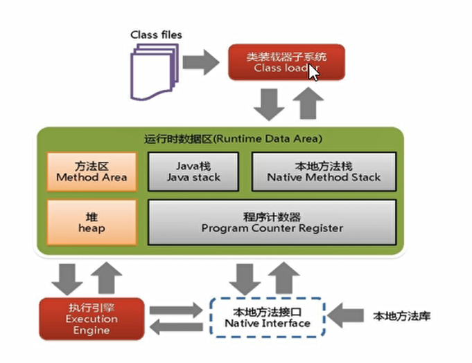
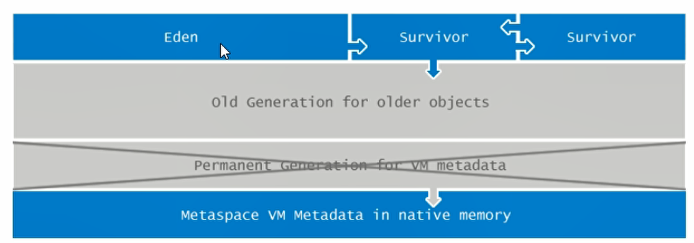
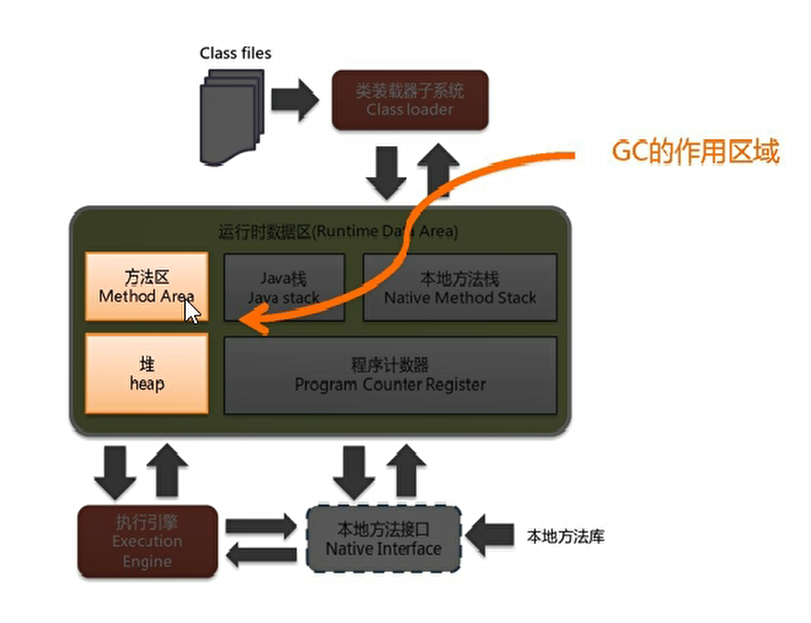
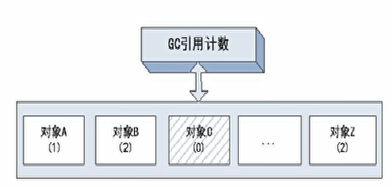

# JVM

## JVM体系结构概览

## Java8以后的JVM

- Survivor：幸存者区0 和幸存者1
- Eden：伊甸园区
- Old Generation for older objects：养老区
- Permanent Generation for VM metadata：永久带（jdk1.7之前）
- Metaspace VM Metadata in native memory：元空间（jdk1.8开始）

> 官方的解释：http://openjdk.java.net/jeps/122

# GC

垃圾回收器

## 作用域

## 垃圾回收的算法

### 1.引用计数

缺点：

- 每次对对象赋值处理均要维护引用计数器，且计数器本身也有一定消耗。
- 较难处理循环引用

> JVM实现一般不采用这种方式

### 2.复制

> 处理过程：复制>>清空>>互换

Java堆从GC的角度可以细分为**新生代（Eden、Form Survivor和To Survivor）**和老年代。

1. eden、FromSurvivor和ToSurvivor，年龄+1
   
   首先，当Eden区满的时候会触发一次GC，把还活着的对象拷贝到FromSurvivor区，当Eden区再次触发的时候，会扫描Eden区和FromSurvivor区，对这两个区进行垃圾回收，经过这次回收还存活的对象，则直接复制到ToSurvivor区（如果对象的年龄已经到达了老年的标准，则赋值到老年代区），同时把这些对象的年龄+1；

2. 清空eden、FromSurvivor
   
   然后清空Eden、和FromSurvivor区中的对象，也即复制后有交换，谁空谁是to

3. ToServivor和FromSurvivor互换
   
   最后，ToServivor和FromSurvivor互换，FromSurvivor变成To，ToSurvivor变成From；
   
   部分对象会在From和To中来回复制，如此交换15次（由JVM参数MaxTenuringThreshold决定，这个参数默认是15），最终如果还是存活就存入老年代。

> 优点：数据不会在内存中碎片化
> 
> 缺点：浪费时间

### 3.标记清除

Mark-Sweep 标记请吃

此算法分为两步：先要标记出要回收的对象，然后统一回收这些对象；

### 4.标记整理

1. 标记
   
   与标记清除一样

2. 压缩：
   
   再次扫描，并整理空间（类似碎片整理）

> 但是移动成本较大