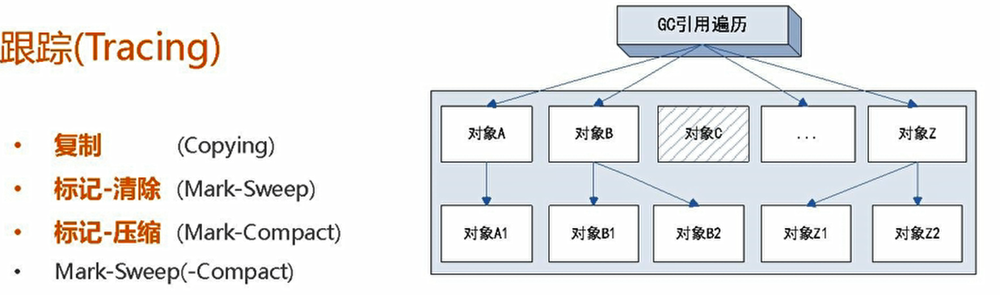
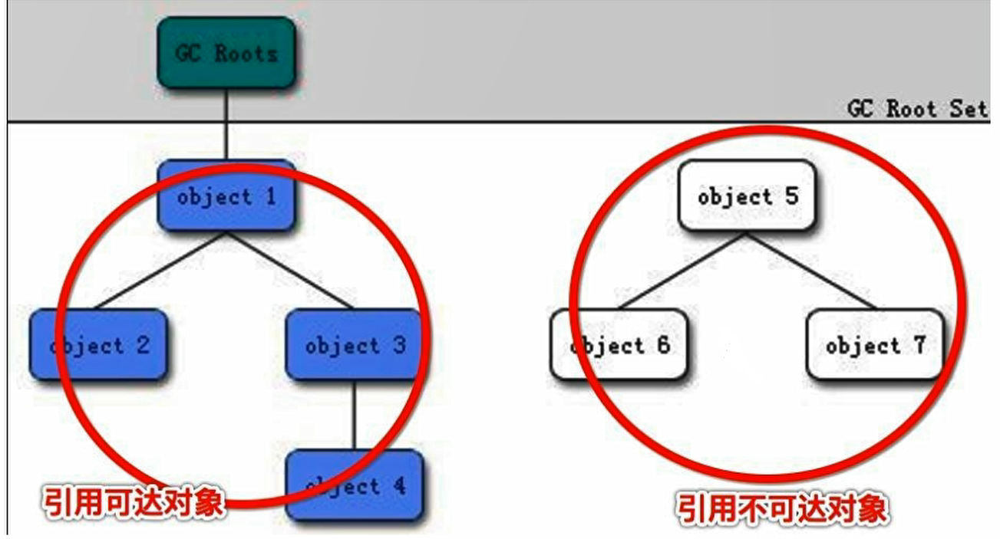

# 垃圾

简单的说就是内存中已经不再被使用到的空间就是垃圾

# 如何判断对象是垃圾

## 引用计数器法

> 不详细解释

## `GCroot`

#### 可达性分析

为了解决引用计数法的循环引用的 问题，Java使用了可达性分析法

所谓“GCRoot”或者说t  racing GC的“根集合”就是一组必须活跃的引用。

​	**基本思路就是通过一系列名为“GCroot”的对象作为起点**，开始向下搜索，如果一个对象到GCroot没有任何引用链是，则说明这个对象不可用。也即给定一个集合的引用作为跟触发，通过引用关系遍历对象，能被遍历到的（可到达的）对象就被判定为存活：没有遍历到的就自然被判定为死亡。

#### GCroot对象有哪些

1. 虚拟机栈（栈帧中的局部变量区，也叫做局部变量表）中引用的对象。；
2. 方法区中的类静态属性引用的对象；
3. 方法区常亮引用对象；
4. 本地方法栈中JNI（Native方法）引用的对象；