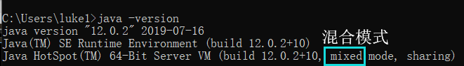
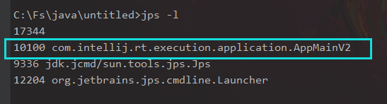
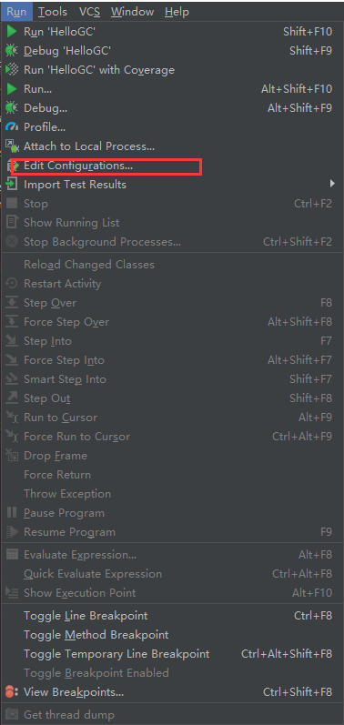
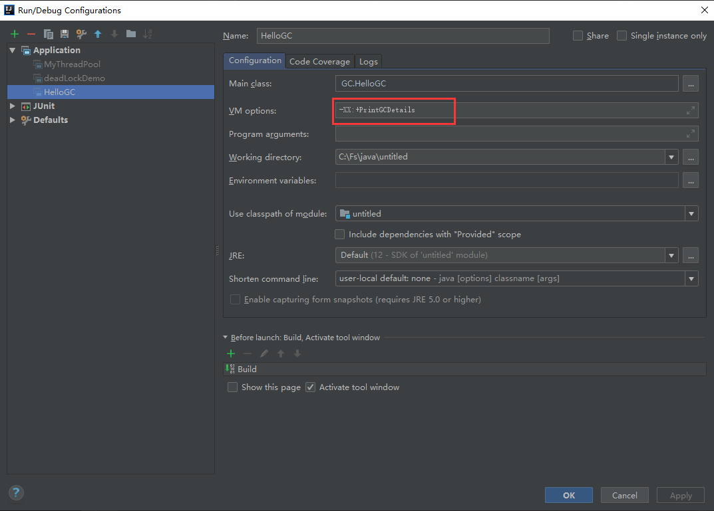
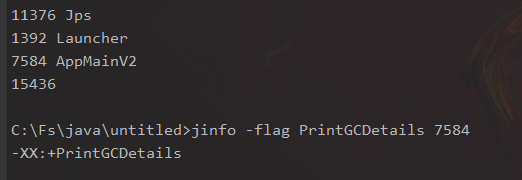
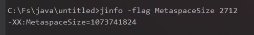

# JVM调优

## JVM参数类型

> [详细解释【简书】](https://www.jianshu.com/p/1c6b5c2e95f9) 

### 标配参数

1. `java -version`
2. `java -help`
3. `java -showversion`

### X参数

1. `-Xint`：解释执行
2. `-Xcomp`：第一次使用就编译成本地代码
3. `-Xmixed`：混合模式



### ==XX参数==

#### Boolean类型

##### 公式

1. `-XX:+属性名`：表示开启
2. `-XX:-属性名`：表示关闭

##### Case（实例）

- `jps -l`



- `jinfo -flag PrintGCDetails 101000`：查看该开关是否打开

  

- 配置参数

  - 使用idea添加参数

  



- 查看该参数的属性是否打开



#### KV类型

##### 公式

`-XX:key=value`

##### case（实例）

先查看当前元空间初始值


配置元空间

```
-XX:MetaspaceSize=1024m
```


重新查看元空间大小



### 查看当前运行程序的配置


1. `jps -l`：获取进程号

2. `jinfo -flag 属性名 进程号` 

   ```cmd
   -XX:MetaspaceSize=1073741824
   ```

3. 获取所有的参数：`jinfo -flags 进程号`

   ```cmd
   C:\Users\luke1>jinfo -flags 2712
   VM Flags:
   -XX:CICompilerCount=4 
   -XX:ConcGCThreads=3 
   -XX:G1ConcRefinementThreads=10 
   -XX:G1HeapRegionSize=1048576 
   -XX:GCDrainStackTargetSize=64 
   -XX:InitialHeapSize=266338304 
   -XX:MarkStackSize=4194304 
   -XX:MaxHeapSize=4261412864 
   -XX:MaxNewSize=2556428288 
   -XX:MetaspaceSize=1073741824 
   -XX:MinHeapDeltaBytes=1048576 
   -XX:NonNMethodCodeHeapSize=5836300 
   -XX:NonProfiledCodeHeapSize=122910970 
   -XX:ProfiledCodeHeapSize=122910970 
   -XX:ReservedCodeCacheSize=251658240 
   -XX:+SegmentedCodeCache 
   -XX:+UseCompressedClassPointers 
   -XX:+UseCompressedOops 
   -XX:+UseG1GC 
   -XX:-UseLargePagesIndividualAllocation
   ```

## ==面试的坑==

> 坑：`-XMS1024m -Xmx1024m`
>
> ​	由于这两个参数常用，所有有一下简单的7用法
>
> - `-Xms` = `-XX:InitialHeapSize`
> - `-Xmx` = `-XX:MaxHeapSize`

## JVM参数的默认值

控制台输入：

```cmd
java -XX:+PrintFlagInitial
```

输出：[JVM参数默认(jdk12).txt](JVM参数默认(jdk12).txt)

- ==`:=`：表示人为修改过的==


## JVM参数最终的值

控制输入：

```cmd
java -XX:+PrintFlagsFinal
```

## JVM常用参数的值

```cmd
java -XX:+PrintCommandLineFlags -version
```

```cmd
-XX:G1ConcRefinementThreads=10 
-XX:GCDrainStackTargetSize=64 
-XX:InitialHeapSize=266275648 
-XX:MaxHeapSize=4260410368 
-XX:+PrintCommandLineFlags 
-XX:ReservedCodeCacheSize=251658240 
-XX:+SegmentedCodeCache 
-XX:+UseCompressedClassPointers 
-XX:+UseCompressedOops 
-XX:+UseG1GC 
-XX:-UseLargePagesIndividualAllocation 
java version "12.0.2" 2019-07-16
Java(TM) SE Runtime Environment (build 12.0.2+10)
Java HotSpot(TM) 64-Bit Server VM (build 12.0.2+10, mixed mode, sharing)
```

> -XX:+UseG1GC 使用GC垃圾回收器
>
> JVM不同GC默认使用的也不同


## 修改JVM参数值

在启动java程序的时候输入要修改的值：

```cmd
java -XX:MetaspaceSize=300m -Xss128k 要运行的class
```

