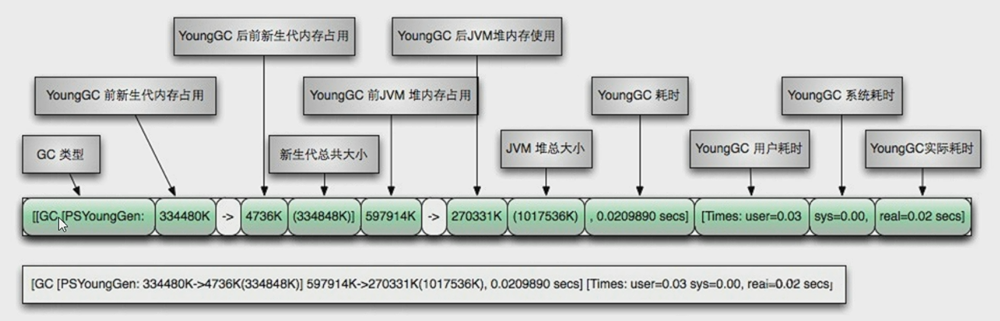
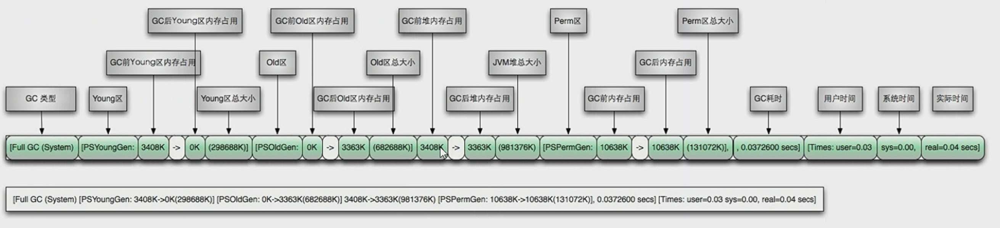
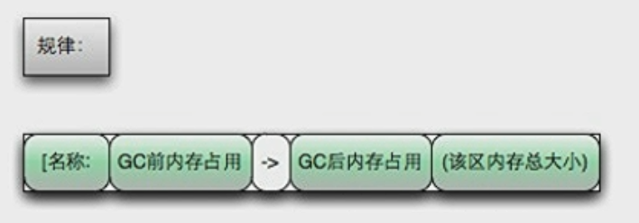

# JVM常用的参数

范例：

```java
long totalMemory = Runtime.getRuntime().totalMemory();//初始内存大小
long maxMemory = Runtime.getRuntime().maxMemory();//最大内存大小
System.out.println("初始内存大小\t"+((double)totalMemory)/1024.0/1024.0+"MB");
System.out.println("最大内存大小\t"+((double)maxMemory)/1024.0/1024.0+"MB");
```

结果：

```cmd
初始内存大小	254.0MB
最大内存大小	4064.0MB
```

## 常用参数

| 参数                     | 默认值               | 释义                                            |
| ------------------------ | -------------------- | ----------------------------------------------- |
| -Xms                     | 物理内存的**1/64**   | 初始内存大小，等价`-XX:InitialHeapSize`         |
| -Xmx                     | 物理内存的**1/4**    | 最大内存大小，等价`-XX:MaxHeapSize`             |
| -Xss                     | 一般为**512k~1024k** | 设置单个线程栈的大小，等价`-XX:ThreadStackSize` |
| -Xmn                     | 堆空间的**3\1**      | 设置年轻代大小，                                |
| -XX:MetaspaceSize        |                      | 设置元空间                                      |
| -XX:+PrintGCDeails       |                      |                                                 |
| -XX:Survivor             |                      |                                                 |
| -XX:NewRatio             |                      |                                                 |
| -XX:MaxTenuringThreshold |                      |                                                 |

>  [官方文档](https://docs.oracle.com/en/java/javase/12/tools/java.html#GUID-3B1CE181-CD30-4178-9602-230B800D4FAE)

### -Xms 堆的初始大小

设置堆的初始大小（以字节为单位）。该值必须是1024的倍数且大于1 MB。附加字母`k`或`K`表示千字节，`m`或`M`指示兆字节，`g`或`G`指示千兆字节。以下示例显示如何使用各种单位将分配的内存大小设置为6 MB：

```
-Xms6291456
-Xms6144k
-Xms6m
```

如果未设置此选项，则将初始大小设置为为旧代和年轻代分配的大小的总和。可以使用`-Xmn`选项或`-XX:NewSize`选项设置年轻代的堆的初始大小。

### -Xmx 内存分配池的最大大小

指定内存分配池的最大大小（以字节为单位），以字节为单位。该值必须是1024的倍数且大于2 MB。附加字母`k`或`K`表示千字节，`m`或`M`表示兆字节，和/ `g`或`G`表示千兆字节。根据系统配置在运行时选择默认值。对于服务器部署，`-Xms`并`-Xmx`经常设置为相同的值。以下示例显示如何使用各种单位将分配的内存的最大允许大小设置为80 MB：

```
-Xmx83886080
-Xmx81920k
-Xmx80m
```

该`-Xmx`选项相当于`-XX:MaxHeapSize`。

### -Xss 线程堆栈大小

设置线程堆栈大小（以字节为单位）。附加字母`k`或`K`表示KB，`m`或`M`表示MB，和/ `g`或`G`表示GB。默认值取决于平台：

* Linux / x64（64位）：1024 KB
* OS X（64位）：1024 KB
* Oracle Solaris / x64（64位）：1024 KB
* Windows：默认值取决于虚拟内存

以下示例以不同的单位将线程堆栈大小设置为1024 KB：

```
-Xss1m
-Xss1024k
-Xss1048576
```

此选项类似于`-XX:ThreadStackSize`。

### -Xmn 年轻代堆的最大大小

设置年轻代（托儿所）的堆的初始和最大大小（以字节为单位）。附加字母`k`或`K`表示千字节，`m`或`M`表示兆字节，`g`或`G`表示千兆字节。堆的年轻代区域用于新对象。GC在该区域比在其他区域更频繁地进行。如果年轻一代的规模太小，那么就会进行大量的小型垃圾收集。如果大小太大，则只执行完整的垃圾收集，这可能需要很长时间才能完成。Oracle建议您保持年轻代的大小大于25％且小于整个堆大小的50％。以下示例显示如何使用各种单位将年轻代的初始和最大大小设置为256 MB：

```
-Xmn256m
-Xmn262144k
-Xmn268435456
```

取而代之的是的`-Xmn`，为年轻一代都设置堆的初始和最大大小选项，您可以使用`-XX:NewSize`设置初始大小和`-XX:MaxNewSize`设置的最大尺寸。

### -XX:MeataspaceSize 元空间

​	元空间的本质和永久代类似,都是对JVM规范中方法区的实现。

​	不过元空间与永久带的最大区别在于：

- **元空间并不在虚拟机中，而是使用本地内存。**

  因此，默认情况下，元空间的 大小受本地内存限制。

```
-XX:MetaspaceSize=1024m
```

### -XX:+PrintGCDetails GC详情

打印垃圾回收的细节情况

- 配置

```
-XX:PrintGCDetails
```

- 运行Hello World!

```
Hello World!
Heap
 PSYoungGen      total 2560K, used 1797K [0x00000000ffd00000, 0x0000000100000000, 0x0000000100000000)
  eden space 2048K, 87% used [0x00000000ffd00000,0x00000000ffec1538,0x00000000fff00000)
  from space 512K, 0% used [0x00000000fff80000,0x00000000fff80000,0x0000000100000000)
  to   space 512K, 0% used [0x00000000fff00000,0x00000000fff00000,0x00000000fff80000)
 ParOldGen       total 7168K, used 0K [0x00000000ff600000, 0x00000000ffd00000, 0x00000000ffd00000)
  object space 7168K, 0% used [0x00000000ff600000,0x00000000ff600000,0x00000000ffd00000)
 Metaspace       used 3240K, capacity 4496K, committed 4864K, reserved 1056768K
  class space    used 353K, capacity 388K, committed 512K, reserved 1048576K
```


- 如果内存满了

  - 配置

  ```java
  -XX:+PrintGCDetails -Xmx10m -Xms10m
  ```

  - java

  ```java
  public class Main {
  
  	public static void main(String[] args) {
  		byte[] bytes = new byte[50*1024*1024];
  		System.out.println("Hello World!");
  	}
  }
  ```

  - 结果

  ```
  [GC (Allocation Failure) [PSYoungGen: 1800K->488K(2560K)] 1800K->728K(9728K), 0.0008121 secs] [Times: user=0.00 sys=0.00, real=0.00 secs] 
  [GC (Allocation Failure) [PSYoungGen: 488K->440K(2560K)] 728K->680K(9728K), 0.0004255 secs] [Times: user=0.00 sys=0.00, real=0.00 secs] 
  [Full GC (Allocation Failure) [PSYoungGen: 440K->0K(2560K)] [ParOldGen: 240K->609K(7168K)] 680K->609K(9728K), [Metaspace: 3246K->3246K(1056768K)], 0.0049692 secs] [Times: user=0.00 sys=0.00, real=0.01 secs] 
  [GC (Allocation Failure) [PSYoungGen: 0K->0K(2560K)] 609K->609K(9728K), 0.0005766 secs] [Times: user=0.00 sys=0.00, real=0.00 secs] 
  [Full GC (Allocation Failure) Exception in thread "main" java.lang.OutOfMemoryError: Java heap space
  	at Main.main(Main.java:4)
  [PSYoungGen: 0K->0K(2560K)] [ParOldGen: 609K->592K(7168K)] 609K->592K(9728K), [Metaspace: 3246K->3246K(1056768K)], 0.0046706 secs] [Times: user=0.11 sys=0.00, real=0.01 secs] 
  Heap
   PSYoungGen      total 2560K, used 80K [0x00000000ffd00000, 0x0000000100000000, 0x0000000100000000)
    eden space 2048K, 3% used [0x00000000ffd00000,0x00000000ffd14340,0x00000000fff00000)
    from space 512K, 0% used [0x00000000fff00000,0x00000000fff00000,0x00000000fff80000)
    to   space 512K, 0% used [0x00000000fff80000,0x00000000fff80000,0x0000000100000000)
   ParOldGen       total 7168K, used 592K [0x00000000ff600000, 0x00000000ffd00000, 0x00000000ffd00000)
    object space 7168K, 8% used [0x00000000ff600000,0x00000000ff694260,0x00000000ffd00000)
   Metaspace       used 3301K, capacity 4496K, committed 4864K, reserved 1056768K
    class space    used 362K, capacity 388K, committed 512K, reserved 1048576K
  ```

- **GC** 



- **FullGC**

  

- 规律



### -XX:SurvivorRatio 幸存区的占比

- 设置新生代中eden(伊甸园区)和S0/S1空间的比例

- 默认为 : `-XX:SurvivorRatio=8`

  ```
    eden space 2048K, 87% used [0x00000000ffd00000,0x00000000ffec1538,0x00000000fff00000)
    from space 512K, 0% used [0x00000000fff80000,0x00000000fff80000,0x0000000100000000)
    to   space 512K, 0% used [0x00000000fff00000,0x00000000fff00000,0x00000000fff80000)
  ```

  

### -XX:NewRatio 新生代与老年代的占比

- 配置新生代和老年代在堆结构的占比

- 默认 : `-XX:NewRatio=2` 新生代占1,老年代占2

- 老年代

  ```
  ParOldGen       total 7168K, used 0K [0x00000000ff600000, 0x00000000ffd00000, 0x00000000ffd00000)
  ```

- 新生代

  ```
   Metaspace       used 3240K, capacity 4496K, committed 4864K, reserved 1056768K
  ```

### -XX:MaxTenuringThreshold  进入老年代的GC次数

- 默认 15次
- 范围 0 到 15 次


