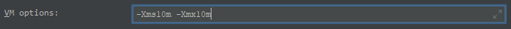
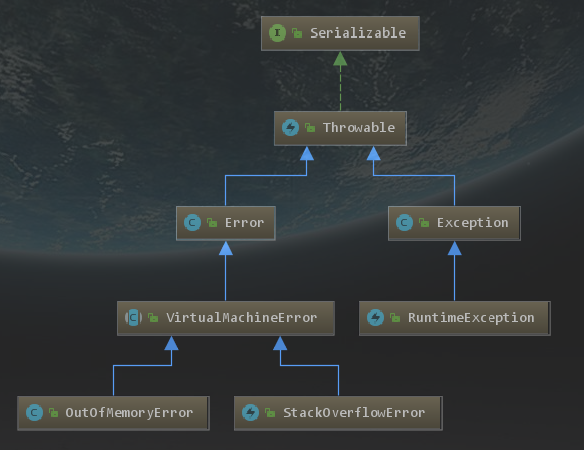

# OutOfMemoryError:java heap space

配置运行参数



测试代码

```java
String nihao = "nihao";
while (true){
    nihao += new Random().nextInt(1111111111);
}
```

返回结果

```cmd
Exception in thread "main" java.lang.OutOfMemoryError: Java heap space
	at java.util.Arrays.copyOf(Arrays.java:3332)
	at java.lang.AbstractStringBuilder.ensureCapacityInternal(AbstractStringBuilder.java:124)
	at java.lang.AbstractStringBuilder.append(AbstractStringBuilder.java:674)
	at java.lang.StringBuilder.append(StringBuilder.java:208)
	at oom.OOM.main(OOM.java:9)
```

Error 继承图

