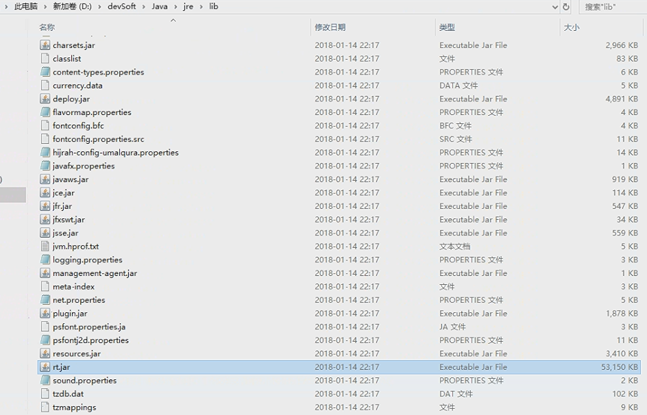
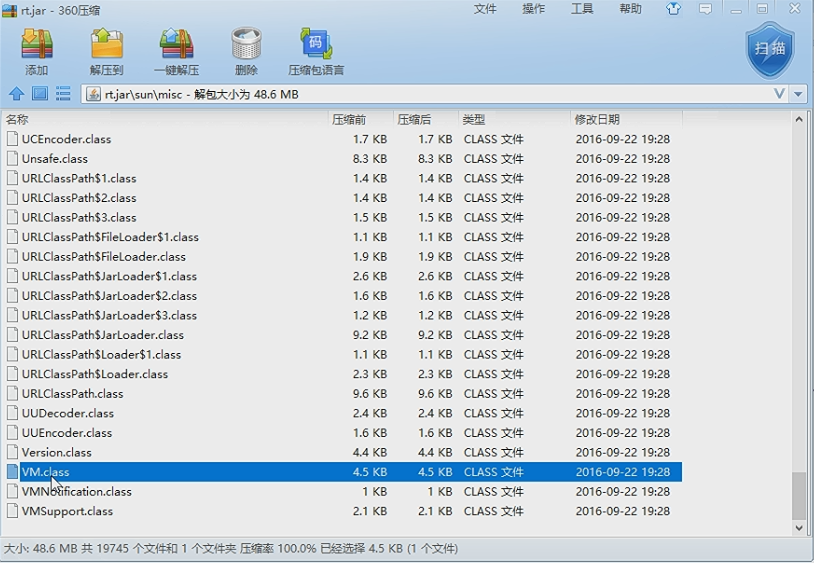
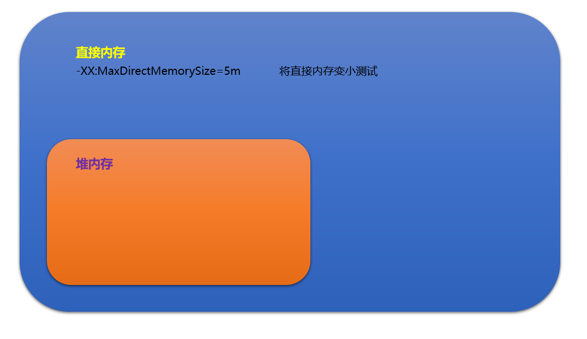

# OutOfMemoryError:Direct buffer memory

直接内存错误

- 元空间爆炸
- 低层设计NIO
- 主要由NIO以你器

## 导致原因

写NIO程序时,经常使用ByteBuffer来读取或者写入数据,这是一种基于通道(Channle)与缓冲区(Buffer)的IO方式;

它可使用Native函数库直接分配堆外内存,然后通过Java堆里面的DirectByteBuffer对象作为这块内存的引用进行操作;

这样能在一些场景显著提高性能,因为避免了在java和Native堆中来回复制数据;

`ByteBuffer.allocate(capability)`第一种方式是分配JVM对内存,属于GC的管辖范围,由于需要拷贝所以相对速度比较慢;

`ByteBuffer.allocteDirect(capability)`第二种方式是分配一个新的直接字节缓冲区。新的缓冲区的位置将为零，它的限制将是它的容量，它的标记将是未定义的，它的每个元素将初始化为零。

但如果不断分配本地内存,对内存已经很少使用,那么JVM就不需要执行GC,DirectBytyeBuffer对象就不会被回收,这时候内存充足,但本地内存可能使用光了,再次尝试分配本地内存就会出现OutOfMemoryError,那程序就直接崩溃了;





## 使用java代码获取最大直接内存

```java
System.out.println("maxDirectMemory:" + ((sun.misc.VM.maxDirectMemory()) / 1024.0 / 1024.0) + "MB");
```

```cmd
maxDirectMemory:3627.0MB
```

> 默认直接内存为系统内存的四分之一




## 错误实现

 ```java
System.out.println("maxDirectMemory:" + ((sun.misc.VM.maxDirectMemory()) / 1024.0 / 1024.0) + "MB");
Thread.sleep(500);
// -XX:MaxDirectMemorySize=5m 配置直接内存的大小
ByteBuffer byteBuffer = ByteBuffer.allocateDirect(6 * 1024 * 1024);
 ```

```cmd
maxDirectMemory:5.0MB
Exception in thread "main" java.lang.OutOfMemoryError: Direct buffer memory
	at java.nio.Bits.reserveMemory(Bits.java:693)
	at java.nio.DirectByteBuffer.<init>(DirectByteBuffer.java:123)
	at java.nio.ByteBuffer.allocateDirect(ByteBuffer.java:311)
	at oom.OOM.main(OOM.java:10)
```


