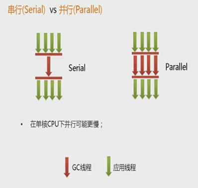
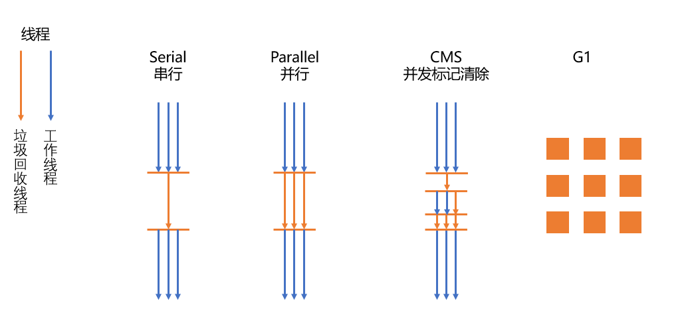

# 四种垃圾收集器

## GC的算法

1. 引用计数
2. 复制
3. 标清
4. 标整

> 没有完美的收集器 , 更没有万能的收集器 , 只能针对具体应用使用最适合的收集器

## 4种主要垃圾收集器

### 1. 串行垃圾回收器(Serial)

- 它只为单线程环境设计 , 且只使用一个线程进行垃圾回收 , 会暂行所有的用户线程 . 不适合服务器

### 2.并行垃圾回收器(Parallel)

- 多个垃圾收集线程并行工作 , 此时使用线程是暂停的 , 使用与科学计算 / 大数据处理首台处理等若交互场景

### 3.并发标记垃圾回收器(CMS)

- 用户线程和垃圾回收线程同时执行( 不一定是并行 , 可能是交替执行) , 不需要停顿用户线程 , 服务器多数用它 , 适用于对响应时间有要求的场景

> 截止Java以前 , 基本是以上的3种垃圾回收器

### 4. G1 垃圾回收器 (Java8-10)

- G1垃圾回收器将对内存分割成不同的区域然后并发的对其进行垃圾回收

