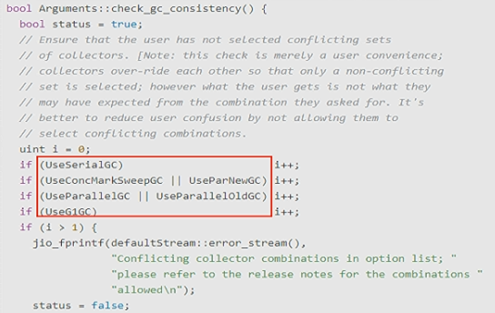
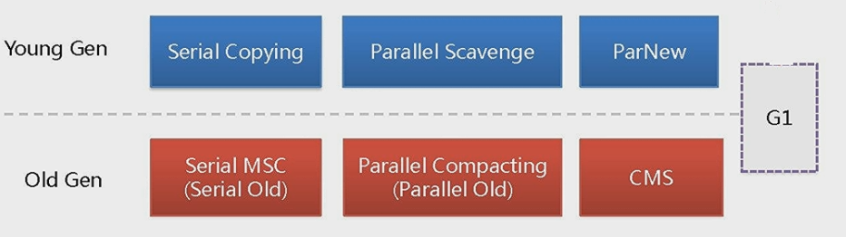
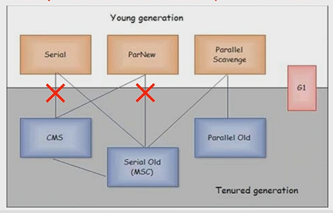
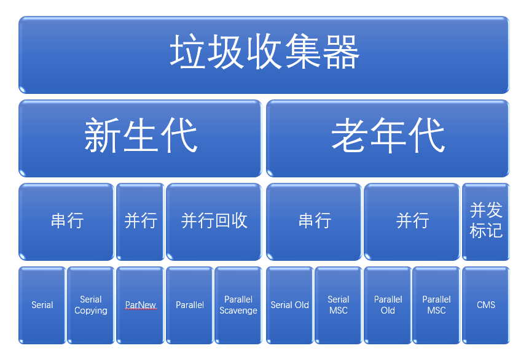
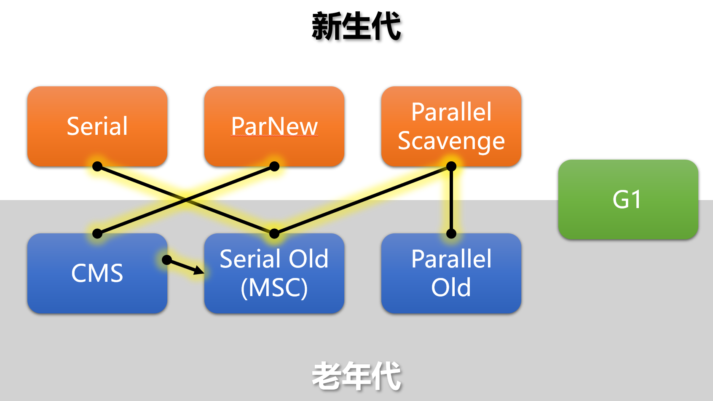
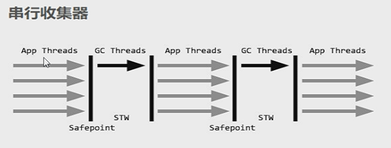
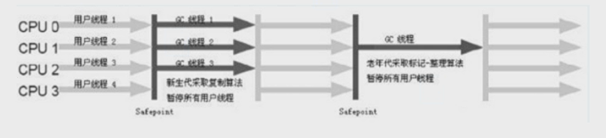
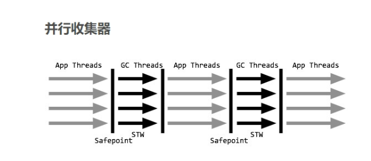
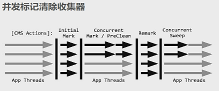
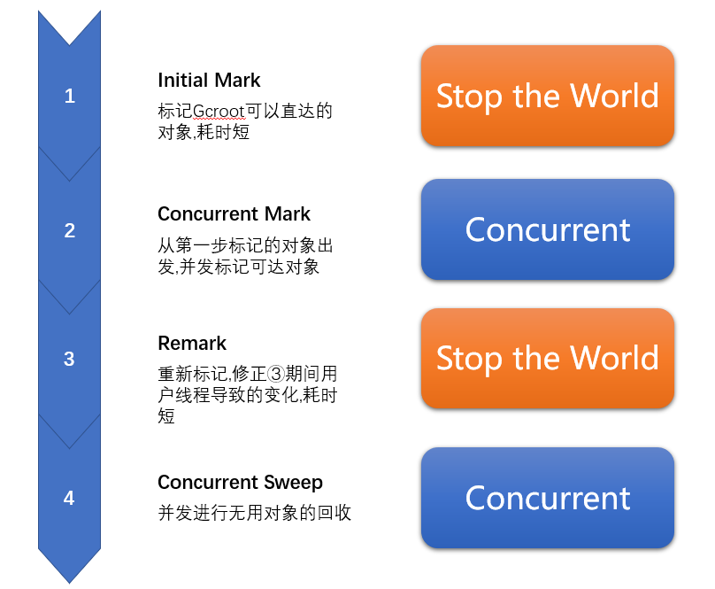

 JVM JMM GC

# 1.查看GC垃圾回收器的默认配置


```cmd
>java -XX:+PrintCommandLineFlags -version
```

```cmd
-XX:InitialHeapSize=267322432 -XX:MaxHeapSize=4277158912 -XX:+PrintCommandLineFlags -XX:+UseCompressedClassPointers -XX:+UseCompressedOops -XX:-UseL
argePagesIndividualAllocation -XX:+UseParallelGC
java version "1.8.0_102"
Java(TM) SE Runtime Environment (build 1.8.0_102-b14)
Java HotSpot(TM) 64-Bit Server VM (build 25.102-b14, mixed mode)

```

- 默认 :  `-XX:+UseParallelGC` [并行垃圾回收器]

> - 常见的GC
> 	- 串行垃圾回收器 : `UseSerialGC`
> 	- 并行垃圾回收器 : `UseParallelGC`
> 	- 并发垃圾回收器 : `UseConcMarkSweepGC[CMS]`
> 	- G1垃圾回收器 : `G1GC`



## 查看正在运行的GC类型

1. 运行java程序

	```java
	public class GC {
		public static void main(String[] args) throws Exception {
			System.out.println("启动");
			Thread.sleep(Integer.MAX_VALUE);
		}
	}
	```

2. 查看进程

	```cmd
	>jps -l
	```

	```cmd
	338276 org.jetbrains.jps.cmdline.Launcher
	338292 GC
	2900
	336832 GC
	246692 org.jetbrains.idea.maven.server.RemoteMavenServer
	338652 sun.tools.jps.Jps
	```

	

3. 查看GC

	```cmd
	>jinfo -flag UseSerialGC 338292 ##查看串行GC
	>jinfo -flag UseParallelGC 338292 ##查看并行GC
	```

	

# 2.更改默认的垃圾回收器 

启动java是加入参数

```
-XX:+UseSerialGC ##[+]代表打开
```

# 3.垃圾回收器使用范围



垃圾回收器就来具体实现这些GC算法并实现内存回收 .

不同厂商、不同版本的虚拟机实现**差别很大** , HoSpot中包含收集器如下 :

> 红色表示Java8版本开始 , 对应的垃圾回收器Deprecated , 不推荐使用




# 4.垃圾收集器参数说明

1. ## **DefNew** - *Default New Generation* - <u>默认新生代</u>

2. ## **Tenured** - *Old* - <u>老年代</u>

3. ## **ParNew** - *Parallel New Generation* - <u>并行新生代</u>

4. ## **PSYoungGen** - *Parallel Scavenge* - <u>并行清除年轻代</u>

5. ## **ParOldGen** - *Parallel Old Generation* - *并行的老年代*

# 5.Server/Client 模式

## 1. 使用范围

只要掌握Server模式即可 , Client 模式基本不会用

## 2. 操作系统

1. 32位Window系统不论什么样的硬件默认都使用Client的JVM模式
2. 32位其他操作模式 , 2G内存同时又2个CPU以上的用Server模式 , 低于该配置还是使用Client模式
3. 64位用 Server 模式


# 6.垃圾收集器





## 6.1新生代

### a.串行

#### Serial [新生代] - Serial Copying [老年代]

一句话 : 一个单线程的收集器 , 在进行垃圾收集的时候 , 必须暂停其他所有的工作线程直到它的手机结束



> 串行收集器组合[Serial + Serial Old]

串行收集器是最古老的收集器 , 最稳定以及效率最高的收集器 , 只使用一个线程去回收但其在进行垃圾手机过程中会产生较长的停顿 ( STOP-The-World 状态) . 虽然在垃圾收集过程中需要暂停所有其他的工作线程 , 但是它简单效率高 , 对于限定单个CPU来说 , **没有线程交互的开销可以获得最高的单线程垃圾收集效率** , *因此Serial垃圾收集器依然是Java虚拟机运行在Client模式下默认的新生代垃圾收集器*

#### 对应的参数

```
-XX:UseSerialGC
```

开启后就会使用 **Serial [Young区]** + **Serial Old [Old区]**的收集器组合

表示 : 

* *新生代、老年代都会使用串行收集器 *
* *新生代使用复制算法 *
* *老年代使用标记整理算法*

### b.并行

#### ParNew

> 新生代用并行 , 老年代用串行

一句话 : 使用多线程进行垃圾回收 , 在垃圾收集时 , 会Stop-the-World 暂停其他所有的工作线程直到它收集结束



ParNew收集器实际就是Serial收集器新生代的并行多线程 , 它最常见的是配合老年代的 CMS GC工作 , 其余的行为和Serial收集器完全一样 ,ParNew垃圾收集器在垃圾收集的过程中同样也要暂停所有其他线程 . 它是很多java虚拟机运行在Server模式下新生代的默认垃圾收集器 .

#### 对应的参数

```
-XX:+UseParNewGC
```

- 启用ParNew收集器 , 只影响新生代的垃圾收集器 , 不影响老年代
- 开启上述参数后 , 会使 : ParNew [新生代] + Serial Old [老年代] 的收集器组合
- 新生代使用复制算法 , 老年代采用标记-整理算法

### c.并行回收

#### * Parallel [新生代] - Parallel Scavenge [老年代] -- java8默认   



> 并行收集器组合 [ Parallel Scavenger + Parallel Old ]

Parallel Scavenge收集器类似 ParNew 也是一个新生代垃圾收集器 , 使用复制算法 , 也是一个并行的多线程的垃圾收集器 , 俗称吞吐量优先收集器 . <u>一句话 : 串行收集器在新生代和老年代的并行化</u>

### 它的关注重点 :

* 可控制的吞吐量 ( Thoughput = 运行用户代码时间 / ( 运行用户代码时间 + 垃圾收集时间 ) . 也即比如程序运行100分钟 , 垃圾收集时间1分钟 , 吞吐量就是 99% ) . 高吞吐量意味着高效利用的CPU时间 , 他多用于在后台运算而不需要太多交互的任务 . 
* 自适调节策略也是 ParallelScavenge 收集器与 ParNew 收集器的一个重要区别 , ( 自适应调节策略 : 虚拟机会根据当前系统的运行情况收集性能监控信息 , 动态调整这些参数以提供最合适的停顿时间 [`-XX:MaxGCPacuseMillils`] 或最大吞吐量 )

### 对应参数

```
-XX:+UseParallelGC
```

或者

```
-XX:+UseParallelOldGC
```

可以使用Parallel Scanvenge收集器

开启后 **新生代使用复制算法 , 老年代使用标记-整理算法**

> ```
> -XX:+ParallelGCThreads=n ##表示启动了8n个GC线程
> ```
>
> * cpu > 8 : n = 5/8
> * cpu < 8 : n = 是几个数


#### 

## 6.2老年代

### a.串行

#### Serial Old - Serial MSC (JDK8之后不会用)

### b.并行

#### Parallel Old - Parallel MSC

- Parallel Old收集器是 Parallel Scavenge的老年代版本 吗使用多线程的标记-整理算法 , Parallel Old收集器在JDK1.6才开始提供.

- 在JDK1.6之前 , 新生代使用ParallelScavenge收集器只能搭配老年代的Serial Old收集器 , 只能保证新生代的吞吐量优先 , 无法保证整体的吞吐量 , 在JDK1.6之前 (Parallel Scavenge + Serial Old)
- Parallel Old 正是为了在老年代同样提供吞吐量优先的垃圾收集器 , 如果系统对吞吐量要求比较高 , JDK1.8之后可以优先考虑新生代 Parallel Scavenge 和 老年代 Parallel Old 收集器的搭配策略 , 在JDK1.8及以后(Parallel Scavenge + Parallel Old)

#### 对应参数

```
-XX:+UseParallelOldGC
```

- 使用Parallel Old收集器, 设置该参数后 新生代Parallel + 老年代 Parallel Old

### c.并发标记清除

#### CMS

- CMS收集器 (**Concurrent Mark Sweep : 并发标记清除**) 是一种获取最短回收停顿时间为目标的收集器
- 适合应用在互联网站或者B/S系统的服务器上 , 这类应用尤其重视响应速度 , 希望系统的停顿时间最短.
- CMS非常适合堆内存大 、CPU核数多的服务器端应用 , 也是G1出现前大型应用的首先收集器.



> 并发标记收集器组合 ParNew + CMS + Serial Old

- Concurrent Mark Sweep 并发标记清除 , 并发收集低停顿 , 并发是指的与用户线程一起执行

#### 对应参数

```
-XX:+UseConcMarkSweepGHC
```

- 开启后会将`-XX:+UseParNewGC`打开
- 开启该参数后 , 使用ParNew [新生代] + CMS [老年代] + Serial Old [老年代备用]

####   * 四步过程



1. 初识标记 (CMS initial mark)

	只是标记一下GC Roots能直接关联的对象 , 速度很快 , 但是仍需要暂停所有的工作线程 ;

2. 并发标记 (CMS concurrent mark)

	 进行GC Roots 跟踪的过程 , 和用户线程一起工作 , 不需要暂停工作线程. 主要标记过程 , 标记全部对象 ;

3. 重新标记 (CMS remark)

	为了修正 在并发期间 , 因用户程序继续运行而导致标记产生变动的那一部分进行从新标记记录 , 仍然需要停止所有用户线程 .

	由于并发标记时 , 用户线程依然运行 ,因此在正式清理前 , 在做修正

4. 并发清除 (CMS concurrentsweep)

	清除 GC Roots 不可达对象 , 和用户线程一起工作 , 不需要暂停工作线程 . 基于标记结果 , 直接清理对象 ;

	由于耗时最长的并发标记和并发清除过程中 , 垃圾手机线程可以和用户线程在一起并发工作 , 所以总体上来看CMS收集器的内存回收和用户线程是一起并发执行的 ;

#### 优缺点

##### 优点

- 并发收集低停顿

##### 缺点

- 并发执行,对CPU资源压力大

	由于并发进行 , CMS 在收集与应用线程会同时增加对内存的占用 , 也就是说 , CMS必须在老年代堆内存用尽之前完成垃圾回收 ,否则CMS回收失败时 , 将触发担保机制 , 串行老年代收集器将会以STW的方式进行一次GC , 从而造成较大的停顿时间 ;

- 采用标记清除会产生大量碎片

	标记清除算法无法整理空间碎片 , 老年代空间会随着应用时长被逐步耗尽 , 最后不得不通过担保机制对堆内存进行压缩 ;

	CMS也提供了参数`-XX:CMSFullGCsBeForeCompaction`(默认为0,即每次都进行内存整理) 来指定多少次CMS收集之后 , 进行一次压缩的 FullGC;


