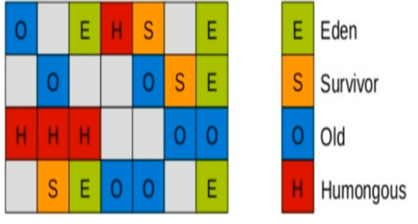
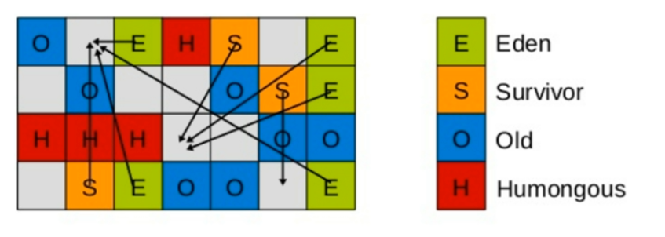
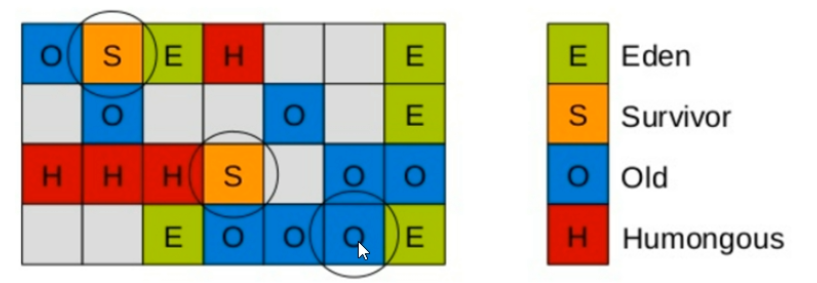
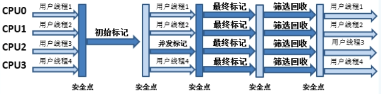

# 以前收集器的特性

1. 新生代和老年代是各自独立的连续内存块
2. 新生代收集使用单 eden+S0+S进行复制算法
3. 老年代收集器必须扫描整个老年代区域
4. 都是以尽可能少儿快的执行GC为原则

# 1.G1是什么!

- G1 (Garbage - First) 收集器 , 是一款面向服务端应用的收集器

	<hr/>

- G1应用在多处理器和大容量内存环境中 , 实现高吞吐量的同时 , 尽可能满足垃圾收集暂停时间的要求 .

- 特性 :

	-  像CMS收集器一样 , 能与应用程序线程并发执行
	- 整理空闲空间更快
	- 需要更多的时间来预测GC停顿时间
	- 不希望牺牲大量的吞吐性能
	- 不需要更大的Java Heap

- G1收集器的目的是取代CMS收集器 , 它同CMS相比 , 在以下方面表现更出色 :

	- G1是一个有整理内存过程的垃圾收集器 , 不会产生很多的内存碎片
	- G1的Stop The World(STW) 更加可控 , G1在停顿时间上添加了预测机制 , 用户可以指定期望停顿的时间.

	<hr/>

CMS垃圾收集器虽然减少了暂停应用程序的运行时间 , 但是他还是会存在着内存碎片的问题 , 于是 ,为了取除内存碎片问题 ,同时又保留CMS立即收集的低暂停时间的优点 , Java7发布了新的垃圾收集器 **G1** 垃圾收集器

G1是在2012年才在JDK1.7u4中可用的 . oracle官网计划 <u>在JDK1.9中将G1变成默认垃圾收集器以替代CMS</u> . 它是一款面向服务器应用的收集器 , 主要应用在多CPU和大内存服务器环境下 , 极大减少了垃圾收集的停顿时间 , 全面提升服务器性能 , 逐步替换Java8之前的CMS收集器.

主要改变的是Eden,Servivor和Tenured等内存区域不再是连续的 , 而是变成了一个个大小一样的region , 每个region 从1m到32m不等 . 一个region有可能属于Eden,Servivor或者Tenured内存区域 . 

# 2.特点

1. G1能充分利用多CPU、多核硬件优势 , 尽量缩短STW
2. G1整体上采用标记-整理算法 , 局部是通过复制算法 , <u>**不会产生内存碎片**</u>
3. 宏观上看G1之中不再区分新生代和老年代 . **<u>把内存划分成为多个独立的子区域(region)</u>** .
4. G1收集器里面整个内存去都混在一起了 ,**<u>但其本身依然在小范围内要进行新生代和老年代的区分</u>** , 保留了新生代和老年代 , 但它们不再是物理隔离 , 而是一部分Region的集合且不需要Region连续的 , 也就是说依然采用不同的GC方式来处理不同的区域 .
5. G1虽然也是分代收集器 ,但是整个内存分区**<u>不存在物理上的</u>**新生代和老年代的区别 , 也不需要完全独立的 servivior(to space)堆做复制准备 , G1**<u>只有逻辑上分代的概念</u>** , 或者说每个分区都可能随着G1的运行在不同代之间切换 

# 3.底层原理

## 3.1 Region 区域化垃圾回收器

- 化整为零 , 避免了全内存扫描 , 只需要按照区域来进行扫描

- 区域化内存划片Region , 整体编为了一些列不连续的内存区域 , 避免了全内存区的GC操作
- 核心思想是将整个对内存区域分成大小相同的子区域(**Region**) , 在JVM启动时会自动设置这些子区域的大小
- 在堆上使用 , **G1并不要求对象的存储一定是物理上连续的只要逻辑上连续即可** , 每个分区也不会固定的为某个代服务 , 可以按需在新生代和老年代之间切换 , 启动是可以通过参数 `-XX:G1HeapRegionSize=n`来指定分区的大小(<u>1MB~32MB , 并且必须是2的幂</u>) , 默认将整堆划分为2048个分区 
- 大小范围在1MB~32MB , 最多能设置2048个区域 , 即最大支持内存为 : 32MB * 2048 = 65536MB = 64G的内存 



- E 伊甸园区	
- S 幸存区
- O 老年代
- H 超大对象区

- G1算法将堆划分为若干个区域 (Region) , 它仍然属于分代收集器
- 这些Region的一部分包含**新生代** , 新生代的垃圾收集依然采用暂停所有的应用线程的方式 , 将存活对象拷贝到老年代或者Survivor(幸存区);
- 这些Region的一部分包含**老年代** , G1收集器通过将对像从一个区域复制到另一个区域 , 完成了清理 . 这就意味着 ,在正常的处理过程中 , G1完成了堆的压缩 (至少是部分堆的压缩) , <u>这样就不会有CMS内存碎片的问题存在了</u>
- 在G1中 , 还有一种特殊的区域 , **<u>叫Humongous(巨大的)区域</u>**如果一个对象占用空间超过的分区的容量50%以上 , G1收集器就认为这是一个巨大的对象 . 这些**<u>巨型对象默认直接会被分配到老年代</u>** , 但是如果他是一个短期存在的巨型对象 , 就会对垃圾回收造成负面影响 . 为了解决这个问题 , G1划分了Humongous区 , 他专门用来存放巨型对象 , 如果一个H区装不下一个巨型对象 , 那么G1会寻找连续的H分区来存储 . 为了能找到连续的H区 , 有时候不得不启动Full GC(拼桌).

## 3.2 回收步骤

### G1收集器的Young GC

针对Eden区进行收集 , Eden区耗尽后会被触发 , 主要是小区域收集 + 形成连续的内存块 , 避免内存碎片

- Eden区的数据移动到Servivor区 , 假如Survivor区空间不够 , Eden区数据会晋级到Old区
- Survivor区的数据移动到新的Survivor区 , 不会晋级到Old区
- 最后Eden区收拾干净了 , GC结束 , 用户的应用程序继续执行 ;





### 四步回收步骤

1. 初识标记

	只标记GC Roots能直接关联到的对象

2. 并发标记

	进行GC Roots Tracing 的过程

3. 最终标记

	修正并发标记期间 , 因程序运行导致标记发生变化的那与部分对象

4. 筛选回收

	根据时间来进行价值最大化的回收



### 案例

```java
import java.util.Random;

/**
 * -Xms1m -Xmx1m -XX:+PrintGCDetails -XX:+UseG1GC
 */
public class G1 {
	public static void main(String[] args) throws Exception {
		System.out.println("启动");
		String str = "luke";
		while (true){
			str += new Random().nextInt(999999999)+new Random().nextInt(88888888);
			str.intern();
		}
	}
}
```

```cmd
[GC concurrent-root-region-scan-start] ## 1.扫描开始
[GC concurrent-root-region-scan-end, 0.0000117 secs] ## 1.扫描结束
[GC concurrent-mark-start] ## 2.并发标记
[Full GC (Allocation Failure)  1024K->623K(2048K), 0.0015041 secs] ## 2.标记耗时
   [Eden: 0.0B(1024.0K)->0.0B(1024.0K) Survivors: 0.0B->0.0B Heap: 1024.1K(2048.0K)->623.1K(2048.0K)], [Metaspace: 3299K->3299K(1056768K)]
 [Times: user=0.01 sys=0.00, real=0.00 secs] 
[GC concurrent-mark-abort]
Heap
 garbage-first heap   total 2048K, used 623K [0x00000000ffe00000, 0x00000000fff00010, 0x0000000100000000)
  region size 1024K, 1 young (1024K), 0 survivors (0K)
 Metaspace       used 3330K, capacity 4496K, committed 4864K, reserved 1056768K
  class space    used 363K, capacity 388K, committed 512K, reserved 1048576K
```

###  

# 4.常用配置参数

- `-XX:+UseGGC`

- `-XX:G1HeapRegionSize=n` 

	设置G1的区域大小 , 值是2的幂 , 范围在1MB到32MB . 目标是根据最小的Java堆大小划分出月2048个区域 ;

- `-XX:MaxGCPauseMillis=n`

	最大的GC停顿时间 ,这是个软目标 , JVM将尽可能 (但不保证) 停顿 小于这个时间 ;

- `-XX:InitiatingHeapOccupancyPercent=n`

	堆占用多少的时候就触发GC , 默认为45

> 开发人员仅仅需要声明一下参数即可 :
>
> **<u>三步归纳 : 开始G1+设置最大内存+设置最大停顿时间</u>**
>
> `-XX:+UseG1GC -Xmx32g -XX:MAXGCPauseMillis=100`
>
> `-XX:MaxGCPauseMillis=n` 最大GC停顿时间单位毫秒 , 这是个软目标 , JVM将尽可能 (但不保证) 停顿小于这个时间

# 5.和CMS相比

1. G1不会产生内存碎片
2. 可以精确控制停顿 , 该收集器是把整个堆 (新生代 , 老年代) 划分为多个固定大小的区域 , 每次根据允许停顿的时间去收集垃圾最多的区域 ;