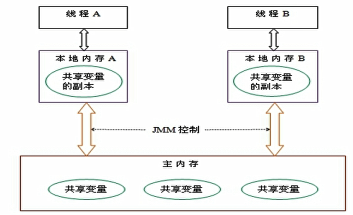
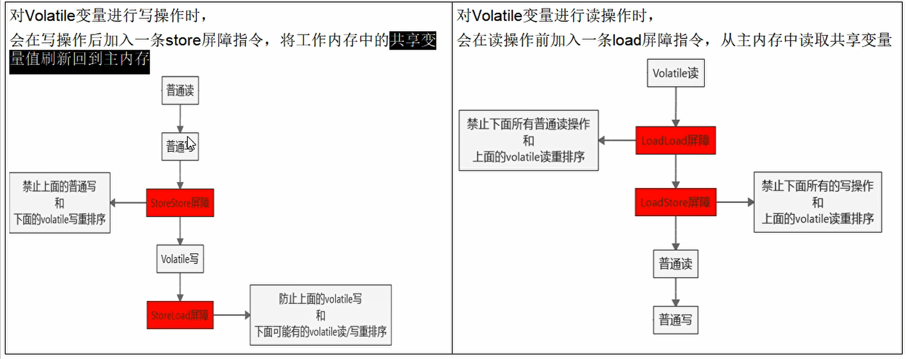

1. 谈谈volatile是什么?
   1. volatile是Java虚拟机提供的轻量级的同步机制
      1. 保证可见性
      2. 不保证原子性
      3. 禁止指令重排
   2. 谈谈JMM
      1. JMM(Java Memory Model )本身是一种抽象概念*<u>并不真实存在</u>*，它描述的是一组规则或者规范，通过这组规范定义了程序中各个变量（包括实例字段，静态字段和构成数组对象的元素）的访问方式
      
      2. JMM 关于同步的规定：
         1. 线程解锁前，必须把共享变量的值刷新会主内存；
         2. 线程加锁前，必须读取主内存的最新值到自己的工作内存中；
         3. 加锁解锁是同一把锁；
         
      3. 访问过程 
      
         ​	由于JVM运行程序的实体是线程，而每个线程创建时JVM都会为其创建一个工作内存（有些地方称之为栈空间），工作内存是每个线程的私有数据区域，而Java内存模型中规定所有变量都存储在==主内存==，主内存是共享内存区域，所有的线程都可以访问，==但线程对变量的操作（读写）必须在工作内存中进行，首先要将变量从主内存中拷贝到自己的工作内存空间，然后对变量进行操作，操作完成后再将变量写回主内存中，==不能直接操作主内存中的变量，各个线程的工作内存空间中存储着主内存中的<u>变量副本拷贝</u>，因此不同的线程之间无法访问对方的工作内存，线程间的通信（传值）必须通过主内存来完成，其简要访问过程如下：
      
         
      
      4. 可见性
      
         可见性是指：一个线程将共享数据修改后，通知其他线程已经修改
      
      5. 原子性
      
         原子性是指：不可分割，完整性。即某个线程在做某个业务时，中间不可以被加塞或者被分割，需要业务整体完整连续执行。（==volatile不保证原子性==）
      
         > 解决：
         >
         > 1. `synchronized`
         > 2. 使用原子类（==J.U.C== : java.util.concurrent.atomic包中的类）
         > 3. Lock
      
      6. 有序性
      
         计算机在执行时,为了提高性能常常会对==指令重排==，一般分为以下3种
      
         源代码 > ==编译器优化重排== > ==指令并行的重排== > ==内存系统重排== > 最终执行指令；
      
         单线程环境里面确保程序最终执行结果和代码顺序执行的结果一致。处理器会在进行重排序列是必须要考虑指令之间数据的依赖性。
      
         多线程环境汇总线程交替执行，由于编译器优化重排的存在，两个线程中使用的变量能否保证一致性是无法确定的，结果无法预测。
      
         volatile 实现==禁止指令重排优化==，从而避免多线程环境下程序出现乱序执行的现象；
   
2. 那些地方使用Volatile

   1. 单例模式（多线程版）

      ```java
      package volaliteDemo;
      
      public class SingletomClass {
          private static volatile SingletomClass singletomClass = null; // volatile 在这里使用是为了使最终的字节码执行顺序不会重新排列,导致的线程不安全问题,虽然这种情况发生的几率极其小,但是一定要考虑到线程的安全性
          private SingletomClass(){
              System.out.println(Thread.currentThread().getName()+"使用SingletonClass的构造方法");
          }
          public static SingletomClass getInstantiation(){
              if (singletomClass == null) {
                  synchronized (SingletomClass.class){
                      if (singletomClass == null) {
                          singletomClass = new SingletomClass();
                      }
                  }
              }
              return singletomClass;
          }
      
          public static void main(String[] args) {
              for (int i = 0; i < 100; i++) {
                  new Thread(()->{
                      SingletomClass.getInstantiation();
                  }).start();
              }
          }
      }
      
      ```

      

> Volatile 的底层实现：
>
> 
>
> ​	内存屏障（Memory Barrier）又称内存栅栏，是一个CPU指令，他有两个作用：
>
> ​	一是保证特定操作的执行顺序；
>
> ​	二是保证某些变量的内存可见性（利用该特性实现了volatile的内存可见性）。
>
> ​	由于编译器和处理器都能执行指令重排。如果在指令间插入一天Memory Barrier则会告诉编译器和CPU，不管什么指令都不能和这条Memory Barrier指令重排序，也就是说==通过插入内存屏障禁止在内存屏障前后的指令执行从排序优化。	没存屏障另外一个作用是强制刷出各种CPU的缓存资源，因此任何CPU上的线程都能读取到这些数据的最新版本 。
>
> 


