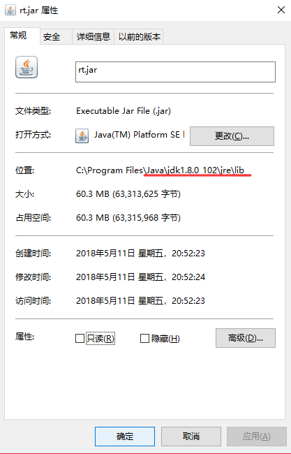
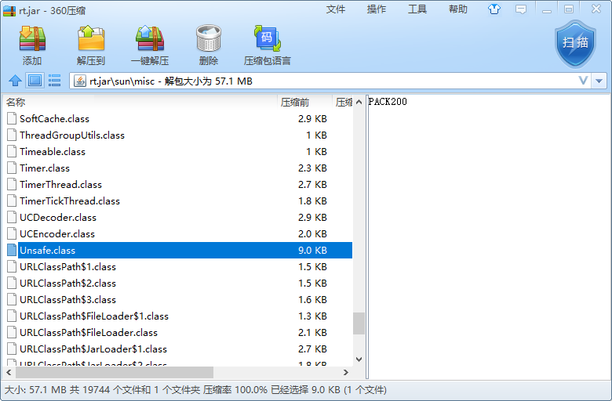

# CAS

## 1.描述

比较交换 => ==CompareAndSet==

1. CAS 的全程为 Compare And Swap，它是一条CPU并发原语；

2. 它的功能是判断内存某个位置的值是否为预期值，如果是则更改为新值，这个过程就是原子的。

3. CAS并发原语体现在Java中就是sun.misc.Unsafe类中的各个方法。调用Unsafe类中的CAS方法，JVM会帮我们实现出CAS汇编指令。这是一种完全依赖于**硬件**的功能，它实现了原子操作。再次强调，由于CAS是一种系统原语，原语属于操作系统用语范畴，是由若干条指令组成的，用于完成某个功能的一个过程，==并且原语的执行必须是连续的，在执行过程中不允许被打断，也就是说CAS是一条CPU的原子指令，不会造成所谓的数据不一致问题==。

例子：

```java
import java.util.concurrent.atomic.AtomicInteger;

public class Test {
    public static void main(String[] args) {
        AtomicInteger atomicInteger = new AtomicInteger(5);
        System.out.println(atomicInteger.compareAndSet(5, 2019)+"=>current data :"+atomicInteger.get());
        System.out.println(atomicInteger.compareAndSet(5, 6666)+"=>current data :"+atomicInteger.get());
    }
}
```

结果：

```cmd
true=>current data :2019
false=>current data :2019
```

## 2.原理

低层实现用==unsafe==类；

- UnSafe 类的位置

  

  

- Unsafe是CAS的核心类，由于Java方法无法直接访问低层系统，需要通过本地方法（native）方法来访问，Unsafe相当于一个后门，基于该类可以直接操作特定内存的数据。==Unsafe类存在于sun.misc包中==，其内部方法可以像C的指针一样直接操作内存，因为Java中CAS操作的执行依赖于Unsafe类方法。

  > 注：Unsafe类中的所有方法都是使用native修饰的，也就是说Unsafe类中的方法都直接调用操作系统低层资源执行相应任务

  1. 如getAndIncrement()自增方法，使用的是unsafe类的方法

  ```java
  public final int getAndIncrement() {
      return unsafe.getAndAddInt(this, valueOffset, 1);
  }
  ```

  2. 其方法最终调用的是native的方法

  ```java
  public final int getAndAddInt(Object var1, long var2, int var4) {
      int var5;
      do {
          var5 = this.getIntVolatile(var1, var2);
      } while(!this.compareAndSwapInt(var1, var2, var5, var5 + var4));
  
      return var5;
  }
  ```

  ```java
  public native int getIntVolatile(Object var1, long var2);
  ```

  3. 而valueoffset属性则是该变量在内存中的指针，这个类是直接对主内存进行操作的；
  4. 变量值使用volatile修饰其可见性；

  ```java
  private static final Unsafe unsafe = Unsafe.getUnsafe();
  private static final long valueOffset;
  
  static {
      try {
          valueOffset = unsafe.objectFieldOffset
              (AtomicInteger.class.getDeclaredField("value"));
      } catch (Exception ex) { throw new Error(ex); }
  }
  
  private volatile int value;
  ```

  > 以上是jdk1.8源码，与jdk10，有所差异但是意思是一模一样的；

- 解析

  假设线程A和B两个线程同时执行getAndAddInt操作:

  1. AtomicInteger里面的value原始值为3，即主内存中AtomicInteger的value为3，根据JMM模型，线程A 和B各自持有值为3的value的副本在各自的工作内存中；
  2. 线程A通过`getIntVolatile(var1,var2)`方法获取到value的值3，很不巧线程被挂起；
  3. 线程B通过`getIntVolatile(var1,var2)`方法获取到value的值3，此时刚好线程B没有被挂起并执行了`compareAndSwapInt`方法比较内存值也为3，成功修改内存为4，线程B收工；
  4. 这时候线程A恢复，执行`compareAndSwapInt`方法比较，发现自己手里的值3和主内存的4不一致，说明该值已经被其他线程抢先一步修改过了，那么本次修改失败，只能循环重新来过；

> 自旋

## 3.底层

汇编实现

## 4.总结

- CAS（Compare And Swap）

  比较当前工作内存中的值和主内存中的值，如果相同则执行规定操作，否则继续比较直到主内存和工作内存中的值相等为止；

- CAS 应用

  CAS有三个操作是，内存值V，旧的预期值A，需要修改的更新值B。

  在预期值A和内存值V相同时，将内存值V修改为B，否则什么都不做。

## 5.缺点

1. 循环时间长开销大

   代码中`do…while…` 一致尝试CAS，假设每次拿到的内容都不一样，高并发情况下开销会很大；

2. 只能保证一个共享变量的原子操作；多个只能使用枷锁保证；

3. 引出ABA问题

### ABA问题示例

1. 初始值为100，线程t1将100改成101，然后又将101改回100
2. 线程t2先睡眠1秒，等待t1操作完成，然后t2线程将值改成2019
3. 可以看到，线程2修改成功

> 要解决ABA问题，可以增加一个版本号，当内存位置V的值每次被修改后，版本号都加1

#### 时间戳：`AtomicStampedReference`