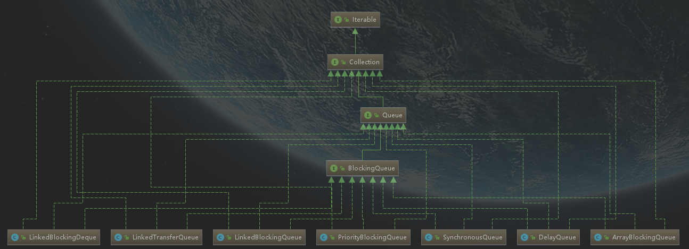

# 阻塞队列

> 线程1往阻塞队列中添加元素，而线程2从阻塞队列中移除元素

- 当阻塞队列是空的时，从队列中**获取**元素的操作将会被阻塞；
- 当阻塞队列是满的时，往队列中**添加**元素的操作将会被阻塞；

## 为什么用，有什么好处？

在多线程领域：所谓阻塞，在某些情况下会**挂起**线程（即阻塞），一旦条件满足，被挂起的线程又会自动**被唤醒**；

好处是，有了阻塞队列我们不需要关心什么时候阻塞线程，什么时候唤醒，因为这一切`BlockingQueue`多给你一手包办了；

在concurrent包发布之前，多线程环境下，**<u>我们每个程序员都必须自己控制这些细节，尤其还要兼顾效率和线程安全</u>，而这会带给程序不小的复杂度；

## 架构

****

- **<u>ArrayBlockingQueue</u>：**
  - **由数组结构组成的有界阻塞；**
- **<u>LinkedBlockingQueue</u>：**
  - **由链表结构组成的有界（但是大小为Integer.MAX_VALUE）阻塞队列；**
- PriorityBlockingQueue：
  - 支持优先级排序的无界阻塞队列；
- DelayQueue：
  - 使用优先级队列实现的延迟无界阻塞队列；
- **<u>SynchronousQueue</u>：**
  - **不存储元素的阻塞队列，也即是单个元素的队列；**
- LinkedTransferQueue：
  - 由链表结构组成的无界阻塞队列；
- LinkedBlockingDeque：
  - 由链表结构组成的双向阻塞对流

## 核心方法

| 方法类型 | 抛出异常  | 特殊值           | 阻塞   | 超时               |
| -------- | --------- | ---------------- | ------ | ------------------ |
| 插入     | add(e)    | boolean offer(e) | put(e) | offer(e,time,unit) |
| 移除     | remove()  | boolean poll()   | take() | poll(time,unit)    |
| 检查     | element() | boolean peek()   | 不可用 | 不可用             |

> 满异常`java.lang.IllegalStateException: Queue full`
>
> 空异常`java.util.NoSuchElementException`

