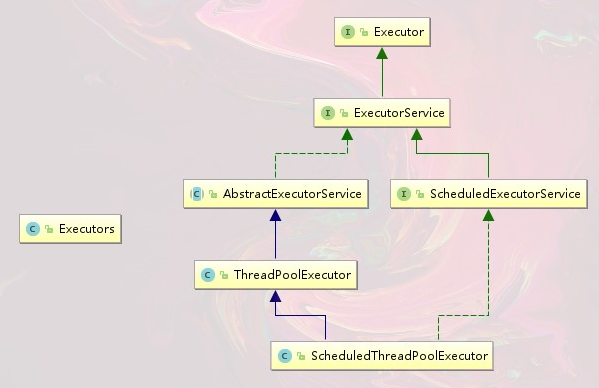
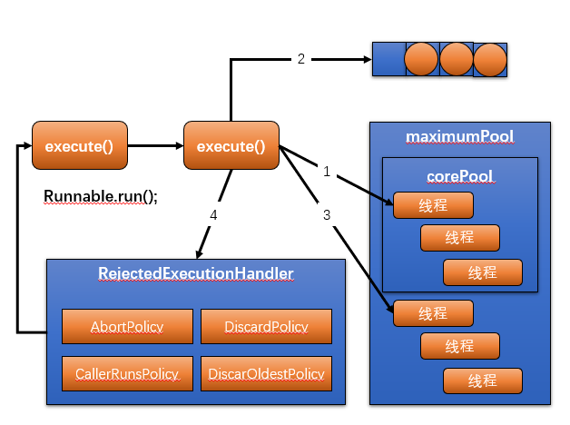
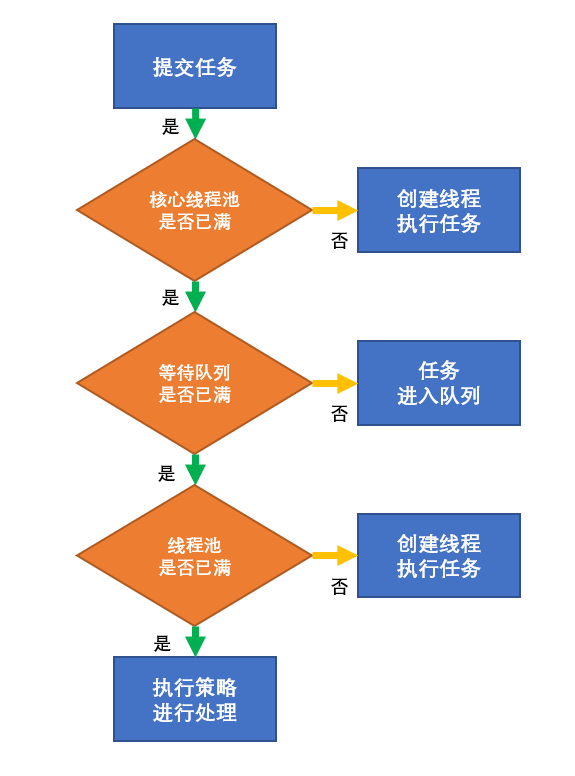

## Callable 接口

用法 : 

``` java
package threadPool;

import java.util.concurrent.Callable;
import java.util.concurrent.FutureTask;
import java.util.concurrent.TimeUnit;

class MyCllable implements Callable<Integer>{

    @Override
    public Integer call() throws Exception {
        System.out.println(Thread.currentThread().getName()+"\tcome in Callable");
        TimeUnit.SECONDS.sleep(3
        );
        return 1024;
    }
}
public class callableDemo {
    public static void main(String[] args)throws Exception {
        FutureTask<Integer> futureTask = new FutureTask<>(new MyCllable());
        new Thread(futureTask,"A").start();
        new Thread(futureTask,"B").start();
        while (!futureTask.isDone()){//如果线程未完成
        }
        System.out.println(futureTask.get());//直到线程结束后,才可以获取返回值,期间线程会阻塞在此处;
        System.out.println("end");
    }
}
```

> 注意：
>
> 1、 futureTask.get()获取线程返回值是，线程没有完成任务，线程会在这里阻塞，一直到线程完成后输出返回值；
>
> 2、futureTask.isDone()可以获取到该线程是否执行完毕

# 线程池

> 获取系统CUP核心数：
>
> ```java
> int x = Runtime.getRuntime().availableProcessors()
> ```
>
> 我去我机子有12个

## 线程池的优势

​	线程池做的工作主要是控制运行的线程数量,**处理过程中将任务放入列表**，然后在线程创建后启动这些任务，**如果线程数量超过了最大数量超出数量的线程排队等候**，等其他线程执行完毕，再从队列中取出任务来执行。

​	他的主要特点为：**线程复用**；**控制最大并发数量**；**管理线程**；

​	第一：降低资源消耗。通过重复利用已创建的线程降低线程创建和销毁造成的消耗；

​	第二：提高响应速度。当任务到达时，任务可以不需要等到线程创建就能立即执行；

​	第三：提高线程的可管理性。线程是稀缺资源，如果无限制的创建，不仅会消耗系统资源，还会降低系统的稳定性，使用线程池可以进行统一的分配，调优和监控；

## 线程池架构说明

Java中的线程池是通过`Executor`框架实现的，该框架都用到了`Executor` 、`Executors`、`ExecutorService`、`ThreadPoolExecutor`；



## 创建线程池的三个方法

> 这三个方法基本不能用

1.        `ExecutorService fixedThreadPool = Executors.newFixedThreadPool(5);`
2.        `ExecutorService singleThreadExecutor = Executors.newSingleThreadExecutor();`
3.        `ExecutorService cachedThreadPool = Executors.newCachedThreadPool();`

### a.固定线程池数量

范例：5个业务员办理10个任务

```java
import java.util.concurrent.ExecutorService;
import java.util.concurrent.Executors;

public class threadPoolDemo {
    public static void main(String[] args) {
        ExecutorService threadPool = Executors.newFixedThreadPool(5);

        try {
            for (int i = 0; i < 10; i++) {
                final int t = i;
                threadPool.execute(() -> {
                    System.out.println(Thread.currentThread().getName() + "\t 办理第" + t + "个业务");
                });
            }
        } catch (Exception e) {

        } finally {
            threadPool.shutdown();
        }
    }
}
```

结果：

```cmd
pool-1-thread-3	 办理第2个业务
pool-1-thread-1	 办理第0个业务
pool-1-thread-5	 办理第4个业务
pool-1-thread-4	 办理第3个业务
pool-1-thread-2	 办理第1个业务
pool-1-thread-4	 办理第8个业务
pool-1-thread-5	 办理第7个业务
pool-1-thread-1	 办理第6个业务
pool-1-thread-3	 办理第5个业务
pool-1-thread-2	 办理第9个业务
```


### b.只有一个线程的线程池

范例：一个业务员办理十个业务

```java
import java.util.concurrent.ExecutorService;
import java.util.concurrent.Executors;

public class threadPoolDemo {
    public static void main(String[] args) {
        ExecutorService threadPool = Executors.newSingleThreadExecutor();

        try {
            for (int i = 0; i < 10; i++) {
                final int t = i;
                threadPool.execute(() -> {
                    System.out.println(Thread.currentThread().getName() + "\t 办理第" + t + "个业务");
                });
            }
        } catch (Exception e) {

        } finally {
            threadPool.shutdown();
        }
    }
}
```


结果：

```cmd
pool-1-thread-1	 办理第0个业务
pool-1-thread-1	 办理第1个业务
pool-1-thread-1	 办理第2个业务
pool-1-thread-1	 办理第3个业务
pool-1-thread-1	 办理第4个业务
pool-1-thread-1	 办理第5个业务
pool-1-thread-1	 办理第6个业务
pool-1-thread-1	 办理第7个业务
pool-1-thread-1	 办理第8个业务
pool-1-thread-1	 办理第9个业务
```


### c.不固定线程池数量

范例：好多业务员办理十个业务

```java
import java.util.concurrent.ExecutorService;
import java.util.concurrent.Executors;

public class threadPoolDemo {
    public static void main(String[] args) {
        ExecutorService threadPool = Executors.newCachedThreadPool();

        try {
            for (int i = 0; i < 10; i++) {
                final int t = i;
                threadPool.execute(() -> {
                    System.out.println(Thread.currentThread().getName() + "\t 办理第" + t + "个业务");
                });
            }
        } catch (Exception e) {

        } finally {
            threadPool.shutdown();
        }
    }
}
```


结果：

```cmd
pool-1-thread-8	 办理第7个业务
pool-1-thread-7	 办理第6个业务
pool-1-thread-3	 办理第2个业务
pool-1-thread-5	 办理第4个业务
pool-1-thread-6	 办理第5个业务
pool-1-thread-2	 办理第1个业务
pool-1-thread-1	 办理第0个业务
pool-1-thread-9	 办理第8个业务
pool-1-thread-10	 办理第9个业务
pool-1-thread-4	 办理第3个业务
```

> a. newFixedThreadPool使用`LinkedBlockingQueue`
>
> ```java
> public static ExecutorService newFixedThreadPool(int nThreads) {
>     return new ThreadPoolExecutor(nThreads, nThreads,
>                                   0L, TimeUnit.MILLISECONDS,
>                                   new LinkedBlockingQueue<Runnable>());
> }
> ```
>
> b. newSingleThreadExecutor使用`LinkedBlockingQueue`
>
> ```java
> public static ExecutorService newSingleThreadExecutor() {
>     return new FinalizableDelegatedExecutorService
>         (new ThreadPoolExecutor(1, 1,
>                                 0L, TimeUnit.MILLISECONDS,
>                                 new LinkedBlockingQueue<Runnable>()));
> }
> ```
>
> c. newCachedThreadPool使用`SynchronousQueue`
>
> ```java
> public static ExecutorService newCachedThreadPool() {
>     return new ThreadPoolExecutor(0, Integer.MAX_VALUE,
>                                   60L, TimeUnit.SECONDS,
>                                   new SynchronousQueue<Runnable>());
> }
> ```

## 底层代码

通过源码追踪可以观察到他们用的是同一种方法

```java
public ThreadPoolExecutor(int corePoolSize,
                          int maximumPoolSize,
                          long keepAliveTime,
                          TimeUnit unit,
                          BlockingQueue<Runnable> workQueue) {
    this(corePoolSize, maximumPoolSize, keepAliveTime, unit, workQueue,
         Executors.defaultThreadFactory(), defaultHandler);
}
```

```java
public ThreadPoolExecutor(int corePoolSize,
                          int maximumPoolSize,
                          long keepAliveTime,
                          TimeUnit unit,
                          BlockingQueue<Runnable> workQueue,
                          ThreadFactory threadFactory,
                          RejectedExecutionHandler handler) {
    if (corePoolSize < 0 ||
        maximumPoolSize <= 0 ||
        maximumPoolSize < corePoolSize ||
        keepAliveTime < 0)
        throw new IllegalArgumentException();
    if (workQueue == null || threadFactory == null || handler == null)
        throw new NullPointerException();
    this.corePoolSize = corePoolSize;
    this.maximumPoolSize = maximumPoolSize;
    this.workQueue = workQueue;
    this.keepAliveTime = unit.toNanos(keepAliveTime);
    this.threadFactory = threadFactory;
    this.handler = handler;
}
```

#### ThreadPoolExecutor 七大参数

1. `int corePoolSize`：线程池汇中常驻核心线程数；
2. `int maximumPoolSize`：线程池中能够容纳同时执行的最大线程数，此值必须大于等于1；
3. `long keepAliveTime`：多余的空闲线程存活的时间，当前线程池数量超过corePoolSize时，当空闲时间达到keepAliveTime值时，多余空闲线程会被销毁直到只剩下corePollSize个线程为止；
4. `TimeUnit unit`：keepAliveTime的单位；
5. `BlockingQueue<Runnable> workQueue`：任务队列，被提交但是尚未被执行的任务；
6. `ThreadFactory threadFactory`：表示生成线程池中工作线程的线程工程，用于创建线程**一般默认的即可**；
7. `RejectedExecutionHandler handler`；拒绝策略，表示当前队列满了并且工作线程大于等于线程池最大线程数（maximumPoolSize）时如何来拒绝新的线程需求；

## 底层工作原理

### ==重点==






1. 当创建了线程后，等待提交过来的任务请求；
2. 当调用execute()方法添加一个请求任务时线程池会做出一下判断
   1. 如果正在运行的 线程数量**小于核心线程**数量（corePoolSize），那么马上**运行任务**；
   2. 如果正在运行的线程数量**大于或等于核心线程**数量（corePoolSize），那么将这个任务**放入队列**；
   3. 如果这个 时候队列满了且**正在运行的线程**数量还**小于最大线程数量**（maximumPoolSize），那么还是要**创建非核心线程**来**运行任务**；
   4. 如果队列满了且**正在运行的线程**数量**大于或者等于最大线程**数量（maximumPoolSize），那么线程池会**启动饱和拒绝策略**来执行；
3. 当一个线程完成任务，它会从队列中取下一个任务来执行；
4. 当一个线程空闲超过了心跳时间（keepAliveTime&unit设置的时间）时，这个线程就会被停掉，完成所有的任务后，最终会收缩到核心线程数量的大小；

## 线程池的4种拒绝策略


- 等待队列已经排满了，再也塞不下新任务了，同时线程池也达到了最大数量，无法为新任务服务，这个时候我们就需要拒绝策略机制合理的处理这个问题；

1. AbortPolicy（默认）：

   直接抛出`RejectedExecutionException`异常阻止系统正常运行；

2. CallerRunsPolicy：

   *调用者运行*一种调节机制，该策略不会抛弃任务，也不会抛出异常，而是将某些任务退回到调用者，

3. DiscardOldPolicy：

   抛弃队列中等待最久的任务，然后把当前任务加入队列中尝试再次提交当前任务；

4. DiscardPolicy：

   直接丢弃任务，不与任何处理也不抛出异常。如果允许丢失，这是最好的一种方案；

## 自定义线程池

> 阿里巴巴开发手册强制：
>
> ​	线程池不允许使用`Executors`去创建，而是通过`ThreadPoolExecutor`的方式,这样的处理方式写的同学更加明确线程池的运行规则,规避资源耗尽的风险。
>
> ​	说明：`Executors`返回的线程池对象的弊端如下：
>
> 1. `FixedThreadPoo`和`SingleThreadPool`：
>
>    允许的请求长度为`Integer.MAX_VALUE`，可能会堆积大量的请求，从而导致`OOM`。
>
> 2. ``CachedThreadPo0l`和`ScheduledTreadPool`：
>
>    允许创建线程数量为`Integer.MAX_VALUE`，可能会创建大量的线程，从而导致`OOM`。

范例：自定义线程池

```java
package threadPool;

import java.util.concurrent.*;

public class MyThreadPool {
    public static void main(String[] args) throws Exception {
        ExecutorService threadPool = new ThreadPoolExecutor(
                2,//核心线程池数量
                5,//最大线程池数量
                5,//空闲释放时间
                TimeUnit.SECONDS,//时间单位
                new LinkedBlockingQueue<>(3),//阻塞队列3位
                Executors.defaultThreadFactory(),//工厂
                new ThreadPoolExecutor.AbortPolicy()//策略
        );
        try {
            for (int i = 1; i <= 9; i++) {//9个会导致报错
                final int t = i;
                threadPool.execute(() -> {
                    System.out.println(Thread.currentThread().getName() + "\t 办理第" + t + "个业务");
                });
            }
        } catch (Exception e) {
            e.printStackTrace();
        } finally {
            threadPool.shutdown();
        }
    }
}
```


```cmd
java.util.concurrent.RejectedExecutionException: Task threadPool.MyThreadPool$$Lambda$1/0x00000008011f0c40@119d7047 rejected from java.util.concurrent.ThreadPoolExecutor@776ec8df[Running, pool size = 5, active threads = 5, queued tasks = 3, completed tasks = 0]
	at java.base/java.util.concurrent.ThreadPoolExecutor$AbortPolicy.rejectedExecution(ThreadPoolExecutor.java:2055)
	at java.base/java.util.concurrent.ThreadPoolExecutor.reject(ThreadPoolExecutor.java:825)
	at java.base/java.util.concurrent.ThreadPoolExecutor.execute(ThreadPoolExecutor.java:1355)
	at threadPool.MyThreadPool.main(MyThreadPool.java:18)
	at java.base/jdk.internal.reflect.NativeMethodAccessorImpl.invoke0(Native Method)
	at java.base/jdk.internal.reflect.NativeMethodAccessorImpl.invoke(NativeMethodAccessorImpl.java:62)
	at java.base/jdk.internal.reflect.DelegatingMethodAccessorImpl.invoke(DelegatingMethodAccessorImpl.java:43)
	at java.base/java.lang.reflect.Method.invoke(Method.java:567)
	at com.intellij.rt.execution.application.AppMainV2.main(AppMainV2.java:131)
pool-1-thread-1	 办理第1个业务
pool-1-thread-2	 办理第2个业务
pool-1-thread-4	 办理第7个业务
pool-1-thread-4	 办理第5个业务
pool-1-thread-5	 办理第8个业务
pool-1-thread-3	 办理第6个业务
pool-1-thread-2	 办理第4个业务
pool-1-thread-1	 办理第3个业务
```

## 如何合理配置线程池
```java
//获取CPU是几核的，我的小米游戏本是12核
int x = Runtime.getRuntime().availableProcessors();
```

### CPU密集型

​	CPU密集型的意思是该任务需要大量的运算，而且没有阻塞，CPU一只全速运行。

​	CPU密集型任务只有在真正多核CPU上才可以得到加速（通过多线程）。

- CPU密集型任务配置尽可能少的线程数量：
  - **CPU核数 + 1 = 线程池数量**


### IO密集型

1. 由于IO密集型任务线程并不是一直在执行任务，则应配置尽可能多的线程，如：

   **CPU核数 * 2 = 线程池数量**

2. IO密集型，即该任务需要大量的IO，即大量的阻塞。

   在单线程上运行IO密集型的任务会导致大量的CPU运算能力浪费在等待中。

   所以在IO密集型任务中可以使用多线程可以大大的加速程序的运行，即使在单核CPU上，这种加速主要就是利用了被浪费的阻塞时间。

   IO密集型时，大部分线程都处于阻塞状态，故需要多配制线程数：

   - 公式：**CPU核数 / ( 1 - 阻塞系数 ) = 线程池数量**
   - 例如8核CPU：**8 / ( 1 - 0.8 ) = 80**

   > 一般阻塞系数在 **0.8 到 0.9** 之间