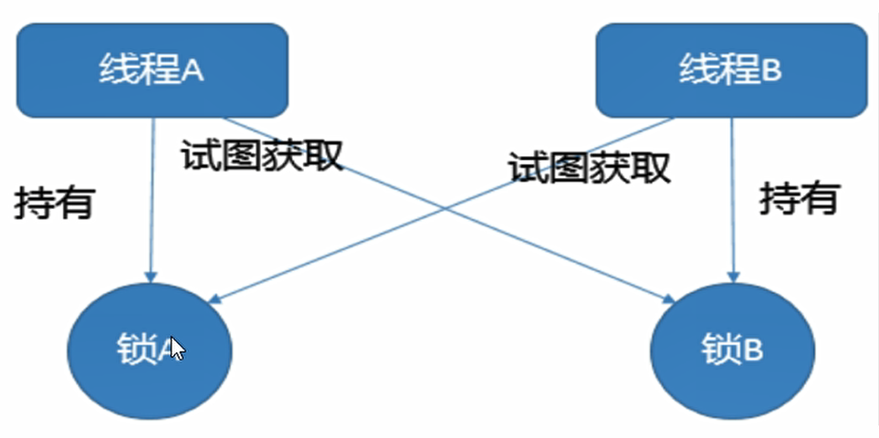

# 死锁

​	死锁是指两个或两个以上的进程在执行过程中，因争夺资源而造成的一种**互相等待的现象**，若无外力干涉那它们都将无法推进下去，如果系统资源充足，进程的资源请求都能够得到满足，死锁出现的可能性就很低，否则就会因争夺有限的资源而陷入死锁。



## 代码

```java
package deadLock;

import java.util.concurrent.TimeUnit;

class HoldLockThread implements Runnable {
    private String lockA;
    private String lockB;

    public HoldLockThread(String lockA, String lockB) {
        this.lockA = lockA;
        this.lockB = lockB;
    }

    @Override
    public void run() {
        synchronized (lockA) {
            System.out.println(Thread.currentThread().getName() + "\t 持有 \t" + lockA + "\t 尝试获取\t" + lockB);
            try {
                TimeUnit.SECONDS.sleep(5);
            } catch (InterruptedException e) {
                e.printStackTrace();
            }
            synchronized (lockB) {
                System.out.println(Thread.currentThread().getName() + "\t 持有 \t" + lockB + "\t 尝试获取\t" + lockA);

            }
        }
    }
}

public class deadLockDemo {
    public static void main(String[] args) {
        String lockA ="LOCK_A";
        String lockB ="LOCK_B";
		//注意lockA和lockB的顺序
        new Thread(new HoldLockThread(lockA,lockB),"Thread_A").start();
        new Thread(new HoldLockThread(lockB,lockA),"Thread_B").start();
    }
}

```

## 证明是死锁

在Windows下操作：

- `jsp -l`

  ```cmd
  C:\Fs\java\untitled>jps -l
  17344
  120 com.intellij.rt.execution.application.AppMainV2
  16904 org.jetbrains.jps.cmdline.Launcher
  17180 jdk.jcmd/sun.tools.jps.Jps
  ```

  > 可以看出`120 com.intellij.rt.execution.application.AppMainV2`是上面代码运行时使用的进程；

- `jstack 120` ：进程号

  ```cmd
  //....前面省略
  Java stack information for the threads listed above:
  ===================================================
  "Thread_A":
          at deadLock.HoldLockThread.run(deadLockDemo.java:24)
          - waiting to lock <0x0000000711c18090> (a java.lang.String)
          - locked <0x0000000711c18060> (a java.lang.String)
          at java.lang.Thread.run(java.base@12.0.2/Thread.java:835)
  "Thread_B":
          at deadLock.HoldLockThread.run(deadLockDemo.java:24)
          - waiting to lock <0x0000000711c18060> (a java.lang.String)
          - locked <0x0000000711c18090> (a java.lang.String)
          at java.lang.Thread.run(java.base@12.0.2/Thread.java:835)
  
  ```

  > 可以看出：
  >
  > Thread_A等待0x0000000711c18090已有0x0000000711c18060
  >
  > Thread_B等待0x0000000711c18060已有0x0000000711c18090

  