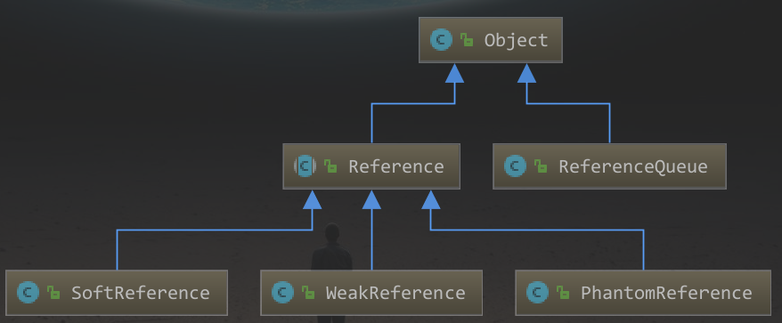
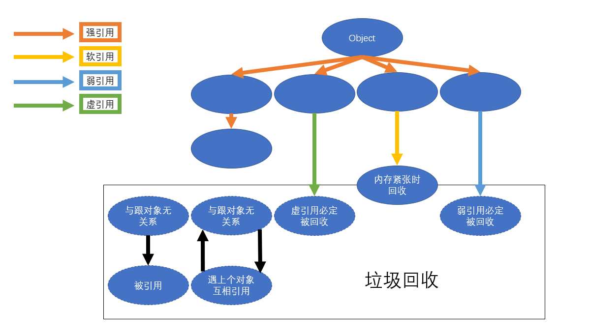

# 引用



## 1. Reference 强引用

- 当内存不足时 , JVM开始垃圾回收 , 对于强引用的对象 , **<u>就算是出现了OOM也不会对该对象进行垃圾回收</u>** ;

- 强引用是我们生活中最常见的普通引用 , 只要还有强引用指向一个对象 , 就能表明对象还"活着" , 垃圾回收器是不会碰这种对象 . 在Java中最常见的就是强引用 , 把一个对象赋给一个引用变量 , 这个引用变量就是一个强引用 . 当一个对象被强引用变量引用时 , 它处于可达状态 , 它是不可能被垃圾回收机制回收的 , 及时该对象以后永远都不会被用到JVM也不会回收 . 因此强引用是造成Java内存泄漏的主要原因之一 ;

- 对应一个普通的对象 , 如果没有其他引用关系 , 只要超过了引用的作用域或者显式的赋值为NULL , 一般认为就是可以被垃圾回收了 (当然了具体的回收时机还是要看垃圾回收的策略了)
### a.例子
- 
```java
  Object obj1 = new Object(); // 这样定义的是强引用
  Object obj2 = obj1; // obj2引用赋值
  obj1 = null;
  System.gc();
  System.out.println(obj2);
```

```cmd
  java.lang.Object@4554617c
```

  

## 2. WeakReference 软引用 

- 软引用是一种相对强引用弱化了一些的引用 , 需要用`java.lang.ref.SoftReference`类来实现 , 可以让对象豁免一些垃圾收集 ;

- 对于只有软引用的对象来说 :

  - 当系统内存充足时它**<u>不会</u>**被回收 ;
  - 当系统内存不足时它**<u>会</u>**被回收 ;

- 软引用通常在对内存敏感的程序中 , 比如高速缓存就会用到软引用 , 内存够用时就保留 , 不够就用回收 ;

### a.例子1  内存够用

 ```java
Object o = new Object();
SoftReference<Object> objectSoftReference = new SoftReference(o);

System.out.println(o);
System.out.println(objectSoftReference.get());

o = null;
System.gc();

System.out.println(o);
System.out.println(objectSoftReference.get());
 ```

```cmd
java.lang.Object@45ee12a7
java.lang.Object@45ee12a7
null
java.lang.Object@45ee12a7
```

### b.例子2  内存不够用

```cmd
-Xms10m -Xmx10m
```

```java
Object o = new Object();
SoftReference<Object> objectSoftReference = new SoftReference(o);

System.out.println(o);
System.out.println(objectSoftReference.get());

o = null;
System.gc();
try {
    byte[] bytes = new byte[30 * 1024 * 1024];
} catch (Exception e) {
} finally {
    System.out.println(o);
    System.out.println(objectSoftReference.get());
}
```

```cmd
java.lang.Object@45ee12a7
java.lang.Object@45ee12a7
null
null
```
> #### 适用场景
>
> 假如有一个应用场景需要读取大量的本地图片
>
> - 如果每次读取图片都从硬盘读取则会严重影响性能 ;
> - 如果一次性全部加载到内存中有可能造成内存溢出 .
>
> 此时软引用就可以解决这个问题 :
>
> ##### 设计思路 :
>
> ​	用一个HashMap来保存图片的路径和响应图片对象关联的**软引用**之间的映射关系 , 在内存不足时 , JVM会自动回收这些缓存图片对象所占用的空间 , 从而有效地避免了OOM的问题 . 
>
>  ```java
>  Map<String,SoftReference<Bitmap>> imageCache = new HashMap();
>  ```


## 3. WeakReference 弱引用

- 弱引用需要用`java.lang.ref.WeakReference`类来实现 , 它比软引用的生命周期更短 
- 对弈又有弱引用的对象来说 , 只要垃圾回收机制运行 , 不管JVM内存是否充足 , 都会回收该对象占用的内存;

### a.例子

```java
Object o = new Object();
WeakReference weakReference = new WeakReference(o);
System.out.println(o);
System.out.println(weakReference.get());

o = null;
System.gc();

System.out.println(o);
System.out.println(weakReference.get());
```

```cmd
java.lang.Object@45ee12a7
java.lang.Object@45ee12a7
null
null
```

> ### WeakHashMap
>
> ```java
> WeakHashMap<Integer, String> map = new WeakHashMap<Integer, String>();
> Integer key = new Integer(1);
> String value = "hashMap";
> 
> map.put(key,value);
> System.out.println(map);
> 
> key = null;
> System.out.println(map);
> 
> System.gc();
> 
> System.out.println(map);
> ```
>
> ```cmd
> {1=hashMap}
> {1=hashMap}
> {} // gc 之后对象就不存在了
> ```
>
> ### ReferenceQueue
>
> ```java
> 		Object o = new Object();
> 		ReferenceQueue referenceQueue = new ReferenceQueue();
> 		WeakReference weakReference = new WeakReference(o, referenceQueue);
> 
> 		System.out.println(o);
> 		System.out.println(weakReference.get());
> 		System.out.println(referenceQueue.poll());
> 
> 		System.out.println("+++++++++++++++");
> 
> 		o = null;
> 		System.gc();
> 		Thread.sleep(500);
> 
> 		System.out.println(o);
> 		System.out.println(weakReference.get());
> 		System.out.println(referenceQueue.poll());
> ```
>
> ```cmd
> java.lang.Object@45ee12a7
> java.lang.Object@45ee12a7
> null
> +++++++++++++++
> null
> null
> java.lang.ref.WeakReference@330bedb4
> ```
>
> 

## 4. PhantomReference 虚拟引用

- 虚引用`java.lang.ref.PhantomReference`类来实现
- 顾名思义 , 就是形同虚设 , 与其他几种引用都不同 , 虚引用并不会决定对象的生命周期 ;
- 如果一个对象仅持有虚引用 , 那么它就和没有引用一样 , 在任何时候都可能被垃圾回收器回收 , 它不能通过它访问对象 , 虚引用必须和引用队列`ReferenceQeueuw`联合使用
- 虚引用的主要作用是跟踪对象被垃圾回收的状态 . 仅仅是提供了一种确保对象被`finalize`之后 , 做某些事情的机制 .
- `PhantomReference`的`get`方法返回总是`null` , 因此无法访问对应的引用对象 . 其意义在于说明一个对象已经进入`finalization`阶段 , 可以被gc回收 , 用来实现比`finalization`机制更灵活的回收操作 . 
- 话句话说 , 设置虚引用的唯一目的 , 就是在这个对象被垃圾回收的时候收到一个系统通知或者后需添加进一步处理 .
- Java技术允许`finalize()`方法在垃圾回收器将对像从内存中清除出去之前必须要的清理工作 .

### a.例子

```java
Object o = new Object();
ReferenceQueue referenceQueue = new ReferenceQueue();
PhantomReference phantomReference = new PhantomReference(o, referenceQueue);

System.out.println(o);
System.out.println(phantomReference.get());
System.out.println(referenceQueue.poll());

System.out.println("+++++++++++++++");

o = null;
System.gc();
Thread.sleep(500);

System.out.println(o);
System.out.println(phantomReference.get());
System.out.println(referenceQueue.poll());
```

```cmd
java.lang.Object@45ee12a7
null
null
+++++++++++++++
null
null
java.lang.ref.PhantomReference@330bedb4
```

# 总结



