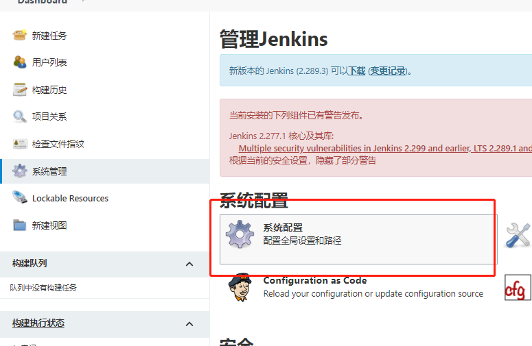
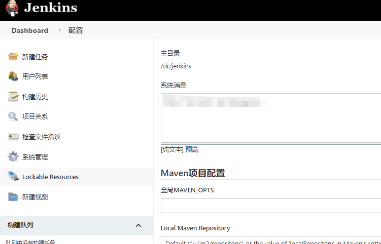

# **一、系统迁移**

## **1.查看主目录**

　　通过网站查看：登录jenkins网站，在系统管理->系统配置页面，可以查看到主目录地址

## 2.**打包需要迁移的数据**

进入到主目录下，可以看到很多文件，是否需要全部打包呢？其实我们只需要打包4个文件就可以了，如上图所示分别是config.xml文件，jobs文件夹，users文件夹和plugins文件夹。从名称上就可以看出来各自的作用，config.xml是存放配置信息的，jobs是存放创建的工程项目的，users是存放用户账信息的，plugins是存放插件的。

`config.xml`文件、`jobs`文件夹，`users`文件夹和`plugins`文件夹

## **3.将数据迁移到目标机器上**

　　将这4个文件夹打包，拷贝到需要迁移的目标机器上，放到jenkins的主目录下。建议在打包和拷贝的时候，两台机器的jenkins都停止服务，防止打包不完整或拷贝不完整。如果迁移的目标机器没有安装jenkins，那么只要在安装完jenkins后直接覆盖这4个文件夹就行了。如果目标机器已经安装jenkins，且安装了部分插件，创建了用户和项目，那么有些文件就不能直接拷贝进去。例如需要迁移的job文件夹中有一个项目和目标机器中job文件夹里的项目同名，那么你就需要取舍了。

