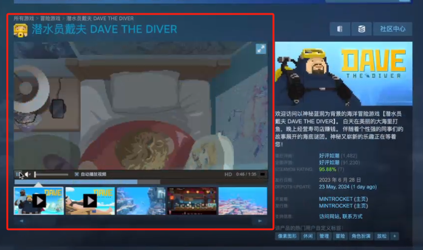

> 客服
>
> 方案1
> 1. 虚拟客服
> 方案2
> 2. 客服账号

> 
> 快速回答问题
> - 问题管理;
> - QRA 内容组件;
> 
> 问题面板: FAQ
> - 特殊的样子
>     问题 : 1. 
> 
> 所有与 html 有关的功能都加一个根标签; `<anzir-content> ... </anzir-content>`

> 剧本人群定级
>   1. 成人
>   2. 儿童

> GMS 选择 , 使用 anzirNo

史诗
> 签到; 打卡; 

> 货源推广信息
>
> 
> 背景音乐, 宣传图,宣传片

> 剧本免费预览范围