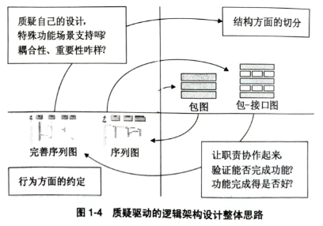
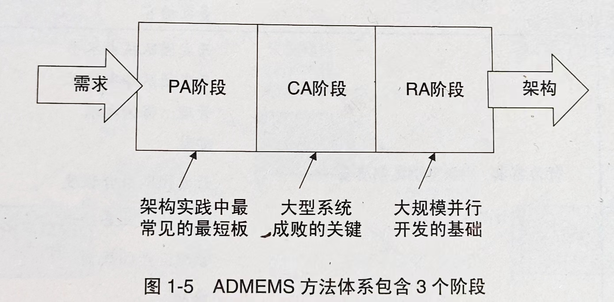
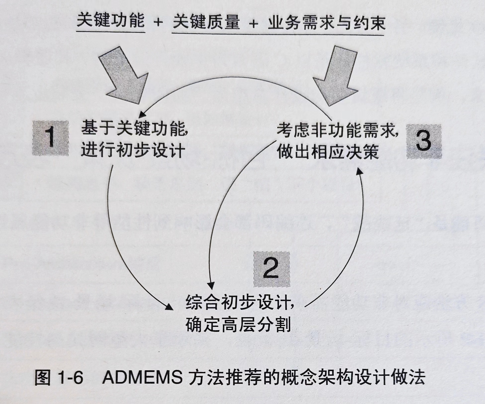
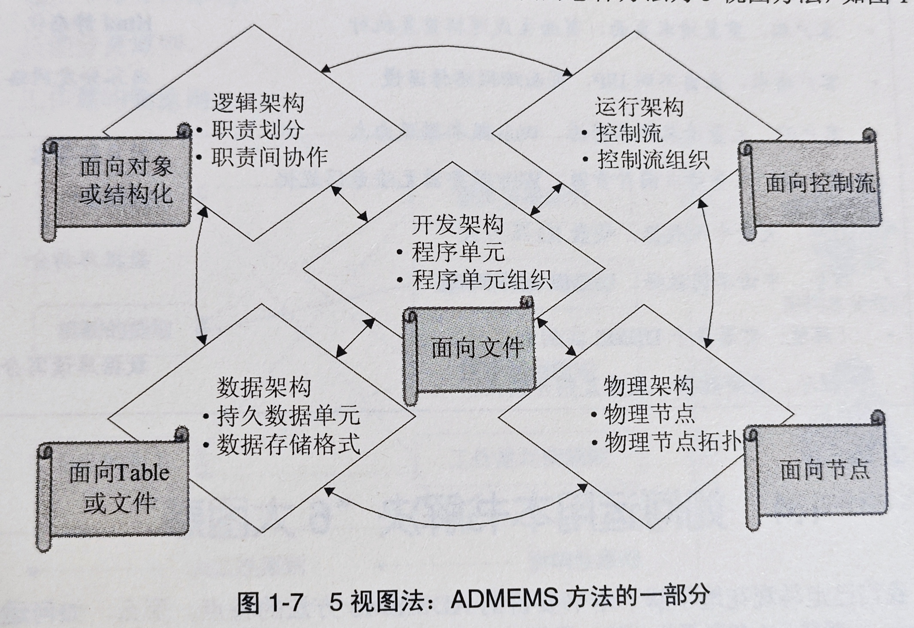

# 论述

> 软件架构在不断发展, 但它仍然是一个尚不成熟的科学;
>
> 推动软件工程研究不断发展的, 常是实际产生或者使用软件是遇到的难题;
> 
> 架构设计的能力, 因掌握起来困难而显得真贵;

## 1.1一线架构师的**六个困惑**

- **4个实际问题的困惑**

    1. **将系统分模块, 如何更合理;**
    2. **大系统架构设计, 如何起步;**
    3. **总觉的需求很糟糕, 影响了架构;**
    4. **非功能需求重要, 但如何设计?**

- **2个职业发展困惑**
  
  1. **架构新手: 缺少指导, 机构设计不知所措;**
  2. **架构老手: 缺乏总结, 总"怕"下一个项目;**
   

## 1.2 本书的**4个核心主张**

**画龙需点睛**

- **方法体系是大趋势;**
- **质疑驱动的架构设计;**
- **多阶段方法;**
- **内置最佳实践的方法;**

### 1.2.1 方法体系的大趋势

单一的方法已捉紧加州. 一线架构是真正需要的, 是覆盖 "需求进, 架构出" 全过程的实践指导---- 只有综合不同方法优点的 "方法体系" 才堪此重任; 

> ADMEMS 方法命名的由来
>
> **Architectural Design Method has been Extended to Method System (架构设计方法已经扩展到方法体系)的缩写**

### 1.2.2 质疑驱动的架构设计

架构毫无疑问是需求驱动的, 而不是模型驱动的;

架构设计是一门艺术, "需求驱动的架构设计" 的总结给架构师的启发是不够的;

事实上架构设计是一个 "质疑驱动的过程" : 需求, 被架构师的大脑有节奏的引入架构设计一波接一波的思维活动中; 例如, 作为架构师, 当你的架构设计进行到一半时, 你可以明显感觉到: 这个架构设计的中间成果, 还需要进一步通过 "质疑" 引入更多的 "质量属性" , 以及 "特殊的场景功能" 来驱动后续的架构设计;

在保留 "需求驱动架构设计" 所有正确的内涵同时, "质疑驱动的架构设计" 告诉架构师: 你的头脑, 才是架构设计的全过程的发动机. 质疑意识, 是架构师最宝贵的意识之一;

### 1.2.3 多阶段还是多视图?

架构设计的多视图方法很重要, 但是, 架构设计方法首先应当是多阶段的, 其次才是多视图的;

> - 阶段一 : 把握需求特点, 确定架构驱动力;
> - 阶段二 : 根据重大需求, 确定概念架构;
> - 阶段三 : 细化架构设计, 关注不同视图; (**五视图**)

**一句话, 先做后做---这叫阶段(Phase), 齐头并进---这叫视图(View)**

任何好的方法(不局限于软件领域), 都必须以时间为轴来进行组织, 因为这样才最利于指导实践;

架构设计只许多视图方法, 开始去很美, 其实并不足够; 实际上, 大量一线架构师早已感觉到多视图方法的"不足够";

**结论: 概念架构设计和细化架构设计, 是两个架构阶段, 不是两个架构视图;**

### 1.2.4 内置最佳实践

方法不应该是个空框框, 融入是最佳实践经验; 

ADMEMS融入了哪些实践经验:
- 架构设计的十条经验
  1. 划分子系统: 分层的细化
  2. 划分子系统: 分区的引入
  3. 划分子系统: 机制的提取
  4. 接口的定义: 协作决定接口
  5. 选用序列图: 杜绝协作图
  6. 包-接口图: 从结构到行为的桥
  7. 灰盒包图: 描述关键子系统
  8. 循序渐进的螺旋思维
  9. 设计模式: 包内结构
  10. 设计模式: 包间协作
- 质疑驱动的逻辑架构设计整体思路
  
  

- 基于鲁棒图进行初步设计的10条经验
- ADMEMS矩阵法
- 约束的四大类型
- ....

## 1.3 ADMEMS 方法体系 (3个阶段,1个贯穿环节)

作为方法体系, ADMEMS 方法通过 3个阶段 和 1个贯穿环节, 来覆盖 "需求进, 架构出" 的架构设计完整工作内容;

**3个阶段:**
  1. "Per-architecture" 阶段 (简称PA阶段)
  2. "Conceptual Architecture" 阶段 (简称CA阶段)
  3. "Refined Architecture" 阶段 (简称RA阶段)
   
  

值得强调的是, 上述3个阶段之间的先后顺序有极大的实际意义, 否则就不能称之为 "阶段";

**1个贯穿环节**, 指的是对非功能目标的考虑;

### 1.3.1 Per-architecture 阶段 : ADMEMS 矩阵方法

Per-architecture 阶段的使命, 可以概括为一句话: 全面理解需求, 从而把握需求特点, 进而确定架构设计驱动力; 其中 "ADMEMS" 矩阵居于方法的核心;

| -- | 功能 | 质量 | 约束 |
| -- | -- | -- | -- |
| 业务级需求 | 业务目标 | 快\好\省 | 技术约束性 法规性约束 技术趋势 竞争因素与竞争对手 遗留系统集成 标准约束 分批实施|
| 用户级需求 | 用户需求 | 运行期质量 | 用户群特点 用户水平 多国语言|
| 开发级需求 | 行为需求 | 开发期质量 | 开发团队技术水平 开发团队分布情况 管理: 保密要求 安装 开发团队磨合程度 开发团队业务知识 管理: 产品规划 维护|

### 1.3.2 Conceptual Architecture : 重大需求塑造概念架构

概念架构 ≠ 理想化架构; 所以, 必须考虑包括功能、质量、约束在内的所有方面的需求; 
   

### 1.3.3 Refined Architecture 阶段 : 落地的5视图方法

细化架构是相对于概念架构而言的; 细化架构节点的总体方法为5视图方法;

### 1.3.4 持续关注非功能需求: "目标-场景-决策"表方法

## 1.4 如何运用本书解决**"6大困惑"**