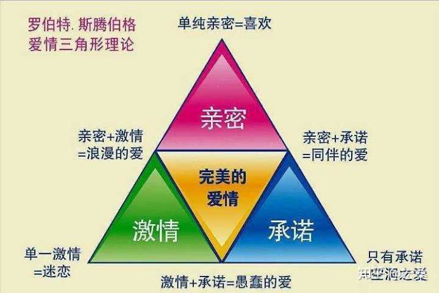

作者：宏桑
链接：https://www.zhihu.com/question/30616492/answer/709689135
来源：知乎
著作权归作者所有。商业转载请联系作者获得授权，非商业转载请注明出处。

# 如何持久恋爱

**1.沟通**

沟通包含诉说和聆听，也就是

有问题及时表达，当你内心有了抱怨，一定要主动跟对方诉说，而不是寄托给所谓的蓝颜红颜；

在对方关心的领域，需要你表达看法和观点的时候，不要敷衍。

当对方在表述的时候，认真聆听，且不要基于表达对立的态度。

举个简单的的例子，你们逛街的时候，对方迟到了，或者瞟了别的女生一眼，你内心很生气很窝火，对方也感受到了你的情绪。可是不管对方怎么问你你都咬死说没事，对方放下心来真的当作没事你却委屈的哭了起来怪身边的他不懂你。

明明有问题却不沟通表达，一个觉得不被理解，一个觉得对方作闹，这是恋爱中的恶性循环。

还有很多情侣走另外一个极端，因为惧怕冲突所以排斥一切会引发争吵的可能。

但其实两个成长于不同家庭环境的人，或多或少会有性格和习惯上的冲突，有矛盾摩擦真的没什么，吵架也是沟通的一种，一味得避免争吵，看起来两个人很和谐，但其实矛盾都在暗地里滋生。

好的争吵，可以最高效的引导两个人达成共识。

关于如何争吵，推荐美国心理学家[马歇尔卢森堡](https://www.zhihu.com/search?q=马歇尔卢森堡&search_source=Entity&hybrid_search_source=Entity&hybrid_search_extra={"sourceType"%3A"answer"%2C"sourceId"%3A709689135})的《非暴力沟通》，如果没时间，也可以参阅我的这篇文章。

[宏桑：“你说话吃枪药了吗？”——为什么我们这么容易和人发生争吵4072 赞同 · 82 评论文章](https://zhuanlan.zhihu.com/p/36028667)

**2.相互妥协**

恋爱中一定会有摩擦，也一定会有过错。

如果你的伴侣犯错，或者你发现了对方身上的一些缺点，要提醒自己接纳，而不是试图改变对方。

作为一个心理咨询师，见过太多崩坏的感情，就是试图改变对方。

选择了一个事业型的男人，然后要求他顾家养娃；

选择进入了一段异地恋，然后不断去跟对方强调异地让自己没有安全感；

选择了一个阅人无数的伴侣，然后又期待ta清纯无知。

盼他疯魔，还盼他孑孓不独活 ；想他冷艳，还想他轻佻又下贱 ；要他阳光，还要他风情不摇晃。

这种带着“改变对方”的恋爱模式，最终的结果往往是让双方都身心俱疲，最后狼狈收场。

性格都有正反两面，阳刚霸气的男人多少有点大男子主义，青春可爱的女孩多少有点矫揉造作，你自己也是凡人，不能只享受性格的红利，不接纳它缺陷的一面。

相互妥协，指的就是接纳彼此的不完美。

**3.为对方改变**

[发展心理学理论](https://www.zhihu.com/search?q=发展心理学理论&search_source=Entity&hybrid_search_source=Entity&hybrid_search_extra={"sourceType"%3A"answer"%2C"sourceId"%3A709689135})告诉我们，人生本来就是慢慢发现自己的过程，从“自我”到“本我”“超我”。

小时候我们都觉得月亮是绕着自己转，世界为自己准备，乃至很多人在恋爱中也觉得恋人应该天然满足自己的诉求。

但恋爱是相互磨合的过程，在这段旅程中我们不可避免的要削掉自己身上的一些棱角，为适应两个人的生活，修正一些生活节奏。

举个简单的例子，或许单身的你是特别晚睡，还希望在晚上多打几盘游戏，但是你的伴侣每天都要早起上班，那么你晚上打游戏的习惯恐怕就只能留在工作日。

再比如恋爱中很多女生喜欢碎碎念，发表很多对两个人关系的感受例如想念和抱怨，然而大多数男生是不喜欢这种情绪交流的。据我观察，能绵延长久的亲密关系，往往是在这个过程中男方越来越善于聆听，而女方越来越减少抱怨，都考虑对方感受做出改变。

说的直白一点，各退一步，改变是相互的，不是单向的。

很多人会觉得这一条跟上一条是矛盾的：既然都说了要相互接纳，为什么还要为了对方改变呢。

其实亲密关系本身是一场囚徒困境，是一种非零和博弈，如果处在亲密关系的两个人思考的方式都是“我”而不是“我们”，都做出对“我”最有利的决定而非站在“我们”的角度，这段感情注定失败。

就好像[囚徒困境](https://www.zhihu.com/search?q=囚徒困境&search_source=Entity&hybrid_search_source=Entity&hybrid_search_extra={"sourceType"%3A"answer"%2C"sourceId"%3A709689135})中处在两个单独囚室内的囚徒，都担心自己信任后对方出卖自己，从而做出伤害双方最大利益的选择。

PS:囚徒困境的解析

> 囚徒困境的故事讲的是，两个嫌疑犯作案后被警察抓住，分别关在不同的屋子里接受审讯。警察知道两人有罪，但缺乏足够的证据。警察告诉每个人：如果两人都抵赖，各判刑一年；如果两人都坦白，各判八年；如果两人中一个坦白而另一个抵赖，坦白的放出去，抵赖的判十年。
> 于是，每个囚徒都面临两种选择：坦白或抵赖。然而，不管同伙选择什么，每个囚徒的最优选择是坦白：如果同伙抵赖、自己坦白的话放出去，抵赖的话判一年，坦白比不坦白好；如果同伙坦白、自己坦白的话判八年，比起抵赖的判十年，坦白还是比抵赖的好。
> 结果，两个嫌疑犯都选择坦白，各判刑八年。如果两人都抵赖，各判一年，显然这个结果好。囚徒困境所反映出的深刻问题是，人类的个人理性有时能导致集体的非理性-聪明的人类会因自己的聪明而作茧自缚，或者损害集体的利益。

**4.远离“暧昧”**

很多亲密关系的崩塌，都是一方觉得另一方跟其他异性有暧昧不明的关系，信任感崩塌，导致分手。

但有趣的是，不同的人，对“暧昧”的评价标准是不一样的。

有的人认为晚上10点后还在跟其他异性聊天就是暧昧；

有的人认为跟异性聊天时用卡哇伊的表情是暧昧；

有的人认为在聚会结束后单独送异性回家是暧昧。

可是，同样有很多人，觉得上述三种行为非常正常。

所以，在恋爱的初期，我们必须建立“暧昧”的共识，这样会减少日后的撕逼频率。

比如宏桑本人对于“暧昧”的定义是，跟异性有非工作原因的一对一约会。

**5.了解思维差异，不要以己度人**

换言之，不要用自己的想法去考虑对方。

这一点尤其需要注意，毕竟男女之间有很多的思维差异。

举个例子：面对负面情绪，男人习惯藏身洞穴，女人习惯通过表达舒缓压力。

男人遇到苦恼的时候喜欢开启“[洞穴机制](https://www.zhihu.com/search?q=洞穴机制&search_source=Entity&hybrid_search_source=Entity&hybrid_search_extra={"sourceType"%3A"answer"%2C"sourceId"%3A709689135})”，也就是自己一个人安安静静待会儿消化烦恼，女人为了表达关心倾向于主动交流试图去打开男人心扉。但是这种强势的交流方式反而会触怒男人，造成冲突。

男人觉得：我应该处理好自己的情绪再跟另一半交流，所以下意识排斥沟通，会说出“你让我自己安静一会儿”类似的话。

女人觉得：缓解情绪应该通过交流，我关心你才试图走近你，你为什么把我推远，你一定是不爱我了。

这个时候双方对处理同一个问题的判断机制不同，从而导致了争吵。所男人以了解妹子喜欢分享情绪这个特质，聊天的时候多分享一些彼此的经历，能够迅速提升亲密度。女人去理解男人的洞穴机制，在男人需要消化情绪的时候给他时间不要过多打扰。

**6.排除“前任误区”**

除了男女思维差异外，还有一个“前任误区”。

比如在情感咨询中我就遇到过类似的问题，小姑娘一脸委屈的跟我抱怨：前任每个节日都会为自己精心准备，还挑选自己喜欢的礼物，而现任什么都没有，是不是不喜欢自己。

可是在我引导下， 她也想到了很多现任做到前任做不到的点，比如现任虽然不重视节日的仪式感，但是很知冷知热，能贴心的记住自己的生理期，并且在那几天下班后都煲粥给自己喝。

美国心理学家[盖瑞.查普曼](https://www.zhihu.com/search?q=盖瑞.查普曼&search_source=Entity&hybrid_search_source=Entity&hybrid_search_extra={"sourceType"%3A"answer"%2C"sourceId"%3A709689135})有一个很有名的亲密关系著作《爱的五种语言》，

这本书中阐述了一个很容易被恋爱中的人忽略的真相：不同的人，表达爱意的方式是不同的，有如下五种：

**肯定的言词、精心的时刻、接受礼物、服务的行动、身体的接触。**

很多年轻的恋人在经历第一段感情后，会把一些事情想的理所当然：前任每一次在自己下班都会接自己，这应该是伴侣都应该做到的，现任竟然说下班自己打车回家，肯定是不在乎。

其实现任没有做到前任的某些事情，或者没做到你期待的一些事情，不代表对方不爱你，只是爱意的表达方式不同。

**7.给彼此空间**

即便是亲密无间的恋人，也都需要自己的空间。

在一起久了，不管有多么相爱，也都会有想要独处的时候，恋爱是很美，可是它也只是人生中的一部分，我们还有事业，爱好，朋友等很多身份需要扮演。

在过去的情感咨询中，见过太多“焦虑型依恋人格”的同学，就不愿意给对方空间，把恋爱变成了捆绑和压迫。

在昨天的咨询中，一个女孩子就反复说着这样的话：

“他一开始不是这样的，一定是不爱我了。”

“我不知道为什么，每段感情都这样，只要她不回我信息，我就觉得她跟别的女人在一起。”

焦虑型依恋往往有如下几个特征：

**患得患失**，得到后就开始脑补各种失去的场景，用占有的方式去表达和理解爱；

**[依赖感](https://www.zhihu.com/search?q=依赖感&search_source=Entity&hybrid_search_source=Entity&hybrid_search_extra={"sourceType"%3A"answer"%2C"sourceId"%3A709689135})强**，想要跟恋人时刻保持联系，想知道ta在哪里，在做什么，跟谁在一起；

**敏感多疑**，总是觉得对方不够爱自己，一句话没说对就容易歇斯底里；

**喜欢试探感情**，严重的甚至习惯于一有冲突就提分手，但目的不是为了分手，而是享受对方挽留自己慌乱的样子；

**习惯于牺牲式的付出**，可这种付出往往是自我感动，而不能让对方认可。

焦虑本质上是一种恐惧：**害怕被抛弃导致的恐惧。**

这种恐惧导致了恋爱中的患得患失和掌控欲，从而让对方倍感压力，导致感情梳理甚至破裂。

关于如何修复焦虑依恋，可以参考这篇文章。

[如何正确面对焦虑型依恋？3131 赞同 · 210 评论回答](https://www.zhihu.com/question/21403560/answer/355492624)

8.爱情的三个要素：亲密，激情，承诺

1988年，美国心理学家罗伯特.斯滕伯格提出了经典的[爱情三角理论](https://www.zhihu.com/search?q=爱情三角理论&search_source=Entity&hybrid_search_source=Entity&hybrid_search_extra={"sourceType"%3A"answer"%2C"sourceId"%3A709689135})，即完美的爱由三种元素构成：激情，亲密，承诺。

![img](image/v2-8e241b1b57416f31a38f8400b6c98214_720w-16473987430731.jpg

激情是爱情中的浪漫，性吸引力和情绪上的着迷。

亲密是双方三观契合的部分，即便剥离恋人关系，也是亲密的朋友。

承诺指双方对未来生活共同的预期，规划，以及相互之间的责任感。

只有激情，叫做迷恋；只有亲密，叫做友谊；只有承诺，叫做空洞。

针对年轻朋友的建议是：

很多人会误解“激情”和“爱情”，认为两个人在一起的时候不那么粘腻了，心跳不加速了，平淡了，就是爱情消失了。

其实每段感情都会如此，因为爱情中的激情是有保质期，理论上过了最初2个月就会逐渐降低，在8-18个月就会消耗殆尽。

如果追求的只是浪漫和激情，那你的爱情永远都挑不出新鲜感的死循环。