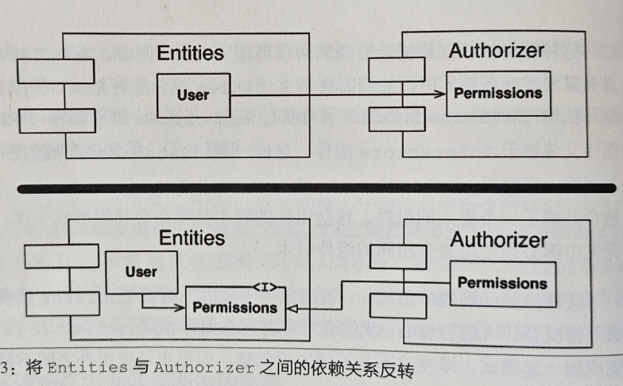
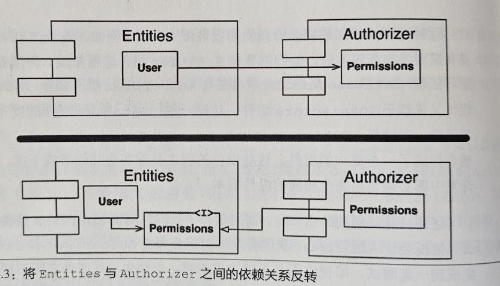
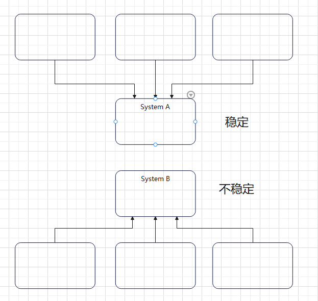
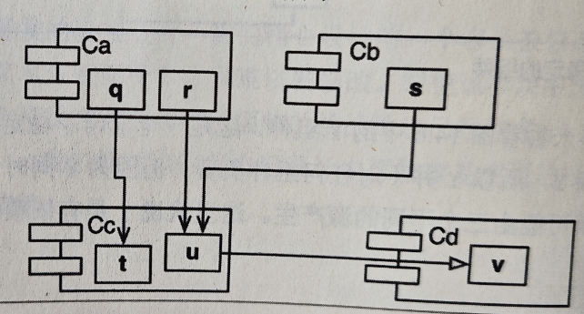
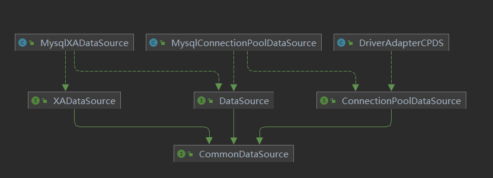
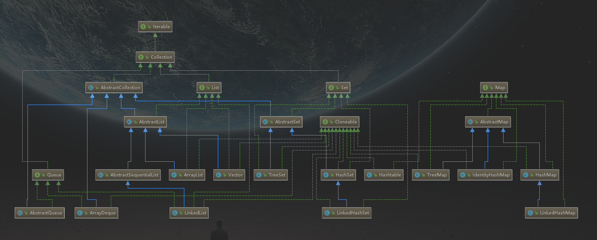
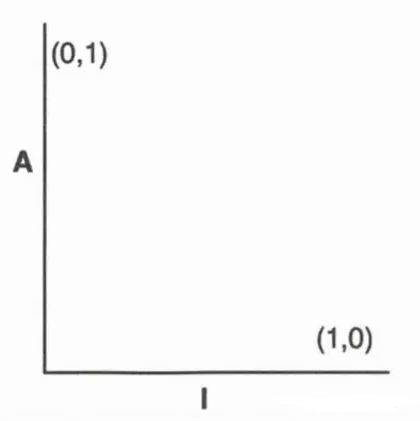
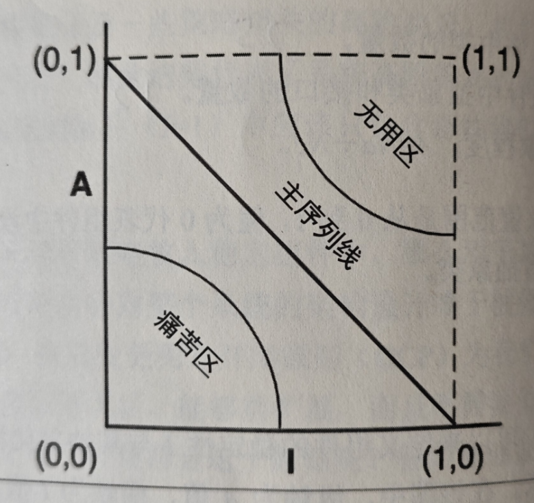
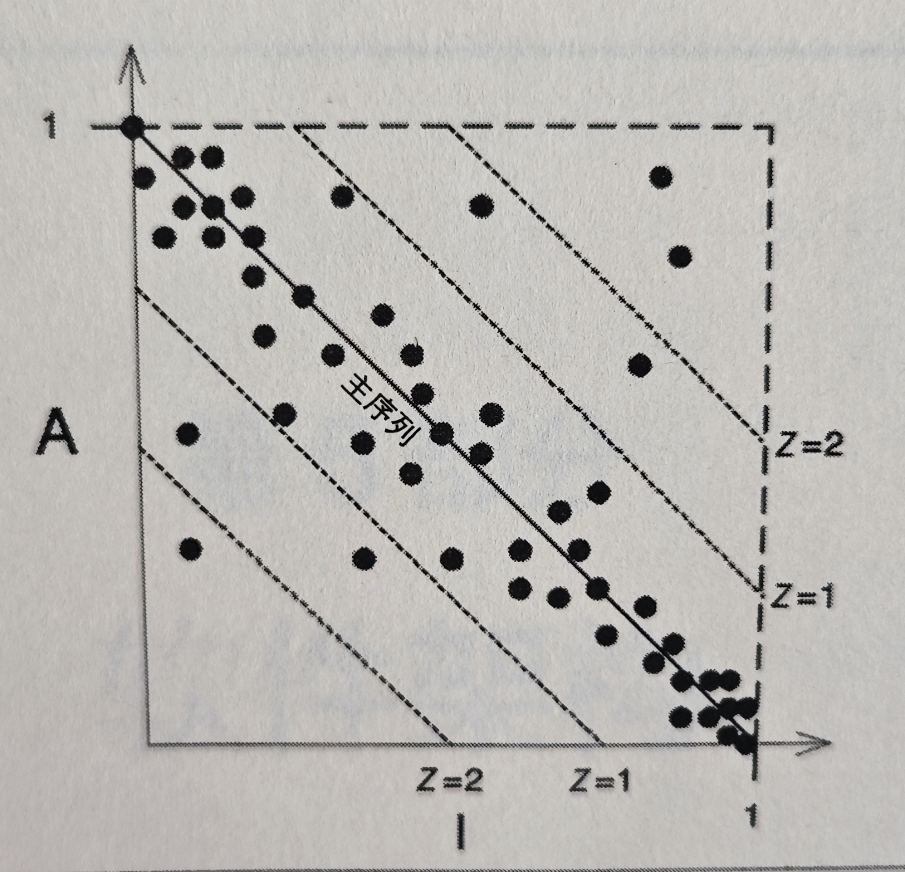

# 第 14 章 组件耦合

## 无依赖环原则

> 组件依赖关系图中不应该出现环

## 每周构建

常见的管理手段; 缺点省略...

## 消除循环依赖

分化可单独发布的组件,交由个人或一组程序员独立完成; 当更新版本时,通过发布机制告知, 其他团队可以选择更新或不更新;

这样就不会出现团队之间相互依赖的情况;

但是,如果想推广上述过程,就必须控制好组件之间的依赖结构,决不允许组件之间存在循环依赖;

更重要的是,也不能沿着依赖关系最终走到起始依赖;

> **这种结构称之为 有向无环图 (Directed Acyclic Graph : DAG)**

## 打破循环依赖

1. 应用依赖翻转原则(DIP);



2. 创建一个新组建;




## 自上而下设计

但是,组件结构不是最初一次设计出来的,而是根据随着系统变化和扩张的;

因此,组件需要根据实际项目的一起扩展和演进;

# 稳定依赖原则

依赖关系必须指向更稳定的方向;

软件开发的难处是,我们精心设计了一个容易修改的组件很可能会由于别人的一个简单的依赖而变得难以修改,

任何一个我们预期会经常变更的组件都不应该被一个难于修改的组件所依赖,否则这个多变的组件也会变得难以修改;

## 稳定性

> 稳定性和变更的频繁度没有直接关系;
>
> **从代码角度可以理解;**
> **稳定 : 是被大量类继承但本身很少或没有依赖其他类,这算是文档 (下图 System A)**
> **不稳定 : 是大量继承了其他类,导致其他类变更自身也需要随之进行变化 (下图 System B)**





### 稳定性指标

具体什么能称之为稳定?

- **Fan-in**: 入向依赖, 指的是组件外部类依赖于组件内部类的数量;
- **Fan-out**: 出向依赖, 指的是组件内部类依赖于组件外部类的数量;
- ***I***: 不稳定性, **`I = Fan-out / (Fan-in + Fan-out)`**, I 的范围 **[0~1]** , **I = 0** 意味着最稳定;



```txt
如上图
Cc类 
    fan-in = 3;
    fan-out = 1;
    I = 3 / (3 + 1);
    I = 0.75;
```

### 并不是所有都是稳定的

如果,一个系统所有的组件,稳定性都是最高的,那这个系统是无法进行任何变更的,这不是我们想要的;

我们的目的是让核心组件稳定,让容易变更的的业务组件容易变更;

可变的组件应该位于顶层,同时依赖稳定的底层组件;

将不稳定的组件放在结构图的顶层很有用,这样我们就很容易找出;

例如常见的 DataSource:



# 抽象稳定原则

> 一个组件的抽象化程度应该和其稳定性保持一致

## 高阶策略应该放在那里

在一个软件系统中，总有些部分是不应该经常发生变更的。这些部分通常用于表现该系统的高阶架构设计及一些策略相关的高阶决策。

如何创建一个足够灵活、能够被扩展, 而且不需要修改得类; 那就是抽象类; (OCP 开闭原则)

## 稳定抽象原则简介

如果一个组件想要成为一个稳定的组件, 那么他就应该由**接口**和**抽象类**组成,  方便扩展;

即: **依赖关系应该指向更抽象的方向**

## 衡量抽象化程度

- Nc: 组件中类的数量
- Na: 组件中抽象类和接口的数量
- A: 抽象程度, A = Na ÷ Nc

举例:


```txt
- Nc: 25
- Na: 12
- A: 0.48
```

## 主序列

我们现在有了组件的稳定性 I与其抽象化程度 A ，就可以来定义他们两者之间的关系了。



## 痛苦区

假设某个组件处于(0,0)位置，那么它应该是一个非常稳定但也非常具体的组件。
这样的组件在设计上是不佳的，因为它很难被修改，这意味着该组件不能被扩展。这样一来，因为这个组件不是抽象的，而且它又由于稳定性的原因变得特别难以被修改，我们并不希望一个设计良好的组件贴近这个区域，因此(0,0)周围的这个区域被我们称为痛苦区。

> 无法变更

## 无用区

我们来看看靠近(1,1)这一位置点的组件，这些组件通常是无限抽象的，但是没有被其他组件依赖，这样的组件往往 无法使用，因此我们将这个区域称为无用区。

> 白抽象,没人用

## 避开这两个区域

坐落于主序列线上的组件不会为了追求稳定性而被设计得“太过抽象”，也不会为了避免抽象化而被设计得“太过不稳定”。这样的组件既不会特别难以被修改， 又可以实现足够的功能。
对于这些组件来说，通常会有足够多的组件依赖于它们，这使得它们会具有一定程度的抽象，同时它们也依赖了足够多的其他组件，这又使得它一定会包含很多具体实现。
在整条主序列线上，组件所能处于最优的位置是线的两端。然而，大型系统中的组件不可能做到完全抽象，也不可能做到完全稳定。所以我们只要追求让这些组件位于主序列线上，或者贴近这条线即可。

## 离主序列的距离

D 指标：距离 D=|A+I-1|，该指标的取值范围是[O,1]。值为 0 意味着组件是直接位于主序列线上的，值为 1 则意味着组件在距离主序列最远的位置。
通过计算每个组件的 D 指标，就可以量化一个系统设计与主序列的契合程度了。如下图





----

组件之间有些依赖关系是好的，有些依赖关系则是不好的，这些经验最后都会体现在这个设计模式中当然，指标并不等同于真理，它只是对我们所定义标准的一个衡量。