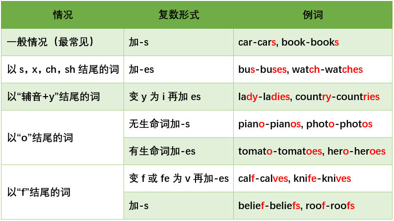
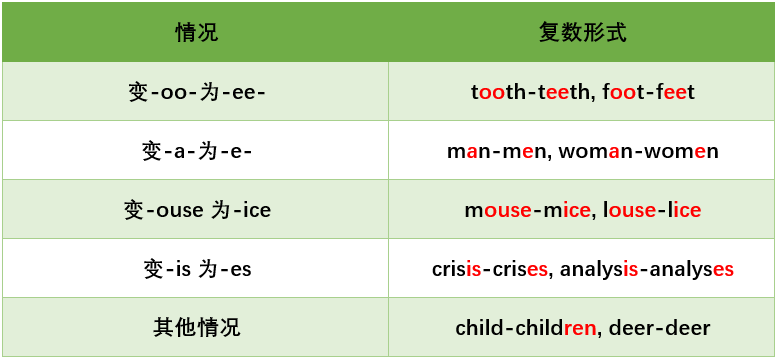
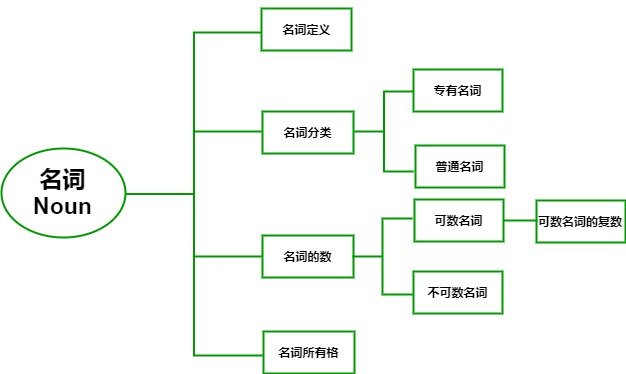

> 上表中的十大词类归纳为**两大类**：
>
> # **1.实词**
>
> *notional words*
>
> 指有实实在在意思的词
>
> **包括**：**名词**、代词、数词、形容词、动词、副词
>
> # **2.虚词**
>
> *form words*
>
> 指没有完整意义，但有语法意义或功能的词。
>
> **包括**：冠词、介词、连词、感叹词

# **名词定义**

**Noun*，简写为 `n.`**

名词是表示**人、事物、地点**或**抽象概念**的词

# **名词分类**

根据词义，名词分为两大类：

* **专有名词**
* **普通名词**

## **1. 专有名词**

**专有名词**指世界上**特定的**或**独一无二的**人或事物，包括：

* **人名**：Tom 汤姆，Mary 玛丽
* **组织名**：the United Nations 联合国
* **国家名**：China 中国，Russia 俄罗斯
* **江河湖海名**： the Yellow River 黄河
* **地名**：Shanghai 上海，Hong Kong 香港
* **月份节日：**五月May，Christmas 圣诞节

> # **the Great Wall** - 长城
>
> 众所周知，长城作为中国古代的军事防御工程，
>
> 以其雄伟的气势和博大精深的文化内涵闻名中外。
>
> 因此长城有着自己独一无二的英文表达。
>
> 
>
> 英文中的专有名词还有一个显著的标志：**大写**！
>
> 为了强调这些事物的特殊性，
>
> 单词的首字母要进行大写。
>
> 
>
> 

## **2. 普通名词**

除专有名词外，其他名词都属于**普通名词**，比如：

* book（书）
* water（水）
* fish（鱼）
* love（爱情）

# **名词的数**

* **有**固定的量化单位

  → 量化单位**被省略**

  → 变身**可数名词**

* **无**固定的量化单位

  → 量化单位**不可省**

  → 变身**不可数名词**

## **1.不可数名词**

说到“**水**”，你想到的是用哪一量词去量化它呢？

一滴水？

一杯水？

一碗水？

一桶水？

是不是觉得，以上说法在日常生活中，均很常用。

没错，对于“**水**”这一事物，

我们很难用一个相对固定的单位

对其进行量化，我们会说：

* 一**滴**水 → a **drop** of water
* 一**杯**水 → a **glass** of water
* 一**碗**水 → a **bowl** of water
* 一**桶**水 → a **bucket** of water

> **既可以充当可数名词，**
>
> **也可以可充当不可数名词**。
>
> ## 
>
> ## 以单词 **time** 为例
>
> **time** 作为名词，主要有以下四种含义：
>
> * 时间
> * 时光
> * 次数
> * 倍数
>
> 
>
> * **time** 表示“**时间**”，不可数。
>
> 时间的概念太广阔了，
>
> 一秒、一分、一小时、一年均是时间范畴，
>
> 实在无法用一个相对固定的量化单位去量化它，
>
> 所以不可数。例句：
>
> 请给我**一些时间**。
>
> Please give me **some time**.
>
> 
>
> * **time** 表示“**时光**”，可数。
>
> 时光的量化单位是相对固定的——
>
> 一**段**时光，所以该量化单位可以被省略。
>
> 因此，**time** 表示“时光”时，变身可数名词。
>
> 例句：
>
> 爱丽丝曾有过**一段**短暂的婚姻**时光**。
>
> Alice was married for **a** short **time**.
>
> 
>
> * **time** 表示“**次数**”、“**倍数**”，可数。
>
> 次数有固定的量化单位：一次、两次......
>
> 倍数有固定的量化单位：一倍、两倍......
>
> 因此，time 表示“次数”、“倍数”时，可数。例句：
>
> 我已经看过**很多次**这部电影了。
>
> I have watched the movie **many times**.
>
> 聪明的你，应该已经发现：
>
> 当我们在表达“**许多次**”时，我们会说“**many times**”。
>
> 单词 **time** 发生了一点小变化——**time**+**s**
>
> 没错！当一个名词是可数名词时，就会呈现出**单数**和**复数**两种形式。
>
> 
>
> 接下来，我们一起来了解一下**可数****名词的复数**。

## **2.可数名词的复数**

### **1. 规则的复数形式**

**注意：**

\1. 大多数可数名词变复数都是在词尾加上字母“**s**”或者“**es**”来构成其复数形式。

（PS：英文26个字母中除了**a**、**e**、**i**、**o**、**u**五个元音字母外，其余均为辅音字母）

\2. 关于以“f”结尾的单词的复数变化的两种情况没有绝对规律，需要大家单独记忆。

### **2. 不规则的复数形式**

当然，也有一些常用的可数名词，

它的复数形式变化却不那么规则。

如下图：

# **名词所有格**

> 名词所有格是指**名词**和**名词**之间的**所有关系**，即：谁是谁的。

在英语中，一共有两种名词所有格：

**’s 所有格** 和 **of 所有格**

## **1. ’s所有格**

> 定义：’s所有格指的是有生命的名词的所有关系，即：谁的人或东西。
>
> 常见造型：名词1’s +名词2（A’s B翻译成：A的B）

举个栗子：

Lao Zhong’s fan

老钟的扇子

John’s girl friend

约翰的女票

上述例子中，名词1（Lao Zhong、John）均为有生命名词。

本来两个毫无关系的名词，通过“'s”的连接，产生了所属关系。

即：名词2是名词1的人或物。

那么，这个让名词和名词发生关系的

“ 's ”在不同情况下怎么使用呢？

### **1.单数名词的所有格**

当名词1是有生命的单数名词时，直接在单词后面接“ ‘s ”再接名词2。

Jimmy’s book 吉米的书

Mark’s room 马克的房间

### **2. 复数名词的所有格**

当名词1是有生命的复数名词时，其所有格要分为以下两个情况。

***a.*** 不以s或es结尾的复数名词，

先在单词后加【**‘s】**再接名词2

Children’s Day 儿童节

women’s wear 女装

***b.***以s或es结尾的复数名词，

先在单词后面接【**‘****】**再接名词2

ladies’ wear 女装

students’ book 学生用书

（体会“女装”的两种英文表达中的所有格写法）

特例：某些表示时间、距离、星球、世界、国家等无生命的东西的名词后加 ’s来表示所有关系。

## **2. of所有格**

> 定义：of所有格指无生命名词或有生命名词的所有关系。
>
> 造型：名词1+of+名词2 （A of B通常翻译为B的A）

举个栗子：

the capital of China 中国的首都

分析：所有格of China帮助说明具体是哪里的首都。

of所有格的使用场景

  1.表示无生命名词的所有关系

the name of the song 歌曲的名字

  2.表示被短语或从句修饰的有生命名词的所有关系

the name of the boy sitting in the car

坐在车里的那个男孩子的名字

分析：在这个例子中，名词2被动词短语“sitting in the car”修饰。

the hat of the man who I just met

我刚遇见的那位男子的帽子

分析：在这个例子中，名词2 the man被从句“who I just met”修饰。

以上是本节对英语十大词性之**名词**的讲解。

相信大家对

