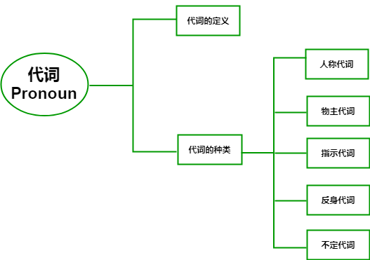
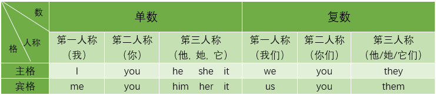
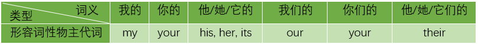
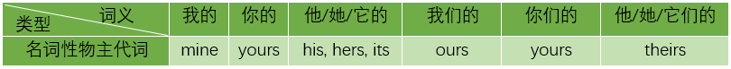
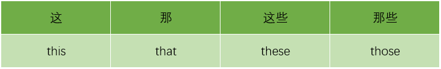
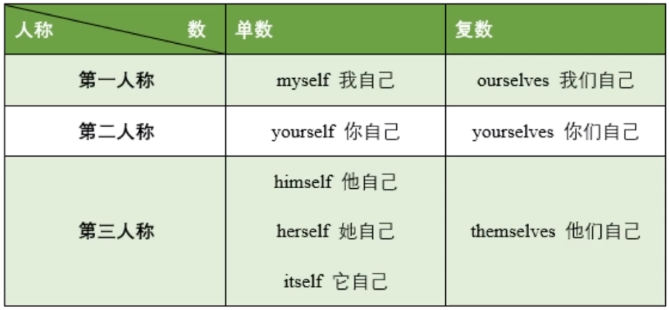
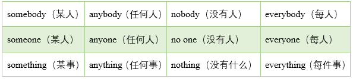

# 代词 Pronoun

# 代词定义 

与中文一样，英文中的**代词**（Pronoun）是**代替名词**的词，在句子中起名词的作用。

# 代词分类

本节课，我们将会为大家介绍五种代词：

**人称代词**、**指示代词**、**反身代词** 、**不定代词**

## 1. 人称代词

**定义**：人称代词是指代“**人或物**”的词。

**比如**：

* **I**：我
* **you**：你，你们
* **we**：我们
* **they**：他们，它们
* **it**：它
* **he**：他
* **she**：她

> 例句：
>
> Tom is a student. He is 13 years old. 
>
> 汤姆是一名学生。他今年13岁。
>
> 
>
> **解析**：在此例句中，**he** 是一个代词，指代了前句中的 **Tom** 这个人。

> 由于代词在句子中起名词作用，
>
> 而名词在句中可作主语或宾语，
>
> 因此，代词在句子中也可以作主语或宾语。

在句中**作主语**的代词需要使用**主格形式**。

在句中**作宾语**的代词需要使用**宾格形式**。

具体如下表所示：

我们通过两个简单的例子感受下：

- 例1：I love Lily.

  我爱莉莉。

  **解析**：这句话中，**I**（我）是动作 **love**（爱）的发出者，是句子的**主语。**因此，此处代词 **I** 是**主格形式**的人称代词。

- 例2：Lily loves me. 

  莉莉爱我。

  **解析**：这句话中，**me**（我）是动作 **love**（爱）的承担者，是句子的**宾语**。因此，此处代词 **me** 是**宾格形式**的人称代词。

## 2. 物主代词

**定义**：物主代词是表示所有关系，即“一个东西是另一个东西的主人”这种关系的代词。

英文共有两种物主代词：**形容词性物主代词**与**名词性物主代词**

1. 首先，我们来看看 **形容词性** **物主代词**

> **Jenny's** bag
>
>  **詹妮的**书包
>
> 
>
> **解析**：**Jenny** 是一个名词，**Jenny's** （詹妮的）是名词所有格——**'s**是名词所有格的显著标志，表达了书包（**bag**）和詹妮（**Jenny**）之间的所属关系：书包是 Jenny 的，而不是 Lily 或者 Mary ，或者其他人的。 
>
> 由于代词用于替代名词，所以，代词也有所有格，也表达了一种所有关系，比如：
>
> 
>
> **her** bag
>
> **她的**书包
>
> 
>
> **解析**：**her** 表达了书包的所属，这个书包既不是他的（ his），也不是我的（my），而是她的（her），相当于一个形容词。

具体如下表所示：

我们再来看看**名词性物主代词**

> 名词性物主代词是**代替****已知物体**的物主代词。比如： 
>
> -Whose bag is it?
>
> ——这是谁的书包？     
>
> -It is **mine**.
>
> ——这是**我的（书包）**。
>
> 解析：这里的mine就是一个名词性物主代词，它代替的是名词结构“my bag”（我的书包）。

因此，我们发现：

**名词性**物主代词=**形容词性**物主代词+**名词**

（mine=my+bag）

## 3. 指示代词

所谓“指示”，即有明确的指向性，具体而言有：

> This/That is my cup.
>
> 这/那是我的杯子。
>
> 
>
> These/Those are your gifts.
>
> 这些/那些是你的礼物。

**this**一般指代距离说话者**较近**的事物

**that**一般指代距离说话者**较远**的事物

**these** 是 **this** 的复数形式

**those** 是 **that** 的复数形式

## 4. 反身代词 

1. 反身代词表示“自己”。如：

   You should take care of **yourself**.

   你应该照顾好**你自己**。

2. 反身代词表示强调。如：

   **I** want to visit Tom **myself**.

   **我**想**亲自**去看看汤姆。

## 5. 不定代词

不定代词，即不指明代词所代替名词的词。

比如：

- someone 某个人

- everybody 每个人

- anything 任何事

  我们发现，这组词都没有具体指代某一个人或事情，因此是不定代词。

> 例如：
>
> ​	There is **something** wrong with my bike.
>
> ​	我的自行车出了**某些**问题。
>
> ​	解析：该例句中的不定代词something（某事、某物）并未指明自行车	具体出现了哪些问题。

类似的不定代词还包括：

> 注意：
>
> some/any/no/everybody **=** some/any/no/everyone