# **动词**

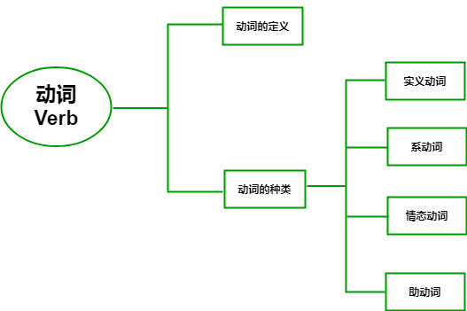

**Verb**

从哲学角度来看

**动词**让孤立的事物有了联系

​        让世界动起来的一类词

# **动词定义**

动词是用来表示**动作**或**状态**的词汇。

> 比如：
>
> ​	玩 - **play**
>
> ​	跳 - **jump**
>
> ​	喜欢 - **like**
>
> ​	存在 - **exist**
>
> ​	睡觉 - **sleep**
>
> ​	消失 - **disappear**

> 你我本无缘，全靠动词连

# **动词的分类**

* **实义动词**
* **系动词**
* **情态动词**
* **助动词**

## 1.实意动词

实义动词就是能够表达**完整意义**的动词。

> **love** - 爱
>
> **hate** - 恨
>
> **laugh** - 笑
>
> **cry** - 哭

这些动作可以是**具体的**、也可以是**抽象的**。

实义动词共分为两类：

* **及物动词**（Transitive Verbs，简写为vt.）
* **不及物动词**（Intransitive Verbs，简写为vi.）

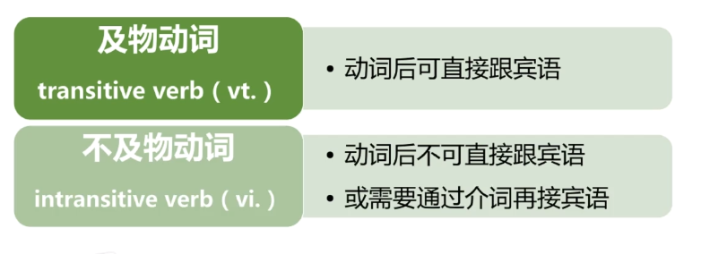

> **及物动词是指动词后可直接跟宾语**
>
> 不及物动词指动词后**不可直接跟宾语**，
>
> 或**需要通过****介词****再接宾语**。

**① 不可直接跟宾语**

比如：

> Tom **left**.
>
> 汤姆**走了**。

> **解析**
>
> 该例句中，
>
> 动词 **left** 后没有任何其他成分。
>
> 因此，**left** 是不及物动词。

**② 需要通过介词再接宾语**

> 比如：
>
> ​	She **looks** at me.
>
> ​	她**看着**我。
>
> ​	**解析**
>
> ​	在该例句中，
>
> ​	动词 **looks** 借助了介词 **at** 来完成对宾语 **me** 的衔接。
>
> ​	因此，动词 **look** 为不及物动词。

## 2.系动词

**系动词**，其实就是**“是”动词**。

### 1. **be 动词**

> * am
> * is
> * are
>
> ...

用来说明主体的性质或状态，意为“**是**”。

比如：

> I **am** a doctor. 
>
> 我是一名医生。
>
> 
>
> She **is** very beautiful. 
>
> 她（**是**）很漂亮。

### 2. **感官动词**

> * feel - 摸起来是
> * taste - 尝起来是
> * smell - 闻起来是
> * sound - 听起来是

...

其本质还是“**是**”这个内核。

比如：

> The bread **tastes** good. 
>
> 面包**尝起来是**不错的。

> The flower **smells** very sweet. 
>
> 这朵花**闻起来是**很香的。

### 3. **情态动词**

情态动词是指表示说话人的语气或主观看法的动词。

> 比如：
>
> ​	你**必须**要写完作业！
>
> ​	You **must** finish your homework.
>
> （表示命令）

> 她**可能**明天来。
>
> She **might** come tomorrow.
>
> （表示可能性）

如果只用“finish”和“come”两个词，

并不能表达说话者想要传达出的语气。

因此在动词前面加上了**情态动词**。

> 常见的情态动词有：can、could、may、might、should、will、would、must

#### 1. can 、could - 能

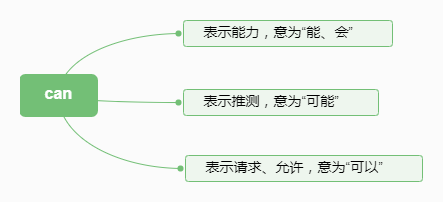

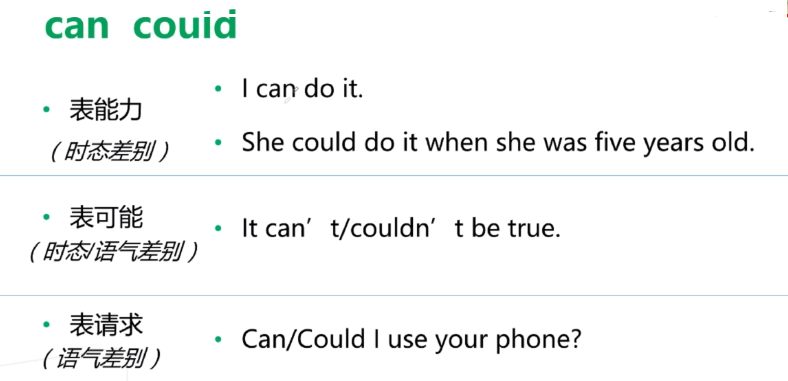

#### 2. many、might - 可能\可以

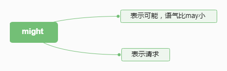

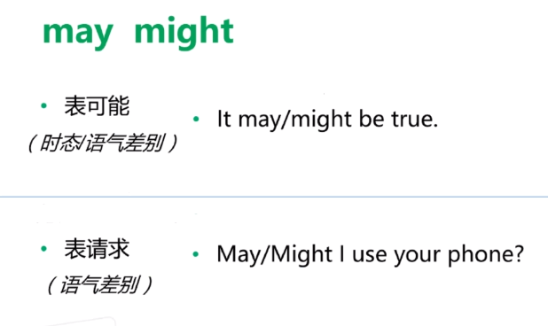

> can 和 could 的可能性 大于 may 和 might

#### 3. will would - 愿意

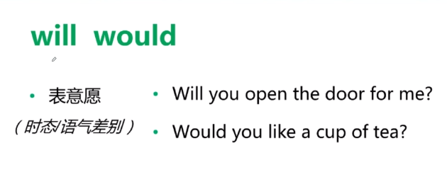

#### 4. should - 应该

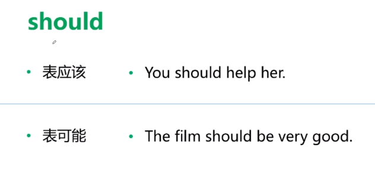

#### 5. must - 必须

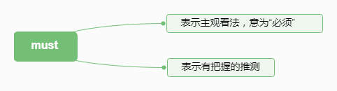

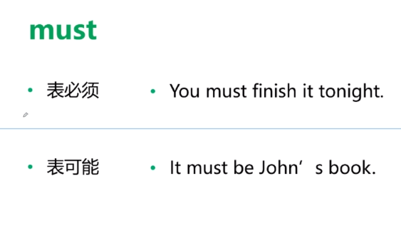

#### - *语气差别*

- 表示可能

  might < may < could < can < should < must

- 表示许可

  might < may < could < can

## 3. 助动词

助动词，顾名思义，就是辅助动词的词。

它没有具体的词义，不能单独使用，主要用于构成时态、语态、或者疑问、否定句。

- 最常见的助动词：

> **be**
>
> **have**
>
> **do**
>
> **will**

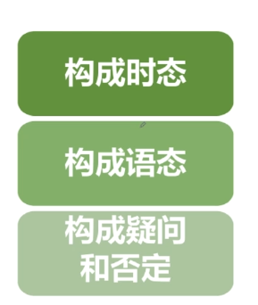

### 1. 构成时态

> I **am** doing my homework now.
>
> I **have** finished my homework.
>
> I **will** do my homework tomorrow.

### 2. 构成语态

> 主动 : They built the house in 1998.
>
> 被动 : The house was built in 1998.

### 3. 疑问句、否定句

> 陈述句 : I love you.
>
> 否定句 : I don’t love you.
>
> 疑问句 : Do you love me.

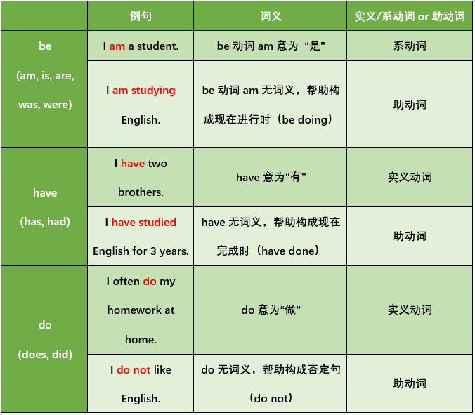