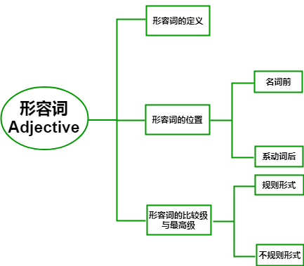
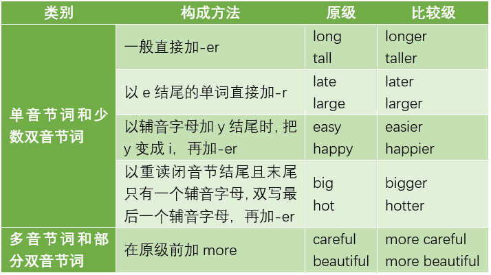
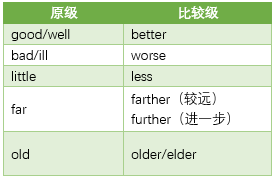
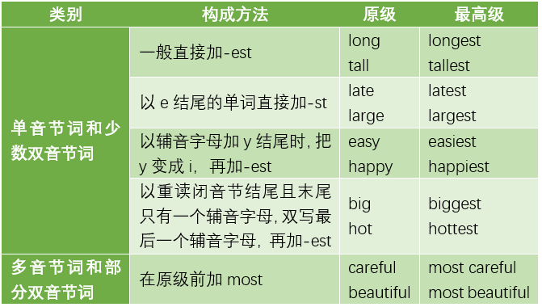
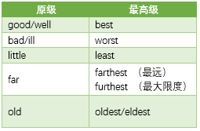

# **形容词**

**Adjective** 

# **形容词定义**

> 形容词是描写或修饰名词、代词的一类词

以歌曲《天堂》的歌词为例：

> **蓝蓝的**天空

* “天空”，是名词，也是被修饰的成分。
* “**蓝蓝的**”，是形容词，用于形容“天空”的颜色。

> **绿绿的**草原

* “草原”，是名词，也是被修饰的成分。
* “**绿绿的**”，是形容词，用于形容“草原”的颜色。

# **形容词位置**

中文里的形容词，相信大家已经非常熟悉啦。

最常见的一种造型就是：“......的XX”，

将形容词置于被修饰的名词前，比如：

> **有钱的**老钟
>
> **贫穷的**小编

* 与中文一样，英文中的形容词

也是用来**修饰名词或代词**的一类词汇。

* 与中文一样，英文中的形容词最常见的位置，

也是**置于被修饰的名词前**，比如：

> **blue** sky
>
> **蓝蓝的**天空

形容词 **blue** 置于名词 sky 前，形容 sky 的颜色。

> **green** grassland
>
> **绿绿的**草原

形容词 **green** 置于名词 grassland 前，

形容 grassland 的颜色。

除此之外，英文中的形容词，也可置于系动词后。

此时，被修饰的成分则会提在系动词前。

根据上节对系动词的讲解，我们知道，

系动词有两类：

## be 动词 + 形容词

> be 动词 + 形容词
>
> * be动词：am、is、are......
>
> * The question **is** **interesting**.
>
>   这个问题**是****有趣的**。

## 系动词 + 形容词

> 系动词 + 形容词
>
> * 感官动词：feel、look、sound、taste......
>
> * The question **sounds** **interesting**.
>
>   这个问题**听起来是****有趣的**。

# **形容词比较级**

> (｀∀´) “我跟你说，他的前女友**比**现在的漂亮。”
>
> “嗨！老李家的儿子**比**我家孩子傻。”(´･･)ﾉ(._.`)

>  公式：**A** + **be** + **形容词比较级** + **than** + **B**

不同于中文，英语在进行比较时，要**对形容词进行变形**。

> 比如
>
> Tom is **taller** than Bob.
>
> 汤姆比鲍勃**高**。

- 规则变化：

- 不规则变化：

# **形容词最高级**

* 最高级公式：

  

> A + be + the + 形容词最高级 + 范围

规则变化：

不规则变化：

