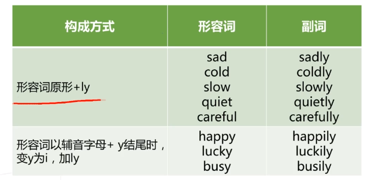

# **副词**

**Adverb**

**adverb：ad + verb**

## **副词**的**作用及位置**：

### 1.副词可**修饰动词**

> 多位于动词之后

### 2.副词还可**修饰形容词**

> 多**位于形容词之前**

> **结论**：副词（adverb）是用于修饰
>
> 动词、形容词、或整个句子的词，
>
> 用来表示时间、地点、程度、方式等概念。

# **副词的造型**

英文中最常见的副词造型：

> **形容词 + ly**

