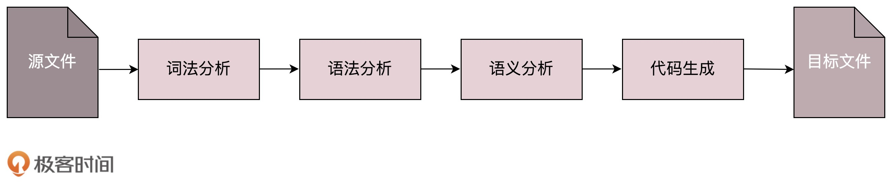
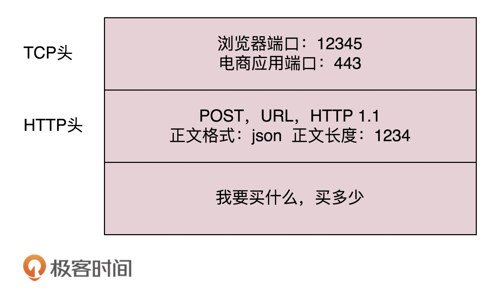
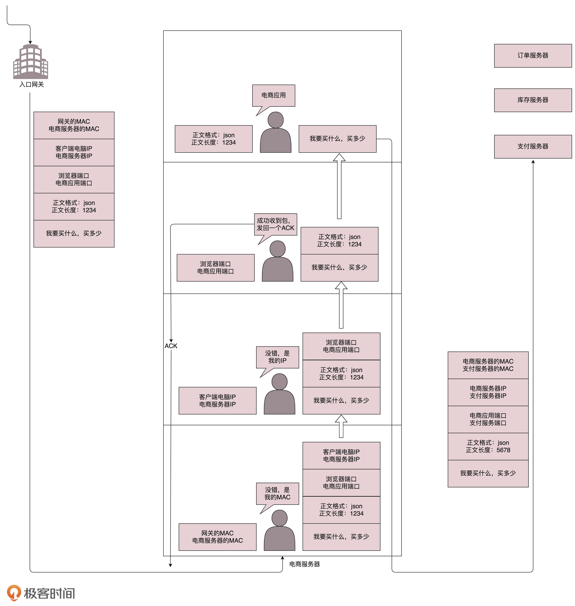
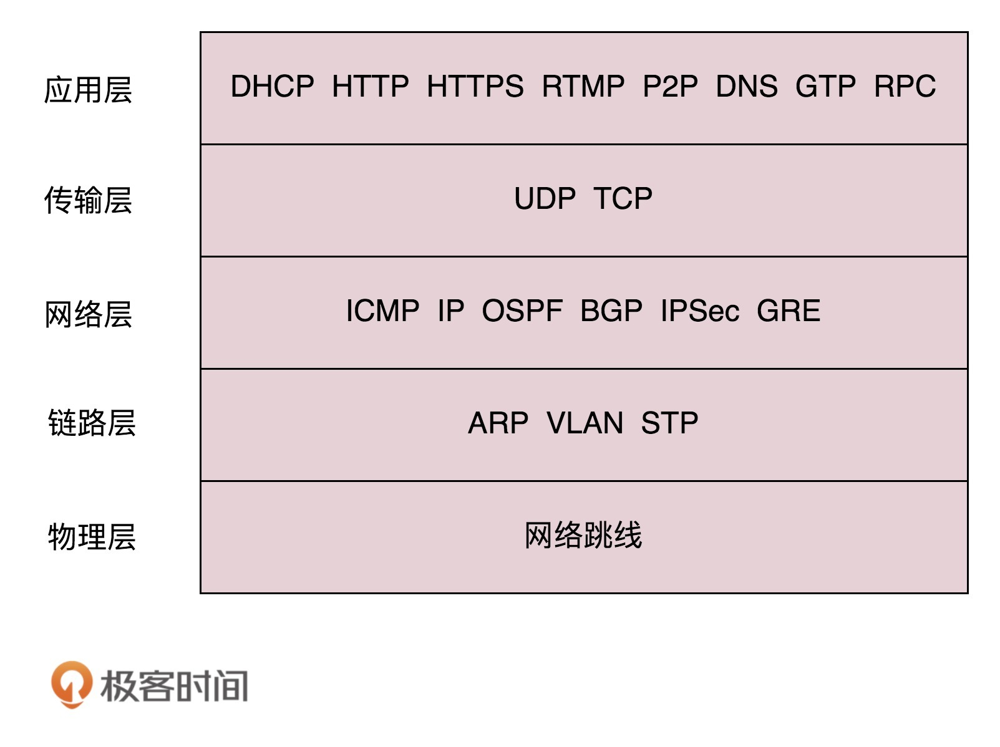

# 协议三要素

1. **语法**，就是这一段内容要符合一定的规则和格式。例如，括号要成对，结束要使用分号等。
2. **语义**，就是这一段内容要代表某种意义。例如数字减去数字是有意义的，数字减去文本一般来说就没有意义。
3. **顺序**，就是先干啥，后干啥。例如，可以先加上某个数值，然后再减去某个数值。

> 只有通过网络协议，才能使一大片机器互相协作、共同完成一件事。

# 网络协议

## 应用层

**DNS**、**HTTP**、**HTTPS** 所在的层我们称为。

https://www.kaola.com 开始在 地址簿协议 **DNS** 去查找，还可以使用另一种更加精准的地址簿查找协议 **HTTPDNS**。

## 传输层

传输层有两种协议，一种是无连接的协议 **UDP**，一种是面向连接的协议 **TCP**。

**TCP** 协议里面会有两个端口，一个是浏览器监听的端口，一个是服务器监听的端口。操作系统往往通过端口来判断，它得到的包应该给哪个进程。

### 网络层

**IP**、**网关**、**ARP**、**MAC**

网络层的协议是 **IP** 协议。在 **IP** 协议里面会有源 **IP** 地址，即浏览器所在机器的 **IP** 地址和目标 **IP** 地址，也即电商网站所在服务器的 **IP** 地址。

目标 IP 地址，就开始想如何根据这个门牌号找到目标机器。操作系统往往会判断，这个目标 IP 地址是**本地人**，还是**外地人**。

如果去国外要去海关，去外地就要去**网关**。

在本地通信基本靠吼，于是操作系统大吼一声，谁是 192.168.1.1 啊？网关会回答它，我就是，我的本地地址在村东头。这个本地地址就是 MAC 地址，而大吼的那一声是 **ARP** 协议。

于是操作系统将 **IP** 包交给了下一层，也就是 **MAC** 层。**网卡**再将包发出去。由于这个包里面是有 **MAC** 地址的，因而它能够到达网关。

网关往往是一个路由器，到某个 IP 地址应该怎么走，这个叫作路由表。

**路由器**有点像玄奘西行路过的一个个国家的一个个城关。每个城关都连着两个国家，每个国家相当于一个局域网，在每个国家内部，都可以使用<u>本地的地址 MAC 进行通信</u>。

一旦跨越城关，就需要拿出 IP 头来，里面写着贫僧来自东土大唐（就是源 IP 地址），欲往西天拜佛求经（指的是目标 IP 地址）。路过宝地，借宿一晚，明日启程，请问接下来该怎么走啊？

城关往往是知道这些“知识”的，因为城关和临近的城关也会经常沟通。到哪里应该怎么走，这种沟通的协议称为**路由协议**，常用的有 **OSPF** 和 **BGP**。

最后一个城关知道这个网络包要去的地方。于是，对着这个国家吼一声，<u>谁是目标 IP</u> 啊？目标服务器就会回复一个 <u>MAC 地址</u>。网络包过关后，<u>通过这个 MAC 地址就能找到目标服务器</u>。

目标服务器发现 MAC 地址对上了，取下 MAC 头来，发送给操作系统的网络层。发现 IP 也对上了，就取下 IP 头。IP 头里会写上一层封装的是 TCP 协议，然后将其交给传输层，即 TCP 层。

如果过一段时间还是没到，发送端的 TCP 层会重新发送这个包，还是上面的过程，直到有一天收到平安到达的回复。这个重试绝非你的浏览器重新将下单这个动作重新请求一次。对于浏览器来讲，就发送了一次下单请求，TCP 层不断自己闷头重试。除非 TCP 这一层出了问题，例如连接断了，才轮到浏览器的应用层重新发送下单请求。
