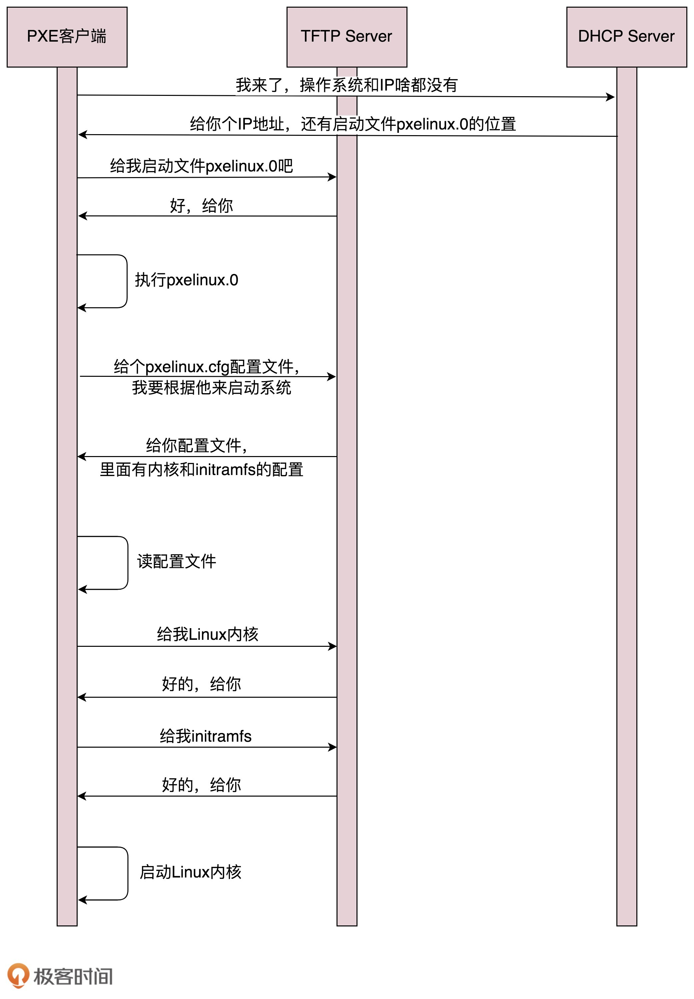

# 如何配置 IP

- 使用 net-tools：

  ```shell
  $ sudo ifconfig eth1 10.0.0.1/24
  $ sudo ifconfig eth1 up
  ```

- 使用 iproute2：

  ```shell
  $ sudo ip addr add 10.0.0.1/24 dev eth1
  $ sudo ip link set up eth1
  ```

  

# 动态主机配置协议（DHCP）

自动配置的协议，也就是<u>动态主机配置协议</u>（Dynamic Host Configuration Protocol），简称 **DHCP**。


解析 DHCP 的工作方式当一台机器新加入一个网络的时候，肯定一脸懵，啥情况都不知道，只知道自己的 MAC 地址。怎么办？先吼一句，我来啦，有人吗？这时候的沟通基本靠“吼”。这一步，我们称为 **DHCP Discover**。


格式就像这样：


DHCP Offer 的格式就像这样，里面有给新人分配的地址。


如果有多个 DHCP Server，这台新机器会收到多个 IP 地址，简直受宠若惊。


当 DHCP Server 接收到客户机的 DHCP request 之后，会广播返回给客户机一个 DHCP ACK 消息包，表明已经接受客户机的选择，并将这一 IP 地址的合法租用信息和其他的配置信息都放入该广播包，发给客户机，欢迎它加入网络大家庭。


最终租约达成的时候，还是需要广播一下，让大家都知道。


##  IP 地址的收回和续租


客户机会在租期过去 50% 的时候，直接向为其提供 IP 地址的 DHCP Server 发送 DHCP request 消息包。客户机接收到该服务器回应的 DHCP ACK 消息包，会根据包中所提供的新的租期以及其他已经更新的 TCP/IP 参数，更新自己的配置。这样，IP 租用更新就完成了。


# 预启动执行环境（PXE）


