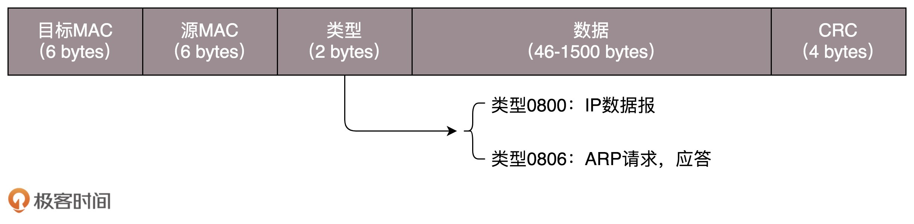
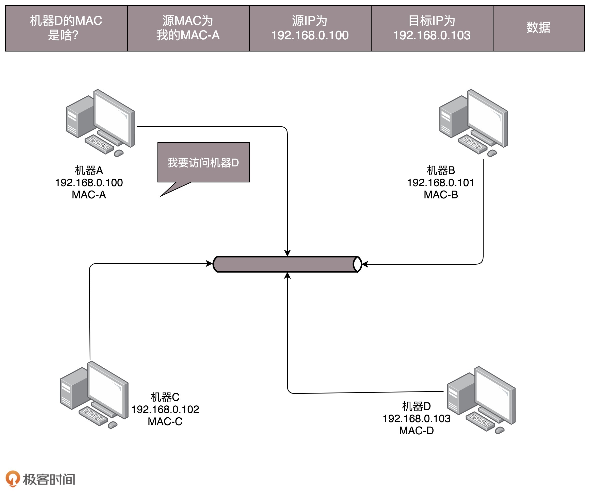
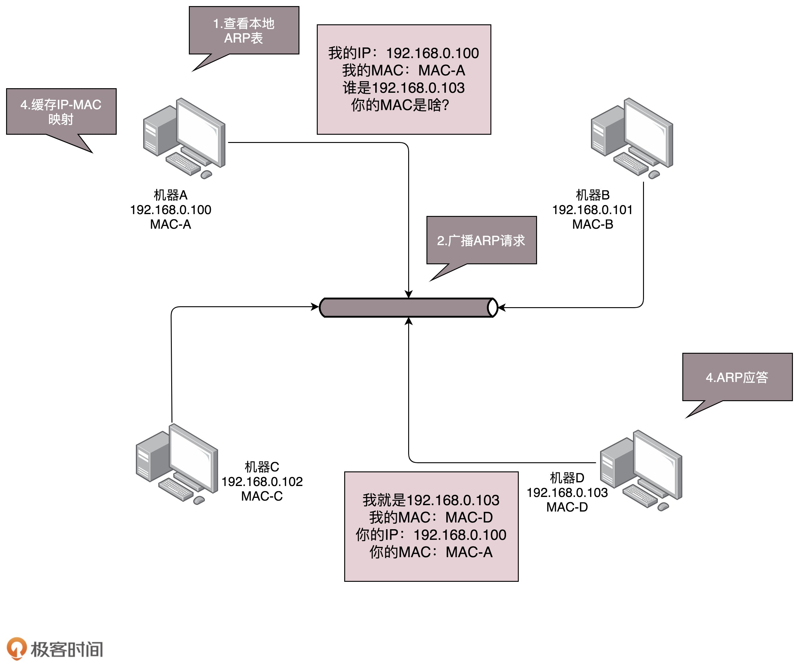
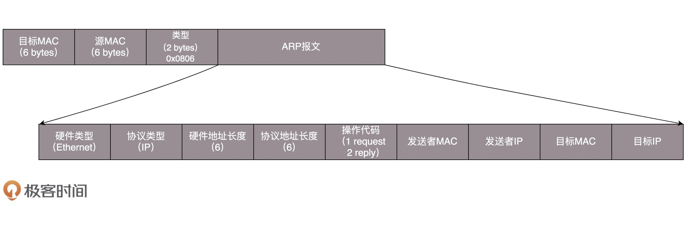

# 第一层（物理层）

使用路由器，是在第三层上。

我们先从第一层物理层开始说。物理层能折腾啥？

交叉线，用的就是所谓的 1－3、2－6 交叉接法。水晶头的第 1、2 和第 3、6 脚，它们分别起着收、发信号的作用。

将一端的 1 号和 3 号线、2 号和 6 号线互换一下位置，就能够在物理层实现一端发送的信号，另一端能收到。当然电脑连电脑，除了网线要交叉，还需要配置这两台电脑的 IP 地址、子网掩码和默认网关。

这三个概念上一节详细描述过了。要想两台电脑能够通信，这三项必须配置成为一个网络，可以一个是 192.168.0.1/24，另一个是 192.168.0.2/24，否则是不通的。这里我想问你一个问题，两台电脑之间的网络包，包含 MAC 层吗？当然包含，要完整。IP 层要封装了 MAC 层才能将包放入物理层。到此为止，两台电脑已经构成了一个最小的局域网，也即 LAN。

可以玩联机局域网游戏啦！等到第三个哥们也买了一台电脑，怎么把三台电脑连在一起呢？先别说交换机，当时交换机也贵。

有一个叫做 **Hub** 的东西，也就是**集线器**。这种设备有多个口，可以将宿舍里的多台电脑连接起来。但是，和交换机不同，集线器没有大脑，它完全在物理层工作。它会将自己收到的每一个字节，都复制到其他端口上去。这是第一层物理层联通的方案。

# 第二层（数据链路层）

Hub 采取的是广播的模式，如果每一台电脑发出的包，宿舍的每个电脑都能收到，那就麻烦了。这就需要解决几个问题：

- **问题一**：这个包是发给谁的？谁应该接收？

- **问题二**：大家都在发，会不会产生混乱？

- **问题三**：有没有谁先发、谁后发的规则？如果发送的时候出现了错误，怎么办？

这几个问题，都是第二层，**数据链路层**，也即 **MAC** 层要解决的问题。MAC 的全称是 <u>Medium Access Control</u>，即媒体访问控制。

控制什么呢？其实就是控制在往媒体上发数据的时候，<u>谁先发、谁后发的问题。防止发生混乱</u>。<u>这解决的是第二个问题。这个问题中的规则，学名叫多路访问。有很多算法可以解决这个问题</u>。就像车管所管束马路上跑的车，能想的办法都想过了。

## 问题一：这个包是发给谁的？谁应该接收？

物理地址，叫作**链路层地址**。但是因为第二层主要解决媒体接入控制的问题，所以它常被称为MAC 地址。

解决第一个问题就牵扯到第二层的网络包格式。对于以太网，第二层的最开始，就是目标的 MAC 地址和源的 MAC 地址。

### 网络包格式

### 类型

类型，大部分的类型是 IP 数据包，然后 IP 里面包含 **TCP**、**UDP**，以及 **HTTP** 等，这都是里层封装的事情。

有了这个目标 MAC 地址，数据包在链路上广播，MAC 的网卡才能发现，这个包是给它的。MAC 的网卡把包收进来，然后打开 IP 包，发现 IP 地址也是自己的，再打开 TCP 包，发现端口是自己，也就是 80，而 nginx 就是监听 80。

### 校验 CRC

第二层的最后面是 **CRC**，也就是循环冗余检测。通过 XOR 异或的算法

### 寻找目标机器 ARP 协议

我怎么知道每个 MAC 地址是谁呢？这就是 ARP 协议，也就是已知 IP 地址，求 MAC 地址的协议。

为了避免每次都用 ARP 请求，机器本地也会进行 ARP 缓存。当然机器会不断地上线下线，IP 也可能会变，所以 ARP 的 MAC 地址缓存过一段时间就会过期。

## 问题二：大家都在发，会不会产生混乱？

比如接下来这三种方式：

- **方式一**：分多个车道。每个车一个车道，你走你的，我走我的。这在计算机网络里叫作信道划分；
- **方式二**：今天单号出行，明天双号出行，轮着来。这在计算机网络里叫作轮流协议；
- **方式三**：不管三七二十一，有事儿先出门，发现特堵，就回去。错过高峰再出。我们叫作随机接入协议。著名的**以太网**，用的就是这个方式。

## 局域网

**交换机**：把 MAC 头拿下来，检查一下目标 MAC 地址，然后根据策略转发的设备。

每个机器的 IP 地址会变，所在的口也会变，因而交换机上的学习的结果，我们称为转发表，是有一个过期时间的