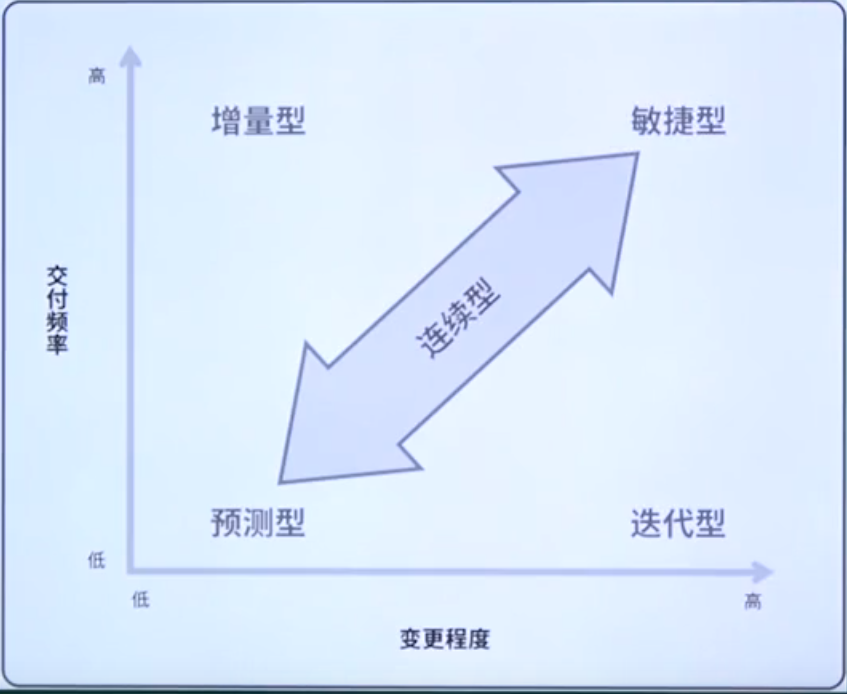
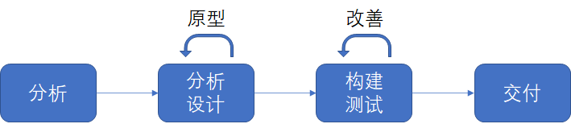
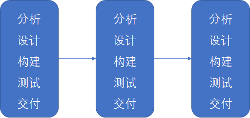

# 四种声明周期

1. 预测型生命周期：一种更为传统的方法，提前进行大量的计划工作，然后一次性执行；执行是一个连续的过程。也成为计划型或瀑布式。
2. 迭代型生命周期：这种方法允许对未完成的工作进行反馈，从而改进和修改该工作。
3. 增量型生命周期：这种方法向客户提供各个已完成的，可能立即使用的可交付成果。
4. 敏捷生命周期：这种方法既有迭代，也有增量，便于完善工作，频繁交付。

## 特征

| 方法   | 需求 | 活动                     | 交付                     | 目标                                     |
| ------ | ---- | ------------------------ | ------------------------ | ---------------------------------------- |
| 预测型 | 固定 | 整个项目仅执行一次       | 一次交付                 | 管理成本                                 |
| 迭代型 | 动态 | 反复执行直至修正（多）   | 一次交付（一）           | 解决方案的正确性                         |
| 增量型 | 动态 | 对给定增量执行一次（一） | 频繁更正小规模交付（多） | 速度（交付速度）                         |
| 敏捷型 | 动态 | 反复执行直至修正         | 频繁小规模交付           | 通过频繁的小规模交付和反馈实现的客户价值 |

> 计划始终贯穿其中：每种生命周期都有要素，不同之处在于完成多少计划以及何时完成

## 声明周期连续区

## 1、预测型生命周期

- 高确定的明确需求、稳定的团队和低风险；
- 项目活动以顺序方式执行。需要详细的计划。尽可能减少预测型项目的变更。监控可能影响的范围、进度计划或预算的变更。
- 预测型项目强调根据部门划分、有效的、顺序的工作，通常不会在项目结束前交付商业价值；
- 如果遇到变更或需求分歧，或者技术解决方案变得不再简单明了，预测型项目就将产生意想不到的成本。

## 2、迭代型生命周期

- 通过连续的原型或概念来改进产品或成果。每一个原型都能带来新的相关方反馈和团队见解。
- 团队在下一周期重复一个或多个项目活动，纳入新的信息。特定迭代中使用时间盒。
- 迭代有利于识别和减少项目的不确定性。迭代型声明周期可能需要更长的时间，因为他是为学习而优化，而不是为了交付速度

## 3、增量型生命周期

- 为了加快交付速度。客户愿意接受整个解决方案的一部分。
- 为客户提供了一个歹意功能或是交付一项完成的工作。
- 团队需要获取关于原型的反馈，然后可能选择将最小可行产品（MVP）交付客户
- 敏捷团队的重要优势：经常交付有商业价值。产品功能得到增加，就能吸引到更多的消费者。

## 4、敏捷型生命周期

- 敏捷环境中，团队期望需求发生变更；
- 基于迭代的敏捷：时间长度相等的时间盒，交付最重要的功能；
- 基于流程的敏捷：根据功能而不是迭代进度进行开发。定义任务板的工作流，并管理格列进行中的工作。

# 敏捷适用性过滤器

- 文化：是否具有支持该方法并已建立信任的团队环境；
- 团队：适当规模的团队是否能在采取敏捷后获得成功？成员是否能够获取成功所需的技术以及业务代表联系渠道？
- 项目：变更速度极快？增量交付可行？项目关键性如何？

# 混合声明周期

## 1. 先敏捷后预测

- 早期采用敏捷型开发生命周期，之后是预测型的发布阶段。可能由不同的团队实施。

## 2. 预测和敏捷结合

- 团队正在逐渐向敏捷过渡，使用方法如短迭代、每日站会和回顾的方法。
- 在项目的其他方面，如前期评估、工作分配和进度跟踪等，仍然尊徐预测法。

## 3. 预测法为主，敏捷法为辅

- 以敏捷方法处理不确定性、复杂性或范围蔓延机会项目的一部分，而使用预测法管理项目的其余部分。

## 4. 敏捷法为主，预测法为辅

- 当某个特定要素不可协商，或者使用敏捷方法不可执行是，使用这种方法。

# 混合生命周期的目的

- 项目风险：增量方法会将资源集中，使项目成果更早完工，从而加快投资回报；
- 商业价值 ：项目管理的目标是在给定的当前环境下尽可能以最好的方式创造价值。
- 中间价值：当组织无法交付中间价值时，敏捷方法可能不是很重要；
- 反馈循环：敏捷频繁向客户交付，并给团队带来反馈。利用反馈重新规划下一部分工作；

# 混合声明周期作为过渡策略

- 无法马上切换到敏捷工作方式。
- 计划渐进的过渡
  - 增加更多的迭代技术，以便改进学习，加强团队和相关方面的一致性
  - 考虑更多增量技术，以加快发起人的价值和投资回报
- 先在风险不大、具有中低程度不确定性的项目中尝试新的技术。然后在尝试更复杂的项目
- 根据组织情况、特定风险，以及团队适应并接受变革的就绪情况来调整的渐进混合过渡。 