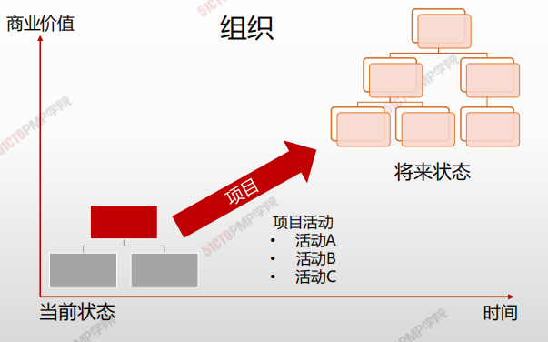

# 项目创造商业价值

## 项目驱动变更

### 期望和结果

> 项目驱动组织进行变更，项目驱动变更是为了获得期望的结果

### 项目管理是实现企业战略的有效途径

- 战略管理的目的是为了企业战略目标的实现；
- 项目是企业战略落地的单元；项目是企业利润的来源；项目也是企业跨部门协作的载体; 
- 项目管理的目标则是任务的完成和实现；
- **“项目管理既是艺术，又是科学，它使远景（<u>vision</u>）转变成为现实。”**
- 战略管理和项目管理都是目标导向的。

## 项目创造商业价值

> PMI将商业价值定义从商业运作中获得的可量化净效应

### 有形效应

- 货币资产
- 股东利益
- 公共事业
- 固定设施
- 工具
- 市场份额

### 无形效应

- 商誉
- 品牌认知度
- 公共利益
- 商标
- 战略一致性
- 声誉

## 项目的启动背景

1. 符合法律、法规或社会要求
2. 满足相关方的要求或需求
3. 创造、改进或修复产品、过程或服务
4. 执行、变更业务或技术战略

| 特定因素           | 特定因素示例                                                 | 符合法律法规和社会需求 | 满足相关方的要求或需求 | 创造、改进或修复产品、过程或服务 | 执行、变更业务或技术战略 |
| ------------------ | ------------------------------------------------------------ | ---------------------- | ---------------------- | -------------------------------- | ------------------------ |
| 新技术             | 某电子公司批准一个新项目，在计算机内存和电子技术发展基础上，开发一种高速、廉价的小型笔记本电脑 |                        |                        | **√**                            | **√**                    |
| 竞争力             | 为保持竞争力，产品价格要低于竞争对手产品价格，需要降低生产成本 |                        |                        |                                  | **√**                    |
| 材料问题           | 某市政桥梁的一些支承构件出现裂痕，因此需要实施一个项目来解决问题 | **√**                  |                        |                                  |                          |
| 政治变革           | 在某新当选官员促动下，当前某项目经费发生变更                 |                        |                        |                                  | **√**                    |
| 市场需求           | 为应对汽油紧缺，某汽车公司批准一个低油耗车型的研发项目       |                        | **√**                  | **√**                            | **√**                    |
| 经济变革           | 经济滑坡导致当前项目优先级发生变更                           |                        |                        |                                  | **√**                    |
| 客户需求           | 为了给新工业园区供电，某电力公司批准一个新变电站建设项目     |                        | **√**                  | **√**                            |                          |
| 相关方需求         | 某相关方要求组织进行新的输出                                 |                        | **√**                  |                                  |                          |
| 法律要求           | 某化工制造商批准一个项目，为妥善处理一种新的有毒材料指定指南 | **√**                  |                        |                                  |                          |
| 业务过程改进       | 某组织实施一个运用精益六西格玛价值流图的项目                 |                        |                        | **√**                            |                          |
| 战略机会或业务需求 | 为增加收入，某培训公司批准一个项目，开发一门新课程           |                        |                        | **√**                            | **√**                    |
| 社会需求           | 为应对传染病频发，某发展中国家的非政府组织批准一个项目，为社区建设饮用水系统和公共厕所，并开展卫生教育 |                        | **√**                  |                                  |                          |
| 环境考虑           | 为减少污染，某上市公司批准一个项目，开创电动汽车共享服       |                        |                        | **√**                            | **√**                    |

