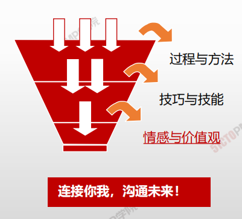

# 项目管理的价值

## 项目管理的痛楚：三边六拍运动

- 三边
  1. 边设计
  2. 边施工
  3. 边修改
- 六拍
  1. 领导 - 拍脑袋决策
  2. 售前 - 拍肩膀承诺客户
  3.  经理 - 拍胸口说没问题
  4. 困难 - 拍桌子骂娘
  5. 实现不了- 拍屁股走人
  6. 生无可恋

> 计划不当    进度失控    目标不明    无序    质量不符    重复低效     约束不利    规章不全    领导不力    范围不明    成本超支    激励不足    职责不清    拖延症    缺乏沟通

## 项目管理的重要性

> 项目管理就是在复杂多变的环境中如何做好一件事

### 项目管理的定义

项目管理就是将**知识、技能、工具与技术**应用于项目活动，以满足项目的要求。

项目管理通过**合理运用于整合特性**项目所需的项目管理过程得以实现。

项目管理使组织**有效且高效**的展开项目。

### 项目成功的四要素

- 范围
- 进度
- 成本
- 质量

> **有效的项目管理能够帮助个人、群体以及公共和私人组织**

> 项目管理及时 “ **事清 、 人爽** ”

- **有效的项目管理能够帮助个人、群体以及公共和私人组**

**织：**

- 达成业务目标；

- 满足相关方的期望；

- 提高可预测性；
- 提高成功的概率；

- 在适当的时间交付正确的产品；

- 解决问题和争议；

- 及时应对风险；

- 优化组织资源的使用；

- 识别、挽救或终止失败项目；

- 管理制约因素（例如范围、质量、进度、成本、资源）；

- 平衡制约因素对项目的影响（例如范围扩大可能会增加

成本或延长进度）；

- 以更好的方式管理变更。

- 理解框架，增强认识

- 掌握方法，提高**管控**水平和管理能力

- 熟悉**流程**，强化管理执行力和穿透力

- 项目管理=**科学**+**艺术**

- 认识自我，掌握相对全面的**一套管控体系**

- 项目经理的成功起点！