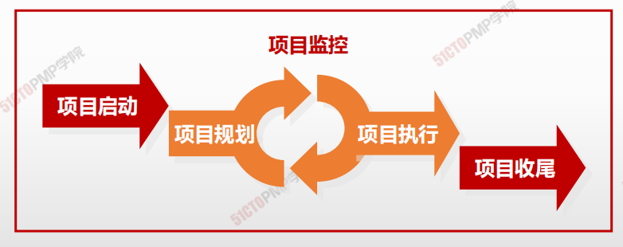
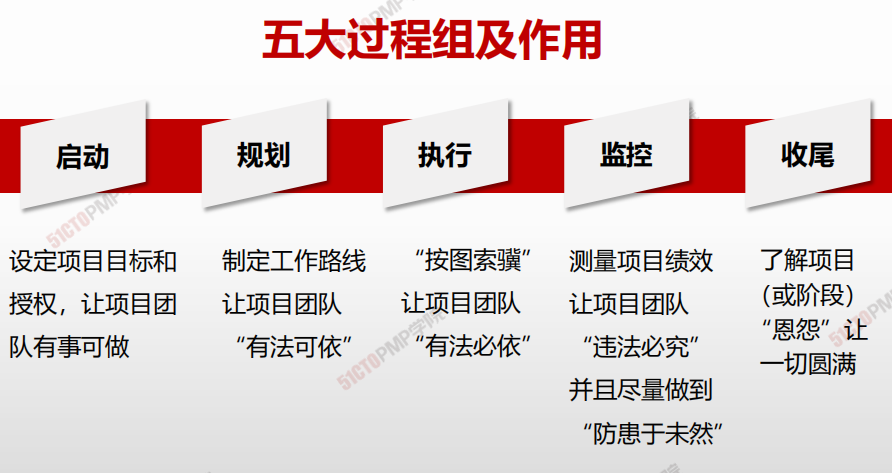
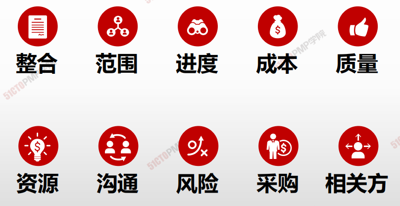
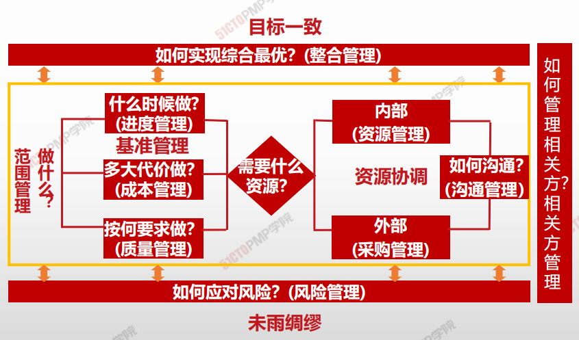

# 项目管理的五大过程组、十大知识领域

## 五大管理过程组

> 启动、规划、执行、监控、收尾

## 项目管理知识领域 - 十五至尊图

| 人/事/物/财/鬼    |                   | **启动过程组**  | **规划过程组**                                               | **执行过程组**                            | **监控过程组**                         | **收尾过程组**    |
| ----------------- | ----------------- | --------------- | ------------------------------------------------------------ | ----------------------------------------- | -------------------------------------- | ----------------- |
|                   | **4.整合管理**    | 4.1制定项目章程 | 4.2制定项目管理计划                                          | 4.3指导与管理项目工作 4.4管理项目知识 | 4.5监控项目工作 4.6实施整体变更控制 | 4.7结束项目或阶段 |
| **事情管理**      | **5.范围管理**    |                 | 5.1规划范围管理5.2收集需求 5.3定义范围 5.4创建WBS    |                                           | 5.5确认范围 5.6控制范围             |                   |
| **事情管理**      | **6.进度管理**    |                 | 6.1规划进度管理 6.2定义活动 6.3排列活动顺序 6.4估算活动持续时间 6.5制定进度计划 |                                           | 6.6控制进度                            |                   |
| **事情管理**      | **7.成本管理**    |                 | 7.1规划成本管理 7.2估算成本 7.3制定预算              |                                           | 7.4控制成本                            |                   |
| **人\物有效协同** | **8.质量管理**    |                 | 9.1规划资源管理 9.2估算活动资源                           | 9.3获取资源 9.4建设团队               | 9.5管理团队                            |                   |
| **人\物有效协同** | **10.沟通管理**   |                 | 10.1规划沟通管理                                             | 10.2管理沟通                              | 10.3监督沟通                           |                   |
| **不确定性管理 ** | **11.风险管理**   |                 | 11.1规划风险管理 11.2识别风险 11.3实施风险定性分析 11.4实施风险定量分析 11.5规划风险应对 | 11.6实施应对                              | 11.7监督风险                           |                   |
| **人\物有效协同** | **12.采购管理**   |                 | 12.1规划采购管理                                             | 12.2实施采购                              | 12.3控制采购                           |                   |
| **人\物有效协同** | **13.相关方管理** | 13.1识别相关方  | 13.2规划相关方参与                                           | 13.3管理相关方参与                        | 13.4监督相关方参与                     |                   |

# 五大过程组

> 项目管理过程组指对项目管理过程进行逻辑分组，以达成项目的特定目标

| 过程组         | 定义                                                         |
| -------------- | ------------------------------------------------------------ |
| **启动过程组** | 定义一个新的项目或现有项目的一个**新阶段**，授权开始该项目或阶段的一组过程。 |
| **规划过程组** | 明确项目范围，优化目标，为实现目标**制定行动方案**的一组过程。 |
| **执行过程组** | 完成项目管理计划中确定的工作，以**满足项目要求**的一组过程。 |
| **监控过程组** | **跟踪**、**审查和调整**项目进展与绩效，识别必要的计划变更并启动相应变更的一组过程。 |
| **收尾过程组** | 正式完成或结束项目、阶段或合同所执行的过程。                 |

## 作用

# 十大知识领域

| 知识领域           | 定义                                                         |
| ------------------ | ------------------------------------------------------------ |
| **项目整合管理**   | 包括为识**别、定义、组合、统一和协调**各项目管理过程组的各个过程和活动而开展的过程与活动。 |
| **项目范围管理**   | 包括确保项目**做且只做**所需的全部工作以成功完成项目的各个过程。 |
| **项目进度管理**   | 包括为管理项目**按时完成**所需的各个过程。                   |
| **项目成本管理**   | 包括为使项目在**批准的预算内**完成而对成本进行规划、估算、预算、融资、筹资、管理和控制的各个过程。 |
| **项目质量管理**   | 包括把组织的质量政策应用于规划、管理、控制项目和产品**质量要求**，以满足相关方的**期望**的各个过程。 |
| **项目资源管理**   | 包括识别、获取和管理**所需资源**以成功完成项目的各个过程。   |
| **项目沟通管理**   | 包括为**确保项目信息**及时且恰当地规划、收集、生成、发布、存储、检索、管理、控制、监督和最终处置所需的各个过程。 |
| **项目风险管理**   | 包括规划风险管理、**识别风险**、开展**风险分析**、规划**风险应对**、实施风险应对和监督风险的各个过程。 |
| **项目采购管理**   | 包括从项目团队**外部采购**或获取所需**产品**、**服务**或成果的各个过程。 |
| **项目相关方管理** | 包括用于开展下列工作的各个过程：**识别**影响或受项目影响的人员、团队或组织，分析相关方对项目的期望和影响，制定合适的管理策略来有效调动相关方参与项目决策和执行。 |

## 项目管理核心价值观与方法论

- <u>成果交付</u>（**目标**）
- <u>过程控制</u>（**规章**、**制度**、方法）
- <u>计划为纲</u>（**计划**）
- <u>动态调整</u>（**监控**、**变更**）
- <u>运筹帷幄</u>（**整合**）

- <u>做且且做</u>，<u>恰当好处</u>（**范围**、**质量**）
- <u>精打细算</u>，<u>稳步推进</u>（**成本**、**进度**）
- <u>合作共赢</u>（资源、**相关方**、**采购**）
- <u>互通有无</u>（**沟通**）
- <u>未雨绸缪</u>（**风险**）

> 资治通鉴（组织过程资产）
>
> 运用之妙、存乎一心（组织内外部环境）

