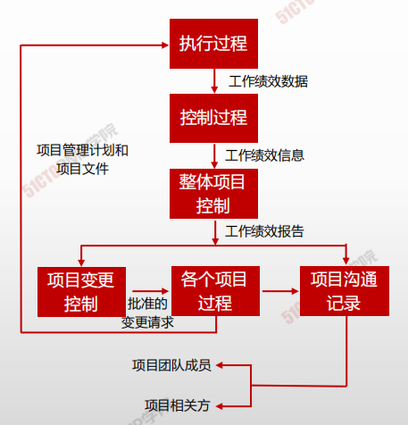
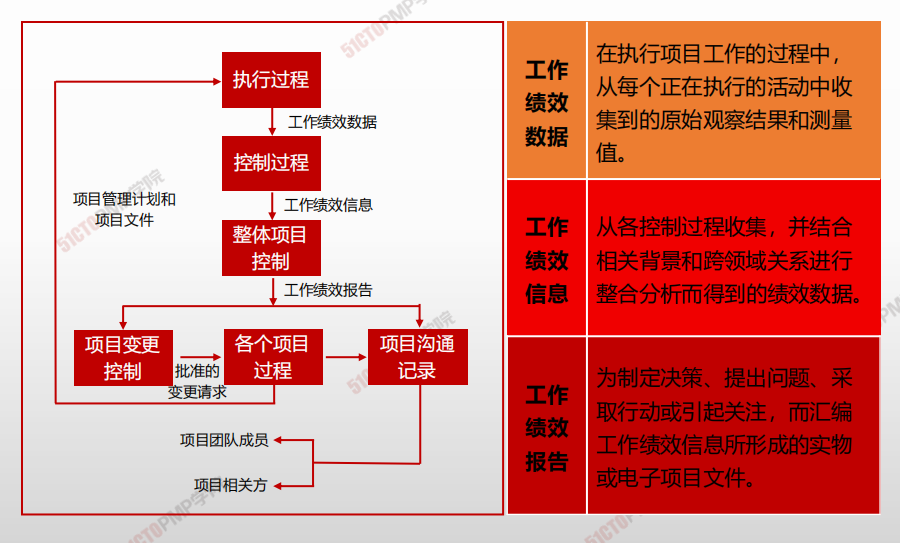

# 项目管理数据和信息

## 工作绩效数据

- 在执行项目工作的过程中，每个正在执行的活动中收集到的原始观察结果和测量值

## 工作绩效信息

- 从各控制过程收集，并结合相关背景和跨领域关系进行整合分析而得到的绩效数据。

## 工作绩效报告

- 为制定决策、提出问题、采取行动或一起关注，而汇编工作绩效信息所形成的的实物或电子项目文件

  
  
||工作绩效数据| 工作绩效信息 |工作绩效报告|
| -- | -- | -- | -- |
|产生于 |指导与管理项目工作过程|确认范围、控制范围、控制进度、控制成本、控制质量、监督沟通、控制资源、监督风险、控制采购、监督相关方参与过程|监控项目工作过程|
|产生时间| 随时| 间隔一定时间，经常 |间隔较长时间，定期或在特殊需要时|
|主要用途 |记录项目执行情况 |反映项目执行与计划之间的偏差，以便决定是否需要变更|整个项目层面的，更深入或更综合的执行与计划的比较，以便决定是否需变更或采取其他行动|
|回答的主要问题| 是什么（What) |为什么会如此（Why)| 准备怎么解决和预防问题（How and how ill)|
|使用者| 项目团队| 项目团队| 项目团队、发起人、高级管理层、客户及其他主要相关方|
|实例|截至本月底完成 了价值1000万元 的工作|截至本月底，与计划相比，进度落后了100万元，超出了控制临界值，主要原因是人员的技能水平低下|截至本月底，进度偏差为-100万 元，超出控制临界值。应加强人员培训，提高技能水平，来赶上进度，并预防再次进度落后|