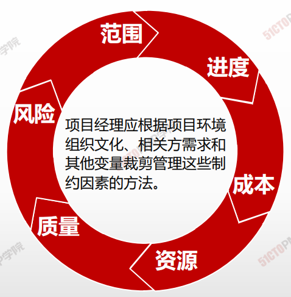

# 裁剪

> 每个项目都是独特性的，所以有必要进行裁剪
>
> 
>
> 在裁剪项目管理是，项目经理还应考虑运行项目所需的各个治理层级，并考虑组织文化

- 并非每个项目都需要《PMBOK指南》所确定的每个过程、工具、技术、输入或输出。
- 裁剪应处理关于**范围、进度、成本、资源、质量和风险**的互相竞争的制约因素。
- 各个制约因素对不同项目的重要性不一样，项目经理**根据项目环境、组织文化、相关方需求和其他变量裁剪管理**这些制约因素的方法。

