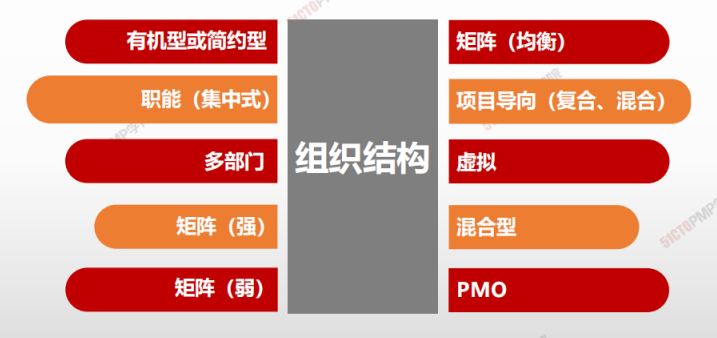

# 组织结构对项目的影响

> - 有机型或简约型
> - 职能型（集中式）
> - 多部门
> - 矩阵（强）
> - 矩阵（弱）
> - 矩阵（均衡）
> - 项目导向（复合、混合）
> - 虚拟
> - 混合型
> - PMO

|组织结构类型|工作组安排方式|项目经理的职权|项目经理的角色| 资源可用性|项目预算管理者是谁？|项目管理人员|
|-|-|-|-|-|-|-|-|-|-|-|-|-|-|-|-|
|有机型或简约型|灵活； 人员并肩工作 |极少或无| 兼职；工作角色（如协调员）制定与否不限| 极少或无 |负责人或操作员|极少或无|
|职能（集中式）|所需开展的工作（如工程、制造|极少或无 |兼职；工作角色（如协调员）制定与否不限| 极少或无 |职能经理 |兼职|
|多部门|其中之一：产品；生产过程；项目组合；项目集；地理区域；客户类型|极少或无| 兼职；工作角色（如协调员）制定与否不限| 极少或无| 职能经理 |兼职|
|矩阵-强|按工作职能，项目经理作为一个职能|中到高| 全职；指定工作角色| 中到高 |项目经理|全职|
|矩阵-弱| 工作职能| 低兼职；作为另一项工作的组成部分，并非指定工作角色，如协调员|低|职能经理| 兼职|
|矩阵-均衡| 工作职能 |低到中|作为一种技能嵌入相关职能，也许不是指定工作角色，如协调员|低到中 |混合 |兼职组织结构对项目的影响|

| **组织结构类型** | **工作组安排方式** | **项目经理的职权** | **项目经理的角色** | **资源可用性** | **项目预算管理者是谁？** | **项目管理人员** |
| ---------------- | ------------------ | ------------------ | ------------------ | -------------- | ------------------------ | ---------------- |
|项目导向（复合、混合）|项目| 高到几乎全权 |全职；指定工作角色|高到几乎全部| 项目经理| 全职|
|**虚拟**|网络架构，带有与他人联系的节点|低到中| 全职或兼职 |低到中| 混合 |可为全职或兼职|
|**混合型**| 其他类型的混合|混合| 混合| 混合| 混合| 混合|
|**PMO** |其他类型的混合|高到几乎全权 |全职指定工作角色|高到几乎全部 |项目经理 |全职|