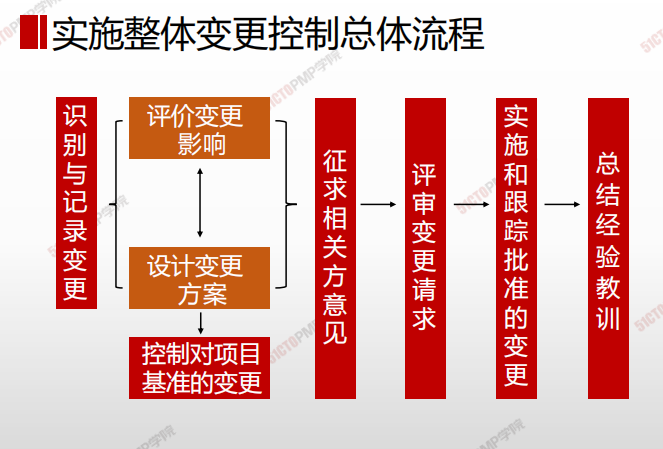
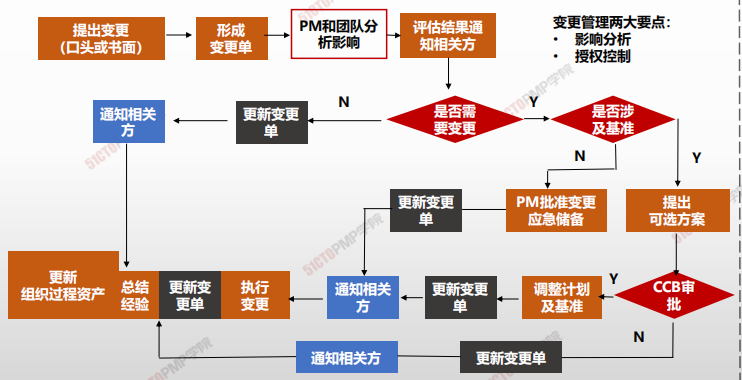
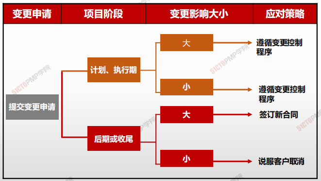

# 实施整体变更控制规则

## 实施整体变更控制的态度和规则

### 态度

- 变更是不可避免的
- 积极主动的去影响引起变更要素
- 确保变更对项目有利，尽量防止不必要的变更
- 变更，无论大小，都必须经过实施整体变更控制过程的审批
- 很小的变更，能引起很大的后果

### 规则

- 任何项目相关方都可以提出变更请求
- 变更请求也可口头提出
- 所有的变更请求都必须
  - 以书面形式记录
  - 提交实施整体变更控制过程审批

## **项目变更控制委员会（CCB）的职责**

**是决策机构，不是作业机构。通常，CCB的工作是通过**

**评审手段来决定项目是否变更，但不提出变更方案。**

## **项目经理的职责**

**响应变更提出者的要求，评估变更对项目的影响及应对方案，要求由技术要求转化为资源需求，供授权人决策；**

**依据评审结果实施即调整项目基准，确保项目基准反映项目实施情况**

## 实施整体变更控制总体流程

## 实施整体变更控制详细流程

## 变更类型和审批权限

|变更类型| 批准| 备注|
|--|--|--|
|项目章程| 签署或批准该章程的人||
|项目目标或项目基准的变更 |变更控制委员会|PM可分析变更的情况提出意见|
|与合同相关的变更 |客户||
|项目计划内的变更 (可通过赶工或快速跟进来解决) |项目经理||
|紧急情况下变更 |项目经理| 后补相关手续|

## 变更应对分析

