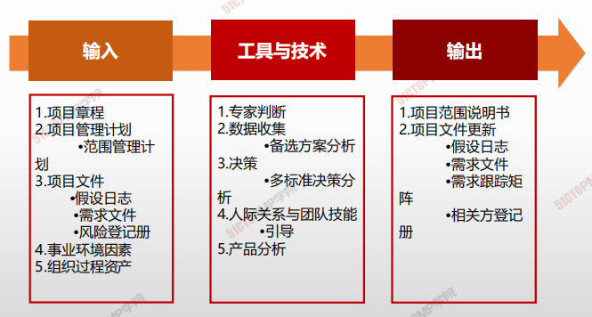

# 定义范围

## 4W1H

| 4W1H                | **定义范围**                                                 |
| ------------------- | ------------------------------------------------------------ |
| what 做什么     | 制定项目和产品详细描述的过程。 <u>作用：描述产品、服务或成果的边界和验收标准。</u> |
| why 为什么做    | 准备好详细的项目范围说明书，对项目成功至关重要。             |
| who 谁来做      | 项目经理带领项目管理团队制定，应该获得发起人/客户和关键相关人的批准。 |
| when 什么时候做 | 收集需求之后                                                 |
| how 如何做      | 应根据项目启动过程中记载的主要可交付成果、假设条件和制约因素来编制详细的项目范围说明书。 专家判断、数据分析、决策、人际关系与团队技能、产品分析 |

## 输入/工具技术/输出

1. 输入
   1. 项目章程
   2. 项目管理计划
      - 范围管理计划
   3. 项目文件
      - 假设日志
      - 需求文件
      - 风险登记册
   4. 事业环境因素
   5. 组织过程资产
2. 工具与技术
   1. 专家判断
   2. 数据收集
      - 备选方案分析
   3. 决策
      - 多标准决策分析
   4. 人际关系与团队技
      - 引导
   5. 产品分析

3. 输出
   1. 项目范围说明书
   2. 项目文件更新
      - 假设日志
      - 需求文件
      - 需求跟踪矩阵
      - 相关方登记册

> ### 价值工程
>
> 在产品开发设计阶段即进行的价值与成本革新活动，因为仍在**工程设计阶段，**故称为**价值工程**

> ### 价值分析
>
> 一旦开始量产后，往往为了成本或利润压力，非进行详尽的价值分析难以发掘可以降低成本或提高价值的改善点。此节点以后持续的分析是降低成本的主要手法，就成为价值分析

> **<u>不同阶段、相同目的：提高价值、减低成本</u>**

### 项目章程和项目范围说明书的内容

| 项目章程                                                     | 项目范围说明书           |
| ------------------------------------------------------------ | ------------------------ |
| 项目目的                                                     | 项目范围描述（渐进明细） |
| 可测量的项目目标和相关的成功标准                             | 项目可交付成果           |
| 高层级需求                                                   | 验收标准                 |
| 高层级项目描述、边界定义以及主要可交付成果                   | 项目的除外责任           |
| 整体项目风险整体项目风险                                     |                          |
| 总体里程碑进度计划总体里程碑进度计划项目的除外责任           |                          |
| 预先批准的财务资源预先批准的财务资源                         |                          |
| 主要相关方清单主要相关方清单                                 |                          |
| 项目审批要求（例如，用什么标准评价成功，由谁对项目成功项目审批要求（例如，用什么标准评价成功，由谁对项目成功整体项目风险 |                          |
| 下结论，由谁来签署项目结束）                                 |                          |
| 项目退出标准（比如，结束或取消项目或阶段前应满足的条件）     |                          |
| 委派的项目经理及其职责和职权                                 |                          |
| 发起人或其他批准项目章程的人员姓名和职权                     |                  |

# 小结

1.  定义范围是制定项目和产品详细描述的过程
2. 项目范围说明书包含项目范围和产品范围
3. 范围说明书是指导规划、执行、评价变更请求是否超过项目边界的基准
4. 项目范围说明书必须由关键相关方签字，代表就项目范围所达成的共识