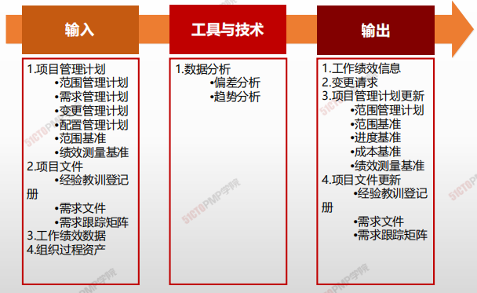
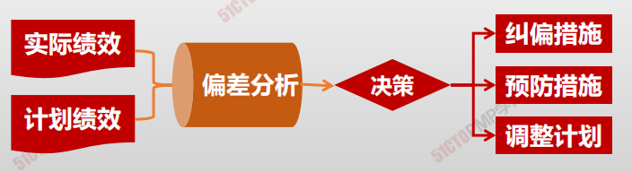
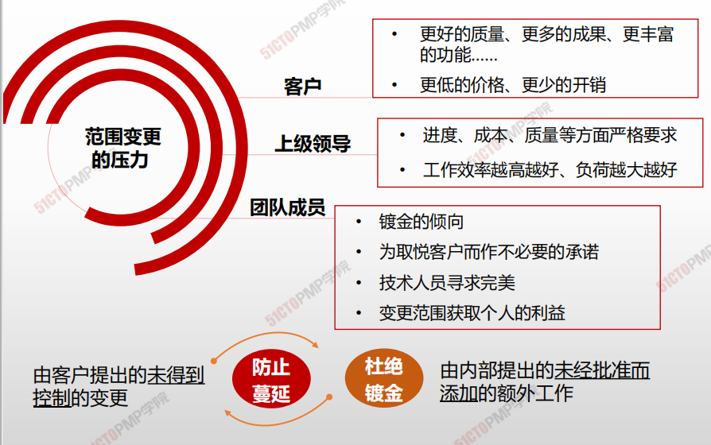
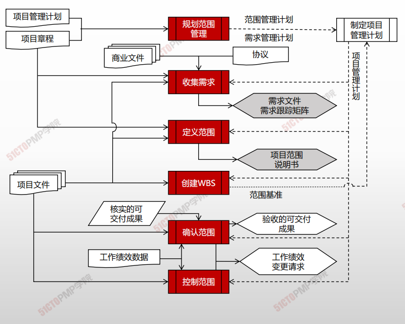

# 控制范围

## 4W1H

| 4W1H                | **创建 WBS**                                                 |
| ------------------- | ------------------------------------------------------------ |
| what 做什么     | 监督项目和产品的范围状态，管理范围基准变更的过程。 <u>作用：在整个项目期间保持对范围基准的维护。</u> |
| why 为什么做    | 防止范围失控，变更实际发生时，管理变更，变更不可避免，必须强制实施变更控制，防止范围蔓延，杜绝范围镀金。项目管理团队 |
| who 谁来做      | 项目管理团队。                                               |
| when 什么时候做 | 项目或阶段末，项目结束前进行。                               |
| how 如何做      | 控制项目范围确保所有变更请求、推荐的纠正措施或预防措施都通过实施整体变更控制过程进行处理。在变更实际发生时，也要采用控制范围过程来管理这些变更。控制范围过程应该与其他控制过程协调开展。数据分析 |

## 输入/工具技术/输出

1. 输入
   2. 项目管理计划
      - 范围管理计划
      - 需求管理计划
      - 变更管理计划
      - 配置管理计划
      - 范围基准
      - 绩效测量基准
   3. 项目文件
      - 经验教训登记册
      - 需求文件
      - 需求跟踪矩阵
   5. 工作绩效数据
   6. 组织过程资产
2. 工具与技术
   1. 数据分析
      * 偏差分析
      * 趋势分析

3. 输出
   1. 工作绩效信息
   2. 变更请求
   3. 项目管理计划更新
      - 范围管理计划
      - 范围基准
      - 进度基准
      - 成本基准
      - 绩效测量基准
   4. 项目文件更新
      - 经验教训登记册
      - 需求文件
      - 需求跟踪矩阵

### 工具与技术

#### 偏差分析

> 偏差分析用于将基准与实际结果进行比较，以确定偏差是否处于临界值区间或是否有必要采取纠正或预防措施；

#### 趋势分析

> 趋势分析旨在审查项目绩效随时间的变化情况，以判断绩效是正在改善还是正在恶化。

#### 控制质量、控制范围和确认范围的区别

|                  | 控制质量                             | 控制范围                   | 确认范围                                                     |
| ---------------- | ------------------------------------ | -------------------------- | ------------------------------------------------------------ |
| **所属知识领域** | 质量管理                             | 范围管理                   | 范围管理                                                     |
| **由谁展开**     | 项目团队                             | 项目团队                   | 项目发起人或客户                                             |
| **何时展开**     | 在项目执行期间持续展开               | 在项目执行期间持续展开     | 在项目执行期间定期展开，即在可交付成果完成并核实为质量合格后及时展开 |
| **为何展开**     | 检查工作过程和可交付成果的技术正确性 | 检查该做的工作是否都该做了 | 检查可交付成果能否通过验收                                   |

#### 范围变更的原因

1. 一个外部事件（例如政府规定的变更）
2. 产品范围定义的一个过失或疏忽
3. 项目范围定义的过失或疏忽
4. 为应对一个风险而实施一个应急计划
5. 一个增值的变更（应用新技术降低成本）

#### 范围控制经验

* **随时为变更做好准备**
* **能不变则不变**

* **如果一定要变，必须确保利于目标**

* **确保所有的变更都经过正式批准**

* **确保变更及时通知到所有相关干系人**

* **探究变更根本原因，丰富组织过程资产**

# 小结

1. 所有范围变更请求需要由实施整体变更控制过程来审查和处理
2. 未得到控制的变更通常称为项目范围蔓延
3. 镀金是指项目团队超出范围定义，主动增加额外的工作而得不   到任何经济补偿的行为
4. PMI理念：防止蔓延，杜绝镀金行为

