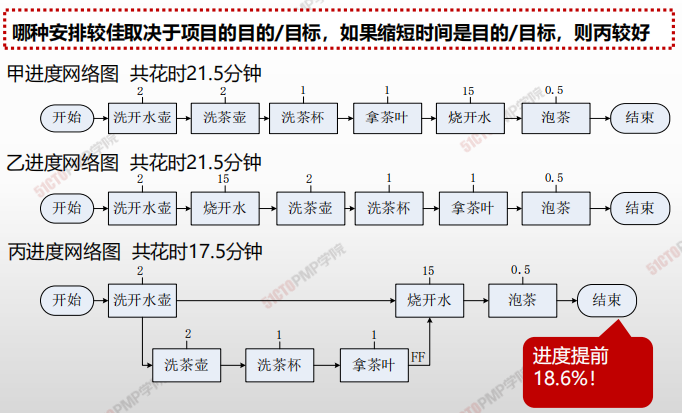

# 项目进度管理概述

|                | **启动过程组** | **规划过程组**                                               | **执行过程组** | **监控过程组** | **收尾过程组** |
| -------------- | -------------- | ------------------------------------------------------------ | -------------- | -------------- | -------------- |
| **6.进度管理** |                | 6.1规划进度管理 6.2定义活动 6.3排列活动顺序 6.4估算活动持续时间 6.5制定进度计划 |                | 6.6控制进度    |                |

> 烧水泡茶典型示例
>
> 

| 6.1  | 规划进度管理     | 为规划、编制、管理、执行和控制项目进度而制定政策、程序和文档的过程。 |
| ---- | ---------------- | ------------------------------------------------------------ |
| 6.2  | 定义活动         | 识别和记录为完成项目可交付成果而采取的具体行动的过程。       |
| 6.3  | 排列活动顺序     | 识别和记录项目活动之间的关系的过程                           |
| 6.4  | 估算活动持续时间 | 根据资源估算的结果，估算完成单项活动所需工作时段树的过程。   |
| 6.5  | 制定进度计划     | 分析活动顺序、持续时间、资源需求和进度制约因素，创建项目进度模型、从而落实项目执行和监控的过程 |
| 6.6  | 控制进度         | 监督项目状态，以更新项目进度和管理进度基准变更的过程。       |

## 1. 一谋

> 规划进度管理

## 2. 四备

> 一备
>
> ​	定义出清单
>
> 	1. 活动清单
>  	2. 里程碑清单
>
> 二备
>
> ​	排序出路线
>
> 三备
>
> ​	资源出参数
>
> 四备
>
> ​	历时出长短

## 3. 二反复

> 1. 反复进行进度计划编制更新
> 2. 反复进行进度控制与优化

