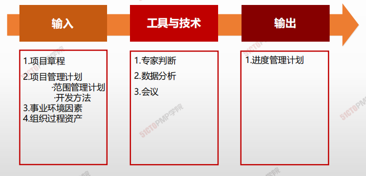
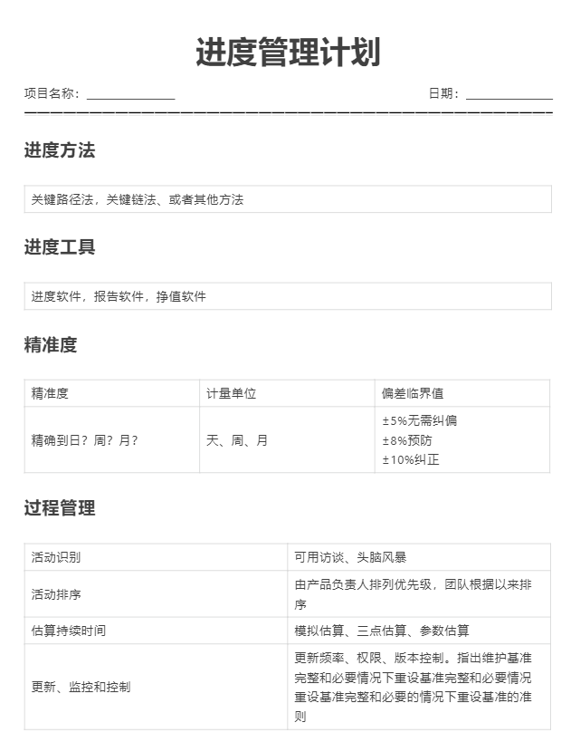

# 规划进度管理

## 4W1H

| 4W1H                | 规划进度管理                                                 |
| ------------------- | ------------------------------------------------------------ |
| what 做什么     | 为规划、编制、管理、执行和控制项目进度而制定政策、程序和文档的过程。 <u>作用：</u>为如何在整个项目期间管理项目进度提供指南和方向 |
| why 为什么做    | 指导进度管理知识领域的其他过程如何开展，提供指南和方向。     |
| who 谁来做      | 项目管理团队。                                               |
| when 什么时候做 | 项目章程制定后，项目进度管理知识领域之前                     |
| how 如何做      | 制定政策、程序和文档 <u>专家判断、数据分析、会议</u>      |

## 输入/工具技术/输出

1. 输入
   1. 项目章程
   2. 项目管理计划
      - 范围管理计划
      - 开发计划
   3. 事业环境因素
   4. 组织过程资产
2. 工具与技术
   1. 专家判断
   2. 数据分析
   3. 会议
3. 输出
   1. 进度管理计划

## 输出

### 进度管理计划

<u>进度管理计划的内容</u>

- 项目进度模型制定
- 进度计划的发布和迭代长度
- 准确度
- 计量单位
- 组织程序链接
- 项目进度模型维护
- 控制临界值
- 绩效测量规则
  - 确定完成百分比的规则
  - EVN技术
  - 进度绩效测量指标
- 报告格式

