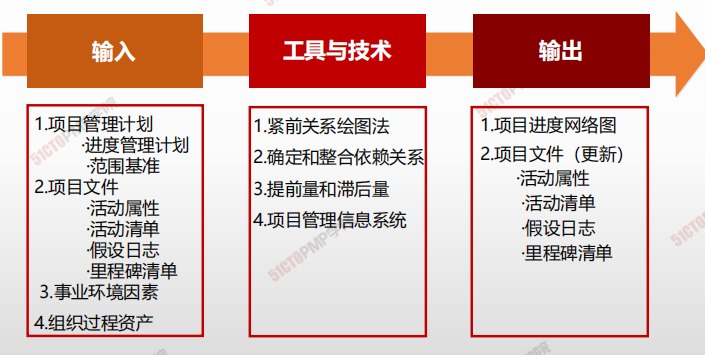
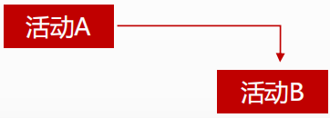
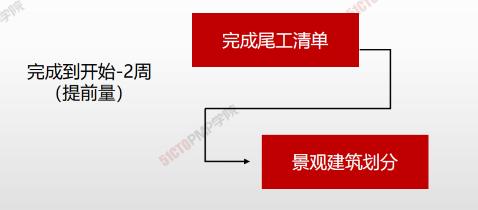
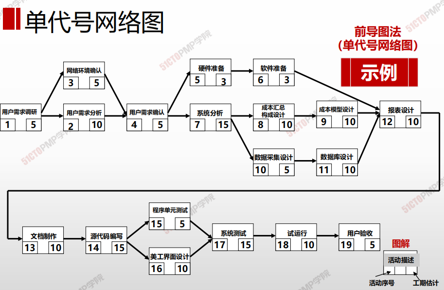
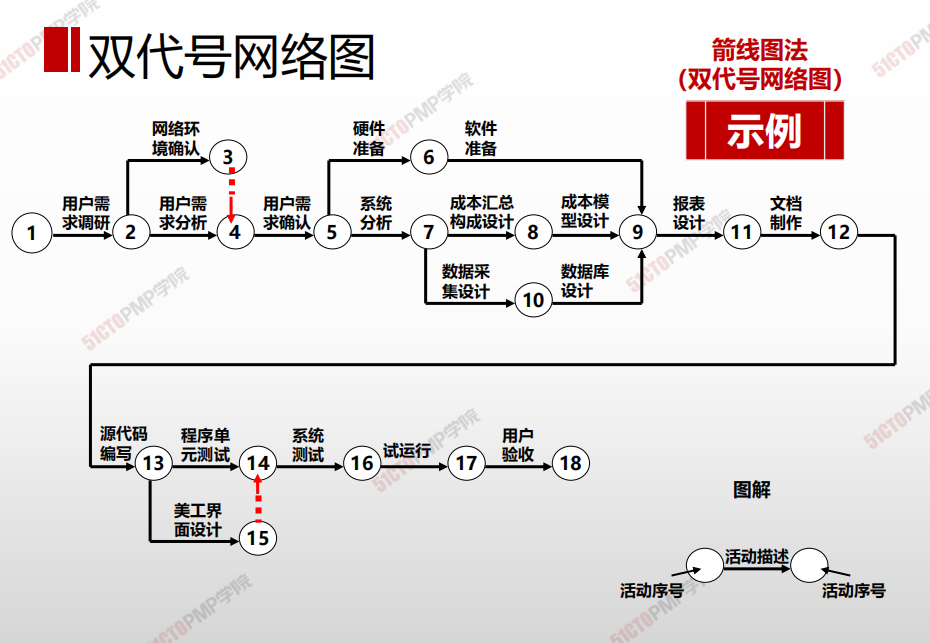
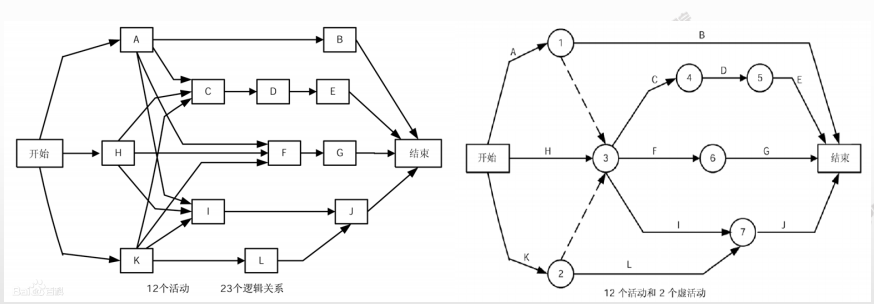

# 排列活动顺序

## 4W1H

| 4W1H                | 排列活动顺序                                                 |
| ------------------- | ------------------------------------------------------------ |
| what 做什么     | 识别和记录项目活动之间的关系的过程。 <u>作用：</u>定义工作之间的逻辑顺序，以便在既定的所有项目制约因素下获得最高的效率 |
| why 为什么做    | 为了指定合理的、符合实际情况的进度计划                       |
| who 谁来做      | 项目管理团队。                                               |
| when 什么时候做 | 定义活动之后。                                               |
| how 如何做      | 处理首尾两项，每项活动都至少有一项紧前活动和一项紧后活动，并且逻辑关系适当 <u>紧前关系绘图法、确定和整合依赖关系、提前量和滞后量、项目管理信息系统</u> |

## 输入/工具技术/输出

1. 输入
   1. 项目管理计划
      - 项目管理计划
      - 范围基准
   2. 项目文件
      - 活动属性
      - 活动清单
      - 假设日志
      - 里程碑清单
   3. 事业环境因素
   4. 组织过程资产
2. 工具与技术
   1. 紧前关系绘图法
   2. 确定整合依赖关系
   3. 提前量和滞后量
   4. 项目管理信息系统
3. 输出
   1. 项目进度网络图
   2. 项目文件（更新）
      - 活动属性
      - 活动清单
      - 假设文件
      - 里程碑清单

## 四种逻辑关系

| 关系            | 图                                                           |
| --------------- | ------------------------------------------------------------ |
| 完成—开始（FS） |  |
| 完成—完成（FF） |  |
| 开始—开始（SS） |  |
| 开始—完成（SF） |  |

### 提前量和滞后量

> 提前量：是相对于紧前活动，紧后活动可以提前的时间量

> 滞后量：是相对于紧前活动，紧后活动需要推迟的时间量

### 四种依赖关系

| 依赖关系       | 解释                                                         | 示例                                                         |
| -------------- | ------------------------------------------------------------ | ------------------------------------------------------------ |
| 强制依赖关系   | 工作中固有的依赖关系工程化、强制性规律                       | 如：软件需求分析必须在对应的软件设计之前完成,又称为硬性依赖关系。 |
| 选择性依赖关系 | 根据项目经验或偏好定义的依赖关系，工序无必然规律，灵活选用   | 如：软件系统测试用例的编写往往在编码开始时进行,又称为软性依赖关系。 |
| 外部依赖关系   | 通常为项目组与项目组外之间的活动关系                         | 如：外部供应商供货                                           |
| 内部依赖关系   | 内部依赖关系是项目活动之间的紧前关系，通常在项目团队的控制中 | 如：只有机器组装完毕，团队才能对其测试。                     |

### 单代号网络图

### 双代号网络图

### 单代号与与双代号的转换

